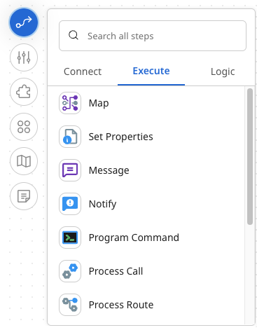

# Manually displaying or hiding steps in the steps palette

<head>
  <meta name="guidename" content="Integration"/>
  <meta name="context" content="GUID-6431a8d0-b39f-4fab-95a3-2f4f847fcdf4"/>
</head>

When you're on the process canvas, you can display or hide the steps palette. The steps palette allows you to find any step and drag it onto the canvas. You can search all steps or choose a category, **Connect**, **Execute**, or **Logic**, and scroll to find the step you want.

## Procedure

1. To display the steps, click the Steps icon ()

   

2. To hide the steps, click the Steps icon again.
