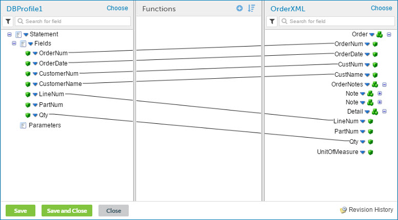

# Mapping elements from source to destination

<head>
  <meta name="guidename" content="Integration"/>
  <meta name="context" content="GUID-663f84fd-7b4a-4cd7-803b-715ee2bd3453"/>
</head>

The mappings in a map show the correspondence of elements in the source profile with elements in the destination profile.

## Procedure

1.  Create or open a map that has source and destination profiles selected.

2.  Click the plus signs in both profiles to display the elements that you want to map.

3.  Locate the elements that you want to map by searching within the list or filtering the list.

    -   To search for an element by name, type all or part of its name in the search box.

    -   To filter the list, click  and select **Show mapped fields only**.

    If the icon is colored , a filter is applied. Click the icon to remove the filter.

    The list of elements is limited by the search or filter criteria. If you have a filter applied, a search returns only items that meet the filter criteria.

4.  Click an element in the source profile, and drag it to an element in the destination profile.

    A line appears between the source element and the destination element, indicating that data will be moved from one to the other when the map runs.

    Valid elements are highlighted in green when you pause on them.

    :::note
    
    Padding is added to profile elements with short names to make it easier to specify the elements as destinations for mappings. As a result, the line connecting the source element to the destination element may not extend to the start of the destination profile name.

    :::

5.  Repeat steps 3 and 4 to map additional elements.

6.  Click **Save**.

    

## Next Steps

If you re-import a source or destination profile to incorporate updates, the updated profile might affect the connections in any map where it is used. See the Profile components topic for more information.