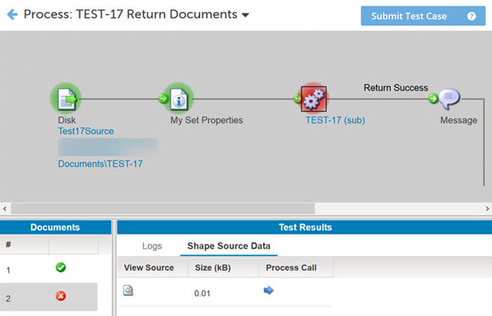
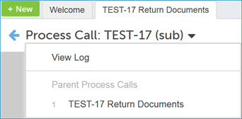

# Reviewing process call results in test mode

<head>
  <meta name="guidename" content="Integration"/>
  <meta name="context" content="GUID-434a2d34-244c-47b8-b101-59ee31d881e1"/>
</head>

You can review the results of a child process, also called a subprocess, that was executed with the Process Call step.

1.  Select the **Process Call** step in the parent process.

2.  In the **Test Results** window click the **step Source Data** tab.

3.  Click the blue **Process Call** arrow in the Process Call column.

    Viewing the Process Call step does not rerun the child process. The Atom is simply uploading the logs for the document from when it originally executed. Test mode displays the steps executed for the document.

    

4.  Click the drop-down arrow next to the name of the subprocess and select **View Log**.

    The log for the subprocess opens.

    

5.  Click the **Close Subprocess** button or click the name of the parent process in the list.

    You return to the view of the parent process in Test mode.