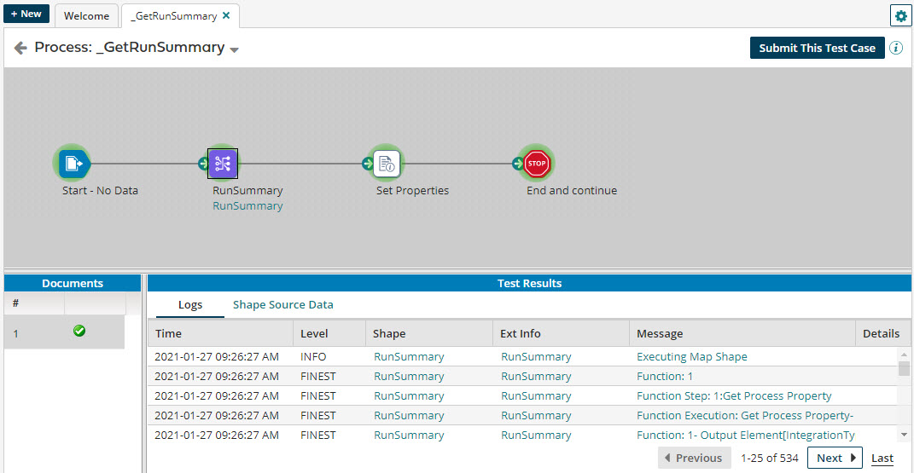

# Running a process in test mode

<head>
  <meta name="guidename" content="Integration"/>
  <meta name="context" content="GUID-4da90c4b-3c2f-4479-a341-a17e2b6199e0"/>
</head>

When you test a process, you can see the progress and the results as each step is tested.

1.  Open a process.

2.  Click **Test** above the upper right corner of the canvas.

3.  If you enter test mode and have made a change to the process without saving it, you receive a message. Select one of the following:

    -   Click **Revert and Reload**.

    -   Click **Save**.

    -   Click **Cancel**.

4.  In the Test window, select the Atom on which the process should execute.

    :::note

    If you do not have an Atom installed, you are prompted to install one before continuing.

    :::

5.  If extensions are enabled for your account, click the **Test Extensions** arrow to configure extension values.

6.  Click **Run Test**.

    The process canvas background turns gray, indicating that you are in test mode. You cannot edit the process.

    :::note

    If the process \(and any subprocesses within the process\) contain a large number of components, a message warning that the test run might take a long time to complete is displayed.

    :::

    While a step is being tested, it is highlighted in yellow. If an error occurs, an error message dialog opens, and the step is highlighted in red. If the step passes the test, it is highlighted in green, and the test continues to the next step in the process.

    If the process exceeds the maximum number of messages that a test execution can generate, warning messages inform you that logging was truncated and/or step execution tracking was truncated. You also receive a message telling you whether the execution completed successfully or failed. The first untested step is highlighted in dark gray. The steps that follow have no highlighting. The status of each document is reported in the Documents pane.

    :::note

    For processes \(or subprocesses within a process\) that include a Process Route component, test mode runs without explicitly deploying the process route or any of its referenced processes.

    :::

    