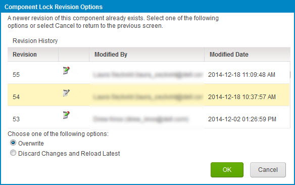
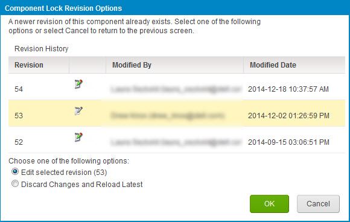

# Selecting and editing a revision of a read-only component

<head>
  <meta name="guidename" content="Integration"/>
  <meta name="context" content="GUID-da237395-8953-4d15-937c-a132bc44a7a1"/>
</head>

This task is relevant if component locking is enabled in your Enterprise or Enterprise Plus Edition account. When you try to lock or save the component you may receive a warning that you have an outdated revision of the component open on the process canvas.

## Procedure

1.  You opened a component, locked it and edited it. Meanwhile an administrator acquired the lock, edited and saved the component. You click **Save**.

    The Component Lock Revision Options dialog opens with these options.

    

2.  You opened a component but did not lock it. Another user opened the same component, locked, edited and saved it. You click **Lock & Edit**.

    The Component Lock Revision Options dialog opens with these options.

    

3.  Choose one of the following:

    -   **Overwrite**

    -   **Edit Selected Revision \(n\)**

    -   **Discard Changes and Reload Latest**

4.  Click **OK**.

    If you selected **Overwrite**, a new revision of the component is created and saved. Skip the rest of the steps in this task.

    If you selected **Edit Selected Revision \(n\)**, the selected revision is open for editing.

    If you selected **Discard Changes and Reload Latest**, your changes are discarded and the latest revision opens for editing.

5.  Edit the component as needed.

6.  Click **Save**.

    If you selected **Edit Selected Revision \(n\)**, the Component Lock Revision Options dialog opens again.

    If you selected **Discard Changes and Reload Latest**, a new revision of the component is created and saved. Skip the rest of the steps in this task.

7.  Select **Overwrite**.

8.  Click **OK**.

A new revision of the component is created and saved.