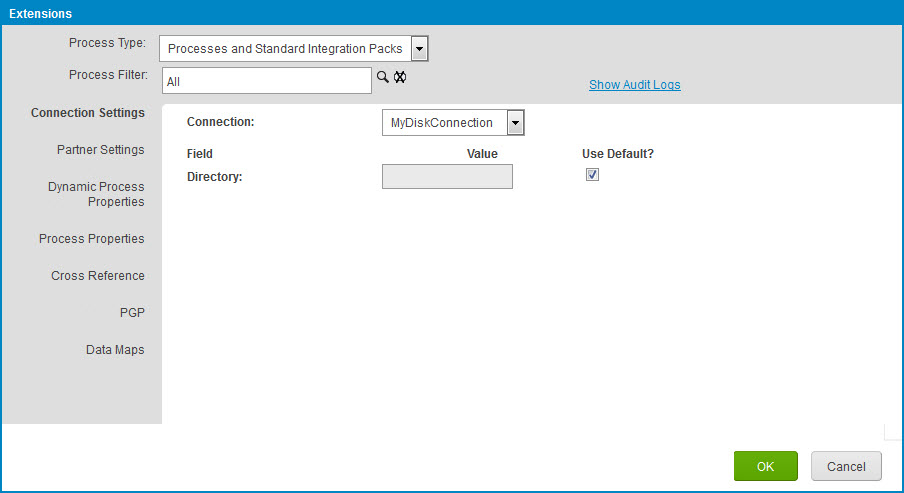

# Setting Environment-level connection settings extension values

<head>
  <meta name="guidename" content="Integration"/>
  <meta name="context" content="GUID-12556b66-7593-4f8c-a890-582f8459b3dd"/>
</head>

Set extension values for connection settings for an Environment.

You must have the Environment Management privilege or Environment Management Full Access custom role to perform this task. You are unable to perform this task if your user is assigned with the Environment Management Read Access custom role.

1.  Select **Manage** \> **Atom Management**.

2.  Select an environment from the list on the left.

3.  From the Environment Management screen, click **Environment Extensions**.

4.  Do one of the following:

-   To filter the controls below to show only extensions defined for a particular process:
1.  Click ** Choose the desired component** adjacent to **Process Filter**.
2.  Select the process in the component chooser.
-   To set extension values for a particular process in an installed, attached multi-install integration pack:
1.  In the **Process Type** list, select Multi Installation Integration Packs.

:::note

This list option displays only if your multi-installation integration packs are installed on your account.

:::

2.  Click ** Choose the desired component** adjacent to **Process**.
3.  Select the process in the component chooser.
5.  Select the **Connection Settings** tab.

6.  In the **Connection** list, select a Connection component for which settings extensions are defined.

7.  For each extension for which you want to set a value, clear the **Use Default?** check box and enter a value. If **Use Default?** is on, the value configured in the underlying Connection component is used at run-time.

8.  For each additional Connection for which settings extensions are defined, repeat steps 6–7.

9.  When you are finished setting extension values, click **OK**.