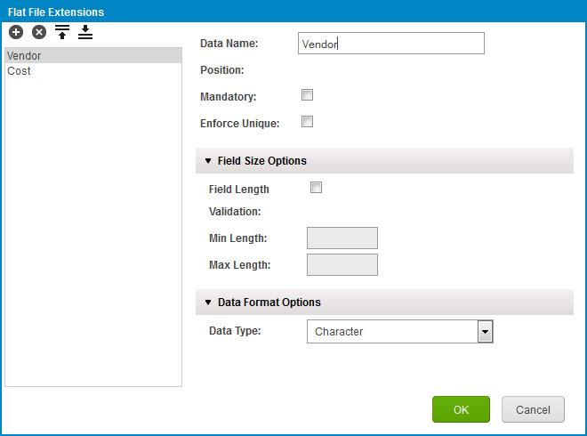

# Setting Environment-level data map extension values

<head>
  <meta name="guidename" content="Integration"/>
  <meta name="context" content="GUID-7ab8d197-f487-4f4d-a75c-5dc7abf8f561"/>
</head>

Set extension values for data maps for an Environment.

You must have the Environment Management privilege or Environment Management Full Access custom role to perform this task. You are unable to perform this task if your user is assigned with the Environment Management Read Access custom role.

If the connection settings for the data source for the source or destination profile are extended, first set the connection settings extensions values on the **Connection Settings** tab in the Extensions dialog.

1.  Select **Manage** \> **Atom Management**.

2.  Select an environment from the list on the left.

3.  From the Environment Management screen, click **Environment Extensions**.

4.  Do one of the following:

-   To filter the controls below to show only extensions defined for a particular process:
1.  Click ** Choose the desired component** adjacent to **Process Filter**.
2.  Select the process in the component chooser.
-   To set extension values for a particular process in an installed, attached multi-install integration pack:
1.  In the **Process Type** list, select Multi Installation Integration Packs.

:::note 

This list option displays only if your multi-installation integration packs are installed on your account.

:::

2.  Click ** Choose the desired component** adjacent to **Process**.
3.  Select the process in the component chooser.
5.  Select the **Data Map** tab.

6.  In the **Data Maps** list, select a data map for which an extension is defined. The data maps are identified in the list by the source and destination object definition names specified on the Object Definitions tab in the process Extensions dialog. Depending on the connector types used to originally build the profiles, first select the Atoms to use to browse for the profiles.

The source and destination profiles are browsed and loaded. This may take a few moments depending on the connector types used to originally build the profiles.

:::note

If connection settings were extended but browsing for the source or destination profile fails, an error message will appear for that profile. Do the following:

1.  Click  adjacent to the error message.

2.  Click **Edit Credentials**.

3.  In the Connection Settings dialog, type the correct extension values.

4.  Click **OK**.

:::

Another attempt will be made to browse and load the profile.

7.  Set data map extension values — flat file profile-based object field additions:

Perform the following sub-steps as needed separately for the source and destination object definitions:

1.  Click ** Edit flat file extensions**.

The Flat File Extensions dialog opens.

2.  Add a field: Click ** Add Element**.

The new field is automatically selected in the field list.

3.  In the **Data Name** field, replace “New Element” with the name of the new field.

4.  Use the controls below the **Data Name** field to set field options.

These controls are identical to those used in the Build page to create and edit a flat file profile component.

5.  For each additional field you want to add, repeat steps B–D.

6.  Click **OK**.

8.  Set data map extension values — field-to-field mappings:

1.  After you selected a data map from the list in step 6, the source and destination profiles and their mappings appear.

2.  If you want to add standard or user-defined functions to your extended map, click the  icon. Configure the extensible [standard](int-Adding_a_standard_function_to_an_extended_data_map_f939f056-ff2a-4625-a1e7-6c339811887f.md) or [user-defined function](int-Adding_a_user_defined_function_to_an_extended_data_map_4ba06b78-8db5-42ea-a58d-593f36be10bb.md).

If you use extensions with integration packs, the Connector Call function is available but cannot be used. This is because no connection or operation components are available in the Connector Call dialog.

3.  In the source column on the left, select the source element to map.

4.  Drag a line to an element in the destination profile on the right.

5.  Or, if you want to use a function, drag a line to the function, and then drag another line to the destination element.

6.  For each additional mapping you want to add, repeat steps A–E.

9.  For each additional data map for which an extension is defined, repeat steps 6–8.

10. When you are finished setting extension values, click **OK**.