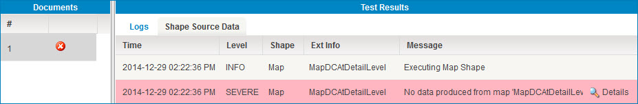

# Viewing a document log error in test mode

<head>
  <meta name="guidename" content="Integration"/>
  <meta name="context" content="GUID-7105cc0e-0783-40b5-b61b-32d45bcd7225"/>
</head>

You can view the log file for a specific document that failed in test mode.

## Procedure

1.  Click the step on the process canvas.

2.  Select the failed document from the numbered list in the **Documents** window.

3.  Refer to the **Logs** tab in the **Test Results** window.

    This displays the log information for that particular step.

4.  Click the **Details** link to learn more about the document-level error.

    

    :::note

    To view the log entries for a connection in the Start step, you must view the process log.

    :::