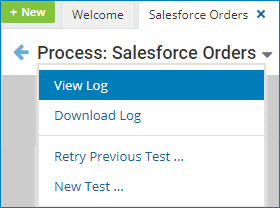

# Viewing a process log in test mode

<head>
  <meta name="guidename" content="Integration"/>
  <meta name="context" content="GUID-1ff9f55d-efda-4c28-a797-73c11acda151"/>
</head>

You can review the high-level log information for the overall process execution that ran in test mode.

## Procedure

1.  When the process execution is completed, click the drop-down arrow next to the process name and select **View Log**.

    

    The log file opens in the Base Process Log window.

2.  To download the contents of the log, click **Save Logs**.

    Depending on your browser and its download settings, you may be prompted to specify the destination path and filename. The default filename is Test\_execution-executionID-yy.mm.dd.log, where executionID is the system-assigned execution ID and yyyy, mm, and dd specify the current date — for example, Test\_execution-01234567-890a-bcde-f012-3456789abcde-2018.11.10.log.

3.  Click **Cancel**.

    :::note

    You can download the log without first opening the Base Process Log window by clicking the drop-down arrow next to the process name and selecting **Download Log**.

    :::