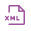

# Viewing the XML for a component

<head>
  <meta name="guidename" content="Integration"/>
  <meta name="context" content="GUID-8f1e6143-fbfa-4717-97a8-c43eed9b48ed"/>
</head>

You can view the XML for a component by clicking the ** View Component XML** icon for a specific revision in the Revision History dialog.

1.  In the Component Explorer, navigate to the folder containing the component.

2.  Double-click the component.

    The component opens on a tab.

3.  Click ** Revision History**.

    The Revision History dialog opens showing each revision.

4.  Click ** View Component XML** next to a revision number.

    The Component XML window opens showing the XML that makes up the selected revision of the component.

5.  Click **Close** to close the Component XML window.