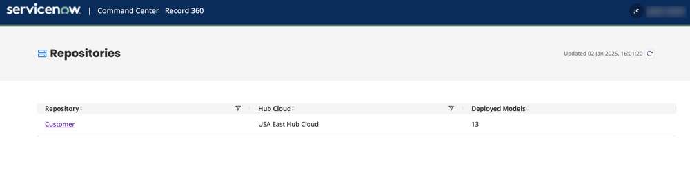
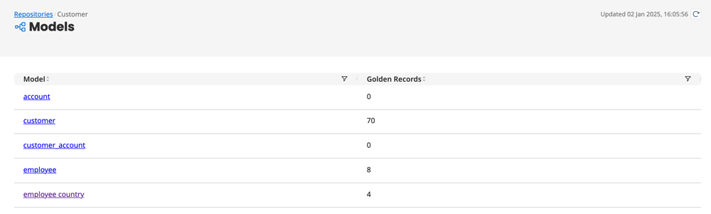

# Viewing golden records in the Command Center 

<head>
  <meta name="guidename" content="DataHub"/>
  <meta name="context" content="GUID-cf905177-5af9-4d63-b0ec-b515547a80ff"/>
</head>

The Command Center powered by ServiceNow provides a golden record view that empowers you to collaborate with business stakeholders on data management tasks and ensure your data remains reliable and consistent. It boosts data trust, streamlines governance, and accelerates decision-making for improved business outcomes. Read [Getting started in Command Center](/docs/Atomsphere/Master%20Data%20Hub/Command_Center/getting_started_in_command_center.md) to learn more about the Command Center benefits and the initial setup.

## Prerequisites

You don't need a ServiceNow account to utilize the Command Center. However, you will need to do the following to get started:

- Contact your account representative
- [Register your user account with the Command Center](/docs/Atomsphere/Master%20Data%20Hub/Command_Center/getting_started_in_command_center.md)
- Ensure you have the following privileges:
    When using the Advanced Security feature:
      - **API Access**
      - **Atom Management Read Access**
      - **MDM - Stewardship**
      - **MDM - View Repositories**

    Without Advanced Security:

      - **Boomi Administrator**

    Read [User Management settings](/docs/Atomsphere/Platform/r-atm-User_management_baf961e2-b480-4fca-a3f5-8262aed6c031.md) to learn more about configuring privileges for user roles.

:::note

We're releasing Command Center initially through [Limited Availability](/docs/Atomsphere/Platform/atm-Feature_release_stages_00d83b66-e5db-4038-8398-fcaead4be12d.md). While we are limiting the number of customers, the release will be open to both existing and new DataHub customers up to that specified limit. The foundational read-only view will be rolled out more broadly to existing Hub customers throughout 2025 based on platform readiness and performance validation.

:::

## View golden records

1. In the Command Center Home page, the list view shows all repositories, the Hub cloud hosting the repository, and the count of deployed models within the repository. Select the repository link to open a list of models.
  
2. Select the deployed model. The list view includes a count of golden records in the model.
  
3. The Command Center lists the golden records with column headers representing the fields in the model. Click the golden record link to open the 360-degree view, where you will see the golden record data.    Use the sorting feature in the column headers to organize the golden records. At the bottom of the screen you can choose how many golden records to display per page.
