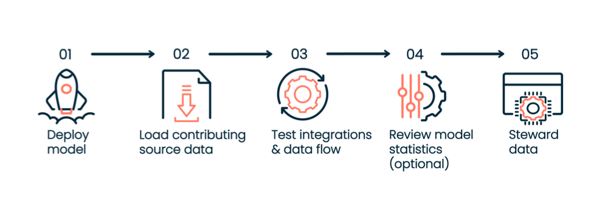
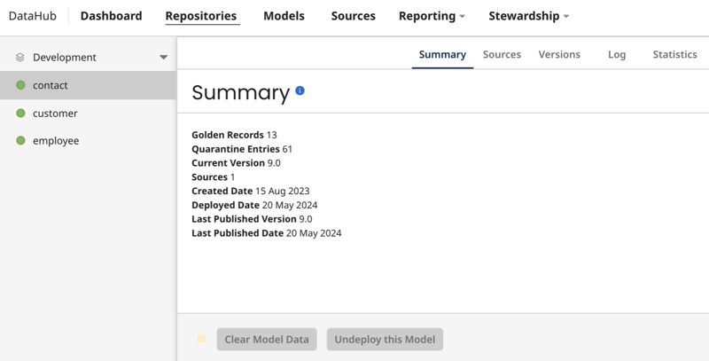

# Deployment 

<head>
  <meta name="guidename" content="DataHub"/>
  <meta name="context" content="GUID-0c9a9774-5e0a-404a-961f-aed993a6cf74"/>
</head>

After creating and publishing a model, [deploy it to a repository](/docs/Atomsphere/Master%20Data%20Hub/Deployment/t-mdm-Deploying_a_model_to_a_repository_4e36910d-ac80-4a04-b600-7dd9ed621444.md), where it will appear on the Repositories page. The deployed model gives Boomi DataHub instructions on managing incoming and outgoing entities and creating golden records based on your model's design.

## Deployment process

You can follow this process when deploying a model. You can initiate post-deployment actions on the [Repositories page](/docs/Atomsphere/Master%20Data%20Hub/Deployment/hub-Viewing_repository_information) or through the [DataHub APIs](/docs/Atomsphere/Master%20Data%20Hub/REST%20APIs/r-mdm-REST_APIs_f43499a6-3d1c-4102-bf13-94b02659dd9f).

1. [Deploy a published model](/docs/Atomsphere/Master%20Data%20Hub/Deployment/t-mdm-Deploying_a_model_to_a_repository_4e36910d-ac80-4a04-b600-7dd9ed621444.md) to the repository.
2. [Enable initial load](#initial-loading-of-source-data) and load data for each contributing source. We recommend starting with the source that has the most trustworthy data. To load data, you must prepare your integrations to transfer data from source systems into Boomi DataHub and create golden records. For an integration example, review [Building an integration process for initial load](/docs/Atomsphere/Master%20Data%20Hub/Synchronization/t-mdm-Building_an_AtomSphere_process_for_an_initial__f03675d2-de6f-4406-a387-534bad3f4b64). You can load data directly into the repository through deployed integrations or into [staging areas](#staging-entities-for-testing) as an optional step. A staging area allows you to preview contributions from source entities and verify that source configurations meet your desired data management objectives before committing the data to the repository for incorporation into golden records.  
3. Test and deploy integrations to check that source record updates from sources are routed to the repository. Test and deploy integrations that send batches of source record update requests specifying create, update, and delete operations are routed from Boomi DataHub to the accepting source. Review [Synchronization](/docs/Atomsphere/Master%20Data%20Hub/Synchronization/c-mdm-Synchronization_2d9308b5-c600-4fa3-a68c-2e6f9e0c865a.md) articles for integration examples. 
4. **Optional:** After data is in the repository, review [model statistics](#model-statistics) to help make model design decisions and identify data quality issues.
5. After deploying your integrations for data synchronization, [schedule the processes](/docs/Atomsphere/Integration/Integration%20management/c-atm-Process_schedules_5d4ec467-f604-46ac-a546-f714a6a2d38e) to run at regular intervals. Steward data as it flows to and from DataHub through integrations and verify data remains synchronized.

## Deployment summary

The domain (deployed model) Summary tab shows the following statistics about the domain:

- Golden record count
- Quarantine entry count (if applicable)
- Current deployed version number
- Number of sources attached to the model
- Number of pending batches of incoming source entities not yet processed
- Number of outgoing source record update requests for which the repository has not received acknowledgement  from integration processes.

## Source configurations

If you add source configurations to the model before deploying, those configurations transfer to the deployed model (domain).  You can also configure and edit sources later in the deployed model.

You can sync changes between your deployed model and the original model design. You can either revert the deployed model to match the original settings or import the deployed model’s settings into the original model. Read [Source attachment and configuration](/docs/Atomsphere/Master%20Data%20Hub/Deployment/c-mdm-Source_attachment_and_configuration_18243706-e83f-4ab8-a723-a64d1f09e4bb.md) for more details.

## Initial loading of source data

You must enable Initial Load mode for each contributing source one at a time. Only one source can send data while in this mode. Activate Initial Load mode using the [Sources tab's user interface](/docs/Atomsphere/Master%20Data%20Hub/Deployment/t-mdm-Loading_data_from_a_source_8c5915de-5144-45a0-8d21-b798879e174a.md) or the [DataHub Platform API](/docs/Atomsphere/Master%20Data%20Hub/REST%20APIs/hub-Enable_Initial_Load_Mode_5fc2de65-051a-40fb-9654-6ae22cb92a71). After enabling it, run the source’s integration process to load all records and data into the repository.  If there is a source system of record for all fields in the domain model, load that source’s data first. Read [Loading data from a source](/docs/Atomsphere/Master%20Data%20Hub/Deployment/t-mdm-Loading_data_from_a_source_8c5915de-5144-45a0-8d21-b798879e174a.md) and [Source attachment and configuration](/docs/Atomsphere/Master%20Data%20Hub/Deployment/c-mdm-Source_attachment_and_configuration_18243706-e83f-4ab8-a723-a64d1f09e4bb.md) to learn more.

## Testing match rules

You can test and preview how match rules quarantine a batch of source entities using the [Match Entities API endpoint](/docs/Atomsphere/Master%20Data%20Hub/REST%20APIs/r-mdm-Match_Entities_d429e265-e650-4ad4-8f9b-5fe08c2db157) or the Boomi Data Hub connector’s [Match Entities operation](/docs/Atomsphere/Integration/Connectors/int-BDH_Match_Entities). You can optionally test how match rules apply to a batch of incoming source entities to identify potential duplicate records and adjust the match rules as needed. The [Match Entities API endpoint](/docs/Atomsphere/Master%20Data%20Hub/REST%20APIs/r-mdm-Match_Entities_d429e265-e650-4ad4-8f9b-5fe08c2db157) and the Boomi Data Hub connector’s [Match Entities operation](/docs/Atomsphere/Integration/Connectors/int-BDH_Match_Entities) provide match results for each entity in the batch. They also return metadata about fuzzy matching, including match strength and threshold, which helps you decide if you need to adjust the fuzzy match settings in the model. This testing is useful when you have existing golden records in a deployed model and want to ensure the match rules work effectively before onboarding a new source.

## Staging entities for testing

You can test and preview how source entities affect the golden record data before committing it to the repository. Create a staging area for each contributing source you want to preview. You have the option to use the [Repository APIs](/docs/Atomsphere/Master%20Data%20Hub/REST%20APIs/hub-Query_Staged_Entities), and [Platform API](/docs/Atomsphere/Master%20Data%20Hub/REST%20APIs/hub-Add_Staging_Area_for_Source_9c53339e-b146-4f24-b214-5fc11bcdae83) staging endpoints, or you can use the [user interface](/docs/Atomsphere/Master%20Data%20Hub/Stewardship/t-mdm-Adding_a_staging_area_for_a_source_a4e18da6-9b8d-4257-a28e-dc1725b587ae) to manage staged entities.

## Model version management

After you change the model design, you can deploy new or older versions of the model to the repository. Model versions are helpful when you modify match rules after testing and want to deploy those changes to the repository. Read [Deploying a newer or older version of a model](/docs/Atomsphere/Master%20Data%20Hub/Governance/t-mdm-Deploying_a_newer_or_older_version_of_a_model_1ebf8753-8993-48f7-a73c-2ee5e26ff0fc) to learn more.

## Source ranking

When you have more than one contributing source, you can indicate which contributing source has the most trustworthy data. You can apply source ranking to each field in a deployed model so that Hub knows which source entity can override a less trustworthy source entity. Read [Configure source rankings](/docs/Atomsphere/Master%20Data%20Hub/Deployment/t-mdm-Configuring_source_rankings_for_a_domain_0e38f4b3-321a-44c7-b811-018f5ad13954) to learn more.

## Setting a default source

You have the option to set a default source when you have a model that has a reference field (a reference model). Setting a default source in a reference model is helpful when the primary model doesn't have a specific reference value/source entity ID pairing to use as the value since the referenced source is not attached. By choosing a default source in the reference model, the primary model can simplify data resolution by automatically using the source entity ID linked to that default source.

Setting a default source ensures that golden records consistently use the same source for reference field values. You can set the default source in the model or in the deployed model (Repository > Deployed Model > Sources tab). Read [Setting the default source](/docs/Atomsphere/Master%20Data%20Hub/Modeling/hub-Setting_the_default_source_for_a_domain_792dcd2c-083f-4d3e-afbe-503ca3a8ac0b) to learn more.

## Model statistics

You can view golden record field value statistics for a deployed model on the Repositories page. The Statistics tab shows metadata, including the number of rows, columns, reference fields, resolved references, and more. These statistics help your organization with model design decisions and identify data quality issues. Read [Viewing golden record field statistics](/docs/Atomsphere/Master%20Data%20Hub/Stewardship/hub-Viewing_golden_record_field_statistics) to learn more.

## Audit log

DataHub logs user actions and system responses for each deployed model. You can view logs for a specific model or for multiple models within a repository. Review audit logs in the user interface or by querying the Platform API’s audit log object. Read [Audit log](/docs/Atomsphere/Master%20Data%20Hub/Governance/c-mdm-Audit_log_4cb7f2e6-f9b3-4e4c-b0ce-ca94aa3c3e77) to learn more.