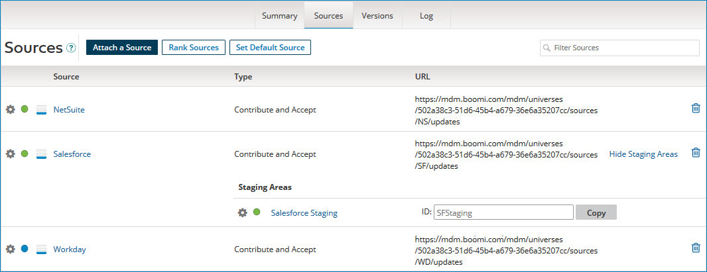

# Source attachment and configuration 

<head>
  <meta name="guidename" content="DataHub"/>
  <meta name="context" content="GUID-18243706-e83f-4ab8-a723-a64d1f09e4bb"/>
</head>

The **Sources** tab lets you configure how sources interact with the repository, including how they contribute and/or accept data. On the Source tab of the repository page, you can perform various actions related to source attachments, such as [attaching a source](../Deployment/t-mdm-Attaching_a_source_to_a_domain_4dc39589-d478-4d0b-a697-645453595f69.md), [modifying source attachments](../Modeling/t-mdm-Configuring_an_attached_source_2f17f57e-2797-44e9-ab6d-c176553fabbb.md), [removing a Source](../Modeling/hub-Removing_a_source_from_a_model_702b80b2-b20c-406d-8aa5-ab462763e259.md), [ranking a source](../Deployment/t-mdm-Configuring_source_rankings_for_a_domain_0e38f4b3-321a-44c7-b811-018f5ad13954.md), [setting a default source](../Modeling/hub-Setting_the_default_source_for_a_domain_792dcd2c-083f-4d3e-afbe-503ca3a8ac0b.md), [adding a staging area](../Stewardship/t-mdm-Adding_a_staging_area_for_a_source_a4e18da6-9b8d-4257-a28e-dc1725b587ae.md), and [viewing pending status](../Governance/t-mdm-Viewing_pending_channel_update_requests_for_a_domain_225c545e-5802-43e7-a19a-60f4c5c81c73.md).

## Before you begin

You must have the following privileges to attach and configure sources in the repository:

 - MDM - View Repositories 
 - MDM - Source Attachment 

## Attaching Sources versus Embedded Sources

You have two options for attaching a source: either you can manually attach a source to a deployed model (also called a domain) in the repository **Source** tab or add a source to a model and deploy it to the repository.

### Attaching a Source 

Manually [attaching a source](../Deployment/t-mdm-Attaching_a_source_to_a_domain_4dc39589-d478-4d0b-a697-645453595f69.md) to a master data domain makes the system represented by that source eligible to contribute data to that domain and/or accept updates of data from that domain. This is done in the **Source** tab of the repository page. You can attach contributing and non-contributing sources to a domain at anytime.

### Embedded Source

When you deploy a model with source configurations to a repository, the model’s sources are automatically attached to the domain. To learn more, refer to [Adding a source to the model](../Modeling/hub-Adding_a_source_to_a_model_e77a2437-3758-413a-bdbe-7911fb57e492.md) topic.

:::caution

When you deploy a version of a model with embedded sources, deploying a subsequent version without embedded sources will remove all sources attached to the domain. To reattach sources, you can either manually reattach them from the **Sources** tab of the domain or deploy a new or previous version with embedded sources.

:::

#### Revert Source configuration

If you are configuring the source of the deployed model in the repository and the original model has embedded source configurations, you can use the [Revert Source Configuration](../Deployment/hub-Reverting_a_source_configuration.md) feature.

This button appears when you have deployed the embedded source into the repository and begin modifying the embedded source configuration in the repository.

It allows you to revert back to the current published source configuration of the model, as the original source configuration differs from the embedded source configuration in the deployed model.

#### Importing source configurations into the model

You can import the deployed model's source configuration into the original model. In the **Sources** tab of the deployed model, you will see a notification with a link to [import the source configuration](../Modeling/hub-Adding_a_source_to_a_model_e77a2437-3758-413a-bdbe-7911fb57e492.md).

Once imported, it will include all changes, such as source attachments and configuration changes.

## Initial Load

Every attached contributing source must enter [Initial Load mode](../Deployment/t-mdm-Loading_data_from_a_source_8c5915de-5144-45a0-8d21-b798879e174a.md) to load all the records and data into the repository. You can activate this mode through either the [user interface](../Deployment/t-mdm-Loading_data_from_a_source_8c5915de-5144-45a0-8d21-b798879e174a.md) on the **Sources** tab or the [APIs](../REST%20APIs/hub-Enable_Initial_Load_Mode_5fc2de65-051a-40fb-9654-6ae22cb92a71.md). Only one source can send data at a time while in this mode. A blue dot next to the source indicates that it is in Initial Load mode.

You can close the Initial Load mode using the [Finish Load mode](../Deployment/t-mdm-Loading_data_from_a_source_8c5915de-5144-45a0-8d21-b798879e174a.md) option. When a source finishes Initial Load mode, it transitions to operation mode, indicated by a green dot next to the source. Operation mode allows the source to send update requests on the channel whenever new or updated data is available, resulting in changes to the golden records. 

Non-contributing sources enter operation mode immediately (green dot) since it does not go through the Initial Load mode.

