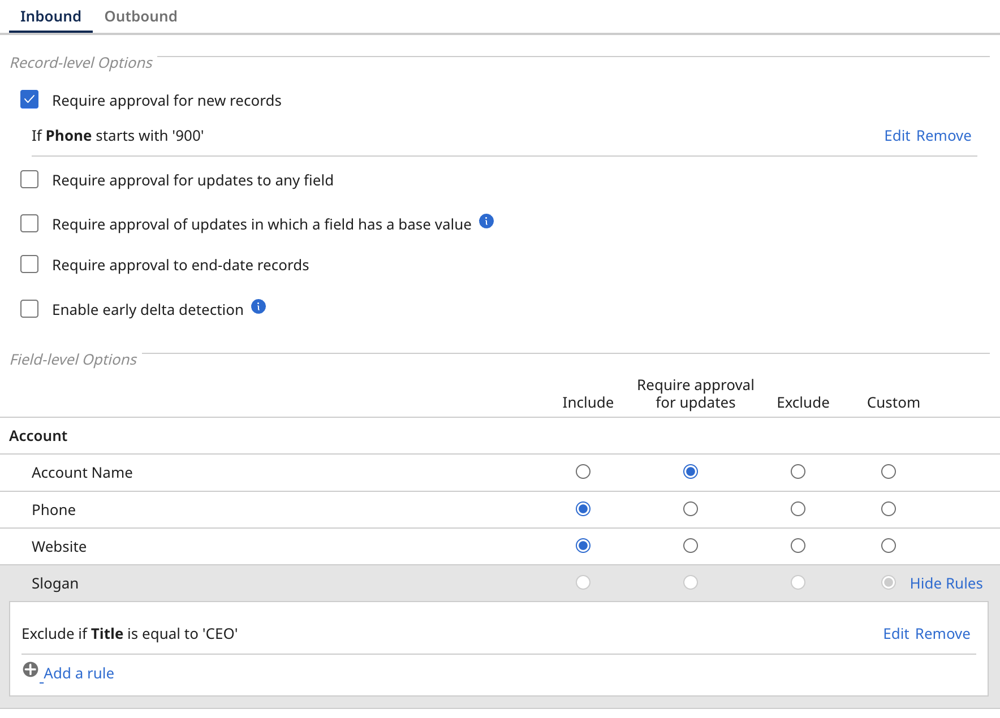
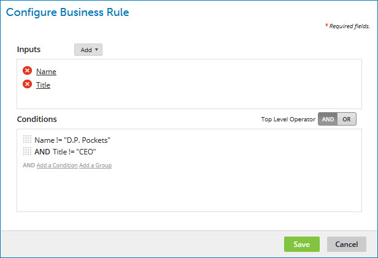

# Configuring a business rule

<head>
  <meta name="guidename" content="DataHub"/>
  <meta name="context" content="GUID-17366f43-a7fd-49e4-910d-9a1acdf4d094"/>
</head>

When you configure a contributing source, you can create a custom rule to determine when to quarantine entities with field updates.

## Procedure​

1. Select the **Repositories** and click the domain to which you want to configure.

2. Select the **Sources** tab.

3. Click **Configure** in the source’s gear icon **** menu.

    The source configuration dialog opens.

4. Select **Inbound** settings to configure the business rule for the contributing source.

5. Set **Record-level Options** for contributing source, if applicable:

    - Select **Require approval for new records** if you need manual approval for new entity contributions from the source before they are incorporated into the domain. 
    
      You can configure this using a simple rule (follow steps 6a–6e) or an advanced rule (follow steps 7a–7f).
    
    - Select **Require approval for updates to any field** if you need manual approval for updates to any field contributions that update any fields or collections in golden records before they are incorporated into the domain. 
    
      You can configure this using a simple rule (follow steps 6a–6e) or an advanced rule (follow steps 7a–7f).

6. **Optional:** Where applicable, you can set a simple rule :

      a. Click **Add a Rule**.
      
      b. In the chooser, select the field whose value you want to be evaluated against a static value.
      
      c. In the adjacent list, select the comparison operator.
      
      d. In the field, type the static value.
      
      e. Click **OK**.

7. **Optional:** Where applicable, you can set an advanced rule :

      a. Click **Add a Rule**.
      
      b. Click **Advanced Configuration**.
      
      The **Configure Business Rule** dialog opens.
      
      
      
      c. In the **Input** section, add either an [input field](../Modeling/t-mdm-Adding_an_input_field_to_a_business_rule_ef201876-b6a6-4700-b999-e95d443e97f5.md) or an [input function](../Modeling/t-mdm-Adding_an_input_function_to_a_business_rule_49aeaa7f-eedc-45ab-b51f-a85c57afe92a.md) and the corresponding output(s).
      
      Repeat this substep as many times as needed.
      
      d. In the **Conditions** section, add either a [condition](../Modeling/t-mdm-Adding_a_condition_to_a_business_rule_7d528c60-ed35-4b33-a2ca-90afac0fd5ad.md) or a [condition group](../Modeling/t-mdm-Adding_a_condition_group_to_a_business_rule_d8602abd-c15b-4fd2-87ce-bbbcca497569.md). Conditions refer to the outputs defined in the previous step.
      
      Repeat this substep as many times as needed.
      
      To change the Boolean operator relating to top-level grouped conditions, click the desired Top Level Operator — **AND** (the default) or **OR**.
      
      e. Click **Save**.
      
      The focus returns to the source configuration dialog.
      
      f. Click **Save**.

8. Set **Field-level Options** for contributing source, if applicable:

     a. Select **Custom**. 

     b. Do one of the following in the topmost list:

      - Select **Exclude if** to conditionally exclude certain fields in create and update operations resulting from entity contributions.

      - Select **Require approval if** to conditionally require manual approval for new entity contributions that would update certain fields.
      
    c. Do one of the following:
      
      - To configure a simple rule, follow steps 6a–6e.

      - To configure an advanced rule, follow steps 7a–7f.

