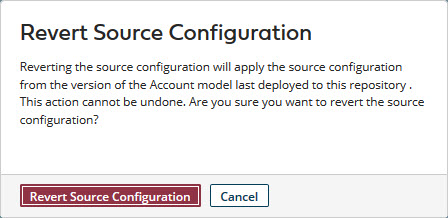

# Reverting a source configuration

<head>
  <meta name="guidename" content="DataHub"/>
  <meta name="context" content="GUID-ecd7ed2b-91a5-4c02-b30c-eae9fd85a6c0"/>
</head>

You can use the Revert Source Configuration feature to restore a model's latest published source configuration in a repository. You'll see this feature after you've deployed and made changes to the embedded source in the repository.

## Procedure​

1. In Repositories > repository page, click the domain to which the source is attached.

2. Click the **Sources** tab.

3. Click **Revert Source Configuration** 

   The Revert Source Configuration dialog appears.

   

4. Click **Revert Source Configuration** to discard any unsaved changes to the source configuration.

   The dialog closes, reverting back to the current published source configuration of the model.

:::note

If you want to synchronize the domain and model source configurations, you can [import the source](../Modeling/hub-Importing_a_domains_attached_sources_f8f7cd85-ddcd-4f32-84a7-adecba23dfe1.md) configuration from the domain into the model. When you go to the repository page, you'll find a notification containing a link to the model’s Sources tab. Click on the link to request the import, which will open in a new browser tab or window. 

:::