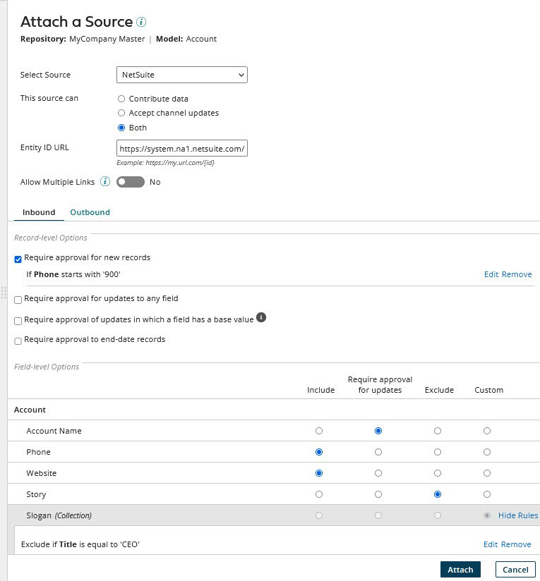
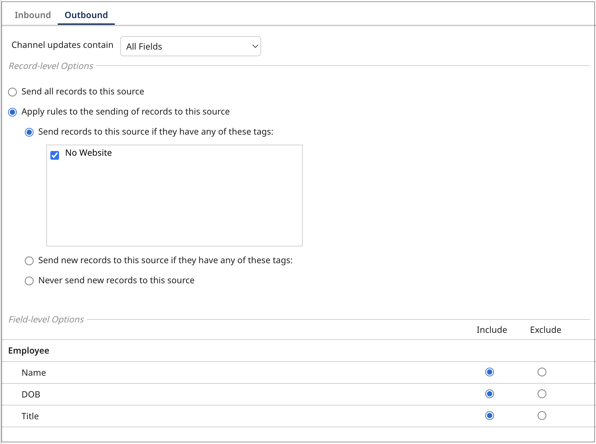

# Manually attaching a source to a domain 

<head>
  <meta name="guidename" content="DataHub"/>
  <meta name="context" content="GUID-4dc39589-d478-4d0b-a697-645453595f69"/>
</head>

Manually attaching a source to a master data domain makes the system represented by that source eligible to contribute data to that domain and/or accept updates of data from that domain.

## Before you begin​

You must have the following privileges to attach and configure sources in the repository:

- MDM - View Repositories

- MDM - Source Attachment

:::note

When a model with embedded sources is deployed to a repository, the model’s sources are automatically attached to the domain. If you manually attach sources and subsequently want to add those sources to the domain model, you can import the source configuration from the domain into the model. This is done in the **Sources** tab in the model page. Importing the source configuration overwrites the model’s source configuration.

:::

## Procedure

1. In the repository page, click the domain to which you want to manually attach the source and select the **Sources** tab.

2. Click **Attach a Source** or **Attach Your First Source**

    

3. In the **Select Source** list, select the source to attach.

4. Make a **This source can** selection — do one of the following:

    - Select **Contribute data** if you do not want the source to accept channel updates. 

    - Select **Accept channel updates** if you do not want the source contributing to master data.

    - Otherwise, leave the default selection as **Both** if you want the source to contribute data and accept channel updates.

5. **Optional**: If the source system supports “deep linking” to individual entity pages, using a different URL format for each object, in the **Entity ID URL** field, type the URL format for the applicable object — specify `{id}` as the placeholder for the source entity ID — for example, `https://system.na1.netsuite.com/app/common/entity/custjob.nl?id={id}`.

   Boomi DataHub will use the specified URL format as a template for constructing target URLs for links, rendered in the Golden Records page, to entities in the source system. The URL template will override any template specified on the Sources page for all domains.

6. **Optional**: Turn on **Allow Multiple Links** to allow multiple links from individual golden records to entities in the source system. The entities contributed from the source cannot be quarantined as potential duplicates.

:::note

If a source is configured to allow multiple links and then reconfigured to disallow multiple links, any existing multiple links from individual golden records to that source’s entities will still remain.

:::

7. Select **Inbound** settings.

8. Set **Record-level Options** for contributing sources, if applicable:

    - Select **Require approval for new records** if you need manual approval for new entity contributions from the source before they are incorporated into the domain.  You can [configure a rule](../Deployment/hub-Configuring_a_business_rule.md) if you want Boomi DataHub to quarantine only new records that satisfy the rule.
    
    - Select **Require approval for updates to any field** if you need manual approval for updates to any field contributions that update any fields or collections in golden records before they are incorporated into the domain. You can [configure a rule](../Deployment/hub-Configuring_a_business_rule.md) if you want Boomi DataHub to quarantine only record updates that satisfy the rule.
    
    - Select **Require approval of updates in which a field has a base value** when you need to get approval for changes to a record that is linked to a pending golden record and the field has a base value. 

    :::note
    
    If this option is not selected, a link is established in these cases, but the update ignores the fields with base values.

    :::

    - Select **Require approval to end-date records** if you need manual approval for entity contributions that specify golden record Delete requests. When you include an entity with a delete request, it will end-date the golden record linked to the specified source entity.
    
    - Select **Enable Early delta detection**. Early delta detection reduces the time it takes to process golden record updates from a contributing source. It allows Boomi DataHub to detect when a submitted entity does not change a golden record. Hub compares the previous entity with the inbound entity. If the inbound entity matches the previous entity submitted, the next time the same entity is submitted again without a change, Hub skips processing the entity. Boomi DataHub will only include the source's entity submissions when it detects a change to the record or if a new model version is deployed or a source configuration is changed. Model deployment or a change to the entity or to a source configuration starts the evaluation process again from the beginning, and Hub will skip the third time the same entity is submitted.

    :::info

    Early delta detection does not detect a change to a record when you are [using third-party data quality services](/docs/Atomsphere/Master%20Data%20Hub/Modeling/t-mdm-Enabling_a_quality_service_to_use_in_data_quality_f74aa25d-86a6-4390-b5f0-e90b75ebbd4a.md) for data enrichment, such as [Loqate](https://www.loqate.com/en-gb/address-verification/). A change cannot be detected because data enrichment from the third party happens after the entity is compared to the previous entity.

    :::

    :::info

    Early delta detection may not detect a change to a record if you submit an entity and then submit the same entity again with changed and unchanged data within 1 second.

    :::

9. Set **Field-level Options** for contributing sources, if applicable:

    - Select **Include** to include the field in create and update operations on golden records resulting from entity contributions. 

    - Select **Require approval for updates** if you need manual approval for new entity contributions that would update the field.
    
    - Select **Exclude** to exclude the field from create and update operations on golden records resulting from entity contributions.

    :::note

    If a model requires an excluded field, ensure that another source contributes the required data first. Otherwise, the record is quarantined until another source contributes values for the required field
    
    :::

    - Select **Custom** if you need the source contributes data to the field based on a custom rule. You can [configure a rule](../Deployment/hub-Configuring_a_business_rule.md) if you want Boomi DataHub to only quarantine fields that satisfy the rule.
    
10. Select **Outbound** settings.

11. In the **Channel updates contain** list, select one of the following, if applicable:

    - Select **All Fields** to request all fields in the golden record.

    - Select **Changed Fields Only** to request only the fields whose values were changed.

12. Set the **Record-level Options** for accepting sources, if applicable:

    - Select **Send all records to this source** to send record updates to the source without restriction.

    - Select **Apply rules to the sending of records to this source** send record updates to the source according to the rules you specify:

        - Select **Send records to this source if they have any of these tags**  to limit update requests on the source’s channel when golden records with specific tags are created, updated, or deleted.
        
        - Select **Send new records to this source if they have any of these tags** to limit the update requests on the source change for new golden records with specific tags.
        
        - Select **Never send new records to this source** to reject the requests to send new records to the source. 

13. Set the **Field-level Options** for accepting sources, if applicable:

    - Select **Include** to include the field in update requests.

    - Select **Exclude** to exclude the field from update requests.

14. Click **Attach**.

    The dialog closes, and the source is attached. When the operation is complete, the gear icon **** appears in the list entry for the newly attached source.

:::note
   
The attach operation will fail and an error message will be displayed if either of the following is true:

- The source you are attaching is not attached to one or more referenced domains and referential integrity of either type is enforced for any of the corresponding reference fields in *this* domain.

- Deployment of the model has not completed. The model may have an invalid name. Try copying the model in the **Models** page, naming the copy with a valid name and then publishing and deploying the copy.

:::