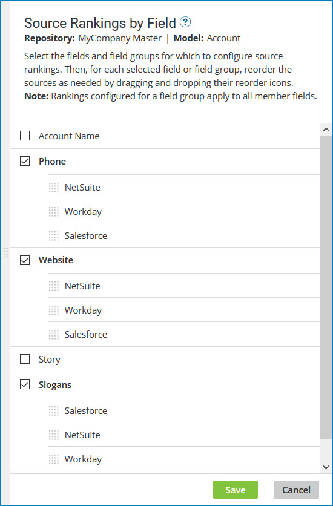

# Configuring source rankings

<head>
  <meta name="guidename" content="DataHub"/>
  <meta name="context" content="GUID-0e38f4b3-321a-44c7-b811-018f5ad13954"/>
</head>

You can configure source rankings for a model or domain based on the relative trustworthiness of the sources in order to automate governance of golden record updates and propagation of update requests.

## About this task

:::note

When you deploy a model that contains sources to a repository, the model’s sources are automatically attached to the domain, and, if the sources in the model are ranked, those rankings are automatically applied to the domain. If you apply source ranking changes to a domain and subsequently want to apply the updated source rankings to the domain model, you will need to import the source configuration from the domain into the model. This is done in the **Sources** tab in the model page. Importing the source configuration overwrites the model’s source configuration, including rankings.

:::

## Procedure

1. Do one of the following:

    - To configure source rankings for a model, in the Models page, click the model for which you want to configure source rankings and select the **Sources** tab.

    - To configure source rankings for a domain, in the repository page, click the domain for which you want to configure source rankings and select the **Sources** tab.

2. Click **Rank Sources**.

3. Select the checkbox adjacent to the field or field group name for which you want to configure source rankings. 

    After selection, the sources in the model or attached to the domain are revealed, along with their corresponding reorder icons ****. These sources will be displayed either in the order they were previously ranked or in alphabetical order if no rankings have been set.

     

4. Drag and drop reorder icons to change the order of the sources to coincide with the desired ranking. Place the source you want to rank highest at the top and the lowest at the bottom. The higher a source in the list, the higher its rank.

   :::note

   If you configure the rankings for a field group, it will automatically apply to all the child fields in that group.

   :::

5. For each additional field or field group for which you want to configure source rankings, repeat steps 3–4.

6. Click **Save**.

   If you apply source ranking to a deployed model, saved changes immediately apply to all incoming entity contributions.