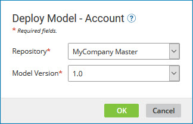
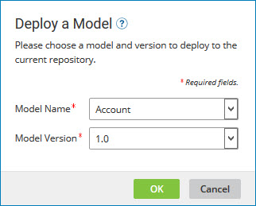

# Deploying a model to a repository 

<head>
  <meta name="guidename" content="DataHub"/>
  <meta name="context" content="GUID-4e36910d-ac80-4a04-b600-7dd9ed621444"/>
</head>

Deploying a model to a repository creates a master data domain hosted in that repository. If the model had embedded sources, you can load data into the domain because the sources are automatically attached to the domain. Otherwise, you must manually attach sources to the domain to enable the loading of data.

:::note

While you would logically deploy related models in tandem, starting with the model being referenced, there is not a requirement to deploy referenced models. This enables you to define relationships between models but defer deployment of individual models until you are ready to create domains and load their data.

:::

## Before you begin

If you configure sources in a model, source settings are automatically attached to the domain upon deployment.

Only published models are eligible for deployment. If a repository contains a deployed model, the repository Summary tab indicates when updated models are available for deployment. The Update Available tag appears after you edit and publish a new model version. In the Summary tab, you can click the **Version** number to deploy a new version.

## Procedure

1.  Do one of the following:

    -   In the Models page, in the models summary list entry for the model to deploy, click **Deploy**.

    -   In the repository page for the repository to which to deploy the model, in the **Summary** tab, click **Deploy a Model** or **Deploy Your First Model**.

    At this point:

    -   If you are working in the Models page, the Deploy Model dialog appears and takes focus.

        

    -   If you are working in the repository page, the Deploy a Model dialog appears and takes focus.

        

2.  Do one of the following:

    -   If you opened the Deploy Model dialog, in the **Repository** list, select the repository to which to deploy.

    -   If you opened the Deploy a Model dialog, in the **Model Name** list, select the model.

3.  In the **Model Version** list, select the version of the model to deploy.

4.  Click **OK**.

    A status dialog is displayed. Upon completion of deployment, the dialog closes.

:::note

DataHub applies tags to golden records in a domain after you finish deploying a model that includes tag definitions. After that, every time you deploy a new version of the model with tag definition changes, Hub reapplies the tags. 

If you deploy a different version of the model while tagging golden records, tagging will pause and start again once the new deployment completes. 
:::