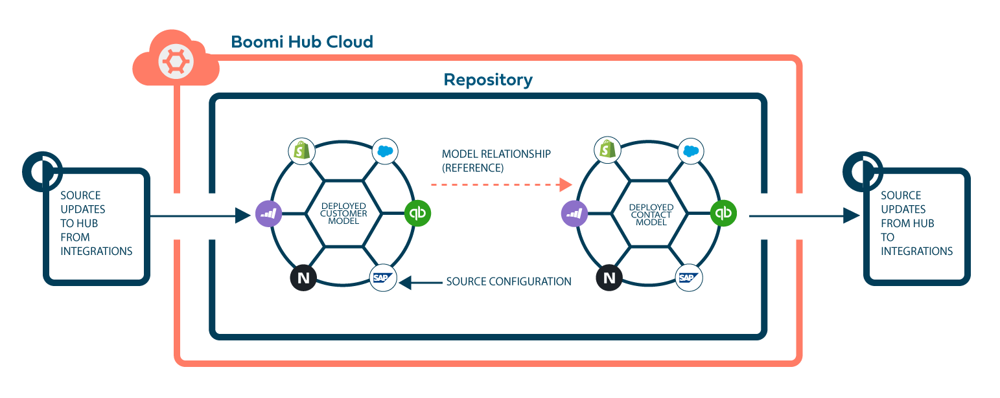

# Getting started with Boomi DataHub

<head>
  <meta name="guidename" content="DataHub"/>
  <meta name="context" content="GUID-8f98c194-2f50-4949-b42d-d3925b210d2b"/>
</head>

The Boomi DataHub is a cloud-based, flexible master data synchronization service that helps you keep valuable data domains, such as customer data, consistent, reliable, and accurate.

Hub is set up, configured, and managed from a web browser in a single instance, multi-tenant environment. It synchronizes with Boomi Integration to connect to any combination of SaaS cloud, on-premises, and hybrid environments. You can configure data sources to contribute to and/or receive quality data using integrations and the Boomi DataHub connector.

After you define the ideal record and deploy a data model, Hub identifies record elements that do not match your data quality standards. Hub maintains validated and up-to-date records, called golden records, and quarantines low-quality data for your review.

Multiple applications in your organization can coordinate and reference golden records to obtain consistent, high-quality, up-to-date information.

## Boomi DataHub lifecycle

There are 4 core data management activities in Hub:

|     |      |     |
| --- | ---  | --- |
|  | [Define](/docs/Atomsphere/Master%20Data%20Hub/Modeling/c-mdm-Modeling_079b48bb-6c87-431f-ac30-5c7ed5d57814.md)  |  Define the characteristics and criteria for data models in a domain.  |
|  | [Deploy](/docs/Atomsphere/Master%20Data%20Hub/Deployment/c-mdm-Deployment_0c9a9774-5e0a-404a-961f-aed993a6cf74.md) | Deploy models to a Hub repository and identify the source systems that will interact with them. |
|    |  [Synchronize](/docs/Atomsphere/Master%20Data%20Hub/Synchronization/c-mdm-Synchronization_2d9308b5-c600-4fa3-a68c-2e6f9e0c865a.md) | Leverage [ Integration](../../Integration/Getting%20started/c-atm-Integration_and_iPaaS_257fcf2c-7e93-48d0-be67-bd53fb444930.md) to orchestrate data synchronization and design process flows to ensure data quality.   |
|      |    [Steward](/docs/Atomsphere/Master%20Data%20Hub/Stewardship/c-mdm-Stewardship_df83d7fb-14c5-4543-afc3-04179e6637e5.md)    |   Steward data as it flows into domains to resolve duplicates and fix data entry issues, as well as identify and correct inaccurate data.  |

Enroll in the [DataHub Essentials course](https://community.boomi.com/s/course-catalog?tabset-2fa7e=3) to learn more about data management, data stewardship, and the lifecycle.

## Boomi DataHub architecture

The Boomi Hub Cloud hosts your repositories, deployed models, and golden records. Sources use integrations to connect to the deployed model to contribute master data, access master data, or both. Models can reference data from other models in the same repository. For example, the Contact model can reference data from the customer ID field in the Customer model.

Boomi recommends you create a development repository, test repository, and production repository so you can develop and test the flow of data and prevent errors. Your production repository is the single source of truth for your business data.

## Data management workflow: A quick start guide 

There are 8 steps to create a new data management project in Boomi DataHub.

### Step 1: Create your repositories

Create a repository that will host your master data, models, and source configurations. Repositories are virtual containers for your validated, trusted data. The data in a repository is hosted in the Boomi Hub Cloud. By default, you can have up to three repositories.

Boomi recommends that you create the following three repositories to minimize the risk of errors to live master data:

-   **Development repository** - use this repository to establish and update deployed models and source settings with a small amount of data. It allows developers to safely experiment with new models and updates.
  
-   **Test repository** - use this repository with a larger amount of data to test connections and ensure data flows correctly between golden records and sources.
  
-   **Production repository** - use this repository to contain the actual, live master data that is accessed by data users for business decisions.

Read [Repositories overview](/docs/Atomsphere/Master%20Data%20Hub/Getting%20started/hub-Repositories_overview_7b1dc32c-13a7-42a8-9716-0bbd76406e70.md) and [Creating a Repository](/docs/Atomsphere/Master%20Data%20Hub/Getting%20started/t-mdm-Creating_a_repository_a495f9fb-2748-492b-a726-fb678645e7cd.md) to learn more.

### Step 2: Create integrations in Boomi Integration

Create integrations that will flow data to and from sources using Boomi Integration and the Boomi DataHub connector. Read the following topics to help you:

-   [Building an integration process for an initial load](/docs/Atomsphere/Master%20Data%20Hub/Synchronization/t-mdm-Building_an_AtomSphere_process_for_an_initial__f03675d2-de6f-4406-a387-534bad3f4b64.md)
-   [Building an integration process to batch incoming updates](/docs/Atomsphere/Master%20Data%20Hub/Synchronization/t-mdm-Building_an_AtomSphere_process_to_batch_and_ro_0d930e58-3a0e-4816-b0a7-d6c8981ae7d2.md)
-   [Boomi DataHub connector](/docs/Atomsphere/Integration/Connectors/int-Boomi_Data_Hub_connector.md)
-   [Boomi DataHub APIs](/docs/Atomsphere/Master%20Data%20Hub/REST%20APIs/r-mdm-REST_APIs_f43499a6-3d1c-4102-bf13-94b02659dd9f.md)

Although you can use the Boomi DataHub APIs to build integrations between your sources and repository, using Integration simplifies the process because it:

-  Does not require coding to build integrations
-   Contains built-in tools to deploy and manage processes
-   Allows you to use the Boomi DataHub connector, which handles the technical aspects of exchanging data between sources and repositories
-   Simplifies administration. Integration and Boomi DataHub are interconnected

### Step 3: Create sources in Boomi DataHub

Establish source connections that will contribute data to the repository, accept record updates, or both. Source applications can be on-premise or cloud. Read [Creating a source](/docs/Atomsphere/Master%20Data%20Hub/Getting%20started/t-mdm-Creating_a_source_9a4b322e-623a-4ba5-9375-1eea62547959.md) to learn more.

### Step 4: Create a model

Create a model that defines the structure of golden records. Models contain rules to identify new records, identify record updates, and quarantine low-quality data. Read  [Creating a model](/docs/Atomsphere/Master%20Data%20Hub/Modeling/t-mdm-Creating_a_model_starting_with_empty_field_layout_66bdcc79-a77b-4c99-8511-4bf7a789516d.md) to learn more.

### Step 5: Configure source settings in the model

You can specify how sources contribute and accept data. Source configurations automatically attach to any deployed model across repositories. Read [Adding a source to a model](/docs/Atomsphere/Master%20Data%20Hub/Modeling/hub-Adding_a_source_to_a_model_e77a2437-3758-413a-bdbe-7911fb57e492.md) to learn more.

### Step 6: Publish and deploy the model to your repository

Hub uses your deployed model to load data from sources, create golden records, and maintain master data in your repository. Read [Publishing a model](/docs/Atomsphere/Master%20Data%20Hub/Modeling/t-mdm-Publishing_a_model_eb005b41-9581-4887-8b16-1dbff5069544.md) and [Deploying a model](/docs/Atomsphere/Master%20Data%20Hub/Deployment/t-mdm-Deploying_a_model_to_a_repository_4e36910d-ac80-4a04-b600-7dd9ed621444.md) to a repository to learn more.

### Step 7: Synchronize and load data from sources

Load data from sources into your repository. Read [Loading data from a source](/docs/Atomsphere/Master%20Data%20Hub/Deployment/t-mdm-Loading_data_from_a_source_8c5915de-5144-45a0-8d21-b798879e174a.md) to learn more.

### Step 8: Steward data in golden records

View golden records and quarantined data. Read [Viewing domain data](/docs/Atomsphere/Master%20Data%20Hub/Stewardship/t-mdm-Viewing_domain_data_22c95cb1-6039-4e79-b1bf-6dc99268fd6b.md) and [Viewing a domain’s quarantine entries](/docs/Atomsphere/Master%20Data%20Hub/Stewardship/t-mdm-Viewing_a_domains_quarantine_entries_37940051-7810-4291-9044-3401866e98d8.md) to learn more.