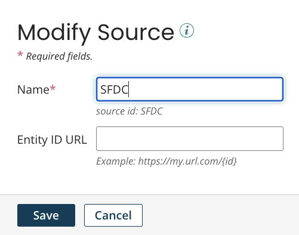
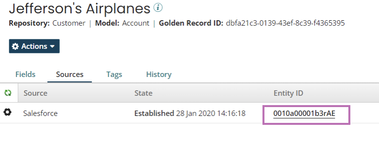

# Creating a source 

<head>
  <meta name="guidename" content="DataHub"/>
  <meta name="context" content="GUID-D788CA06-3098-446B-8AEC-A552241144A1"/>
</head>

Create a source on the Sources page for every application or system that will contribute to data and/or accept data updates. After you create a source, you can attach the source to many models and repositories. Read [Managing sources in models](/docs/Atomsphere/Master%20Data%20Hub/Modeling/hub-Sources_overview_44bc8108-64e3-48a4-a5ee-375fe9a6849b.md) for more information.

## Before you begin

To create a source, you must have administrator privileges or the following privileges:
- **MDM - Source Management**
- **MDM - View Repositories**

## Procedure

1. Navigate to the Sources page.
2. Click **Create a Source** or **Create Your First Source**.
3. In the **Name** field, enter an identifier for the source. For example, Salesforce. Names can be a maximum of 255 characters. 
4. In the **Source ID** field, enter a permanent, unique ID for the source. This is typically an abbreviation, such as SF for Salesforce. Source IDs can be a maximum of 50 characters. Allowable characters are uppercase, lowercase letters, numbers, underscore, and hyphen.

    :::note

    The Source ID is used when setting up integrations, specifically in calls to the Repository API endpoints. It is case sensitive. After creation, you cannot modify it.

    :::
    
5. **Optional**: If the source system supports direct links to data entities, enter the source’s URL format used to create source links. In the URL add the `{id}` placeholder so Boomi DataHub can insert the specific record id. For example,` https://na2.salesforce.com/{id}`. After you deploy a model and you generate golden records, you can view a link to the source’s record from the golden record in the Sources tab of a Golden Record (**Stewardship** > **Golden Records**).

    :::note

    URL templates specified in the Source tab for individual deployed models override any template specified here. This is useful in the cases of source systems supporting linking using a different URL format for each object.

    :::
    
    

5. Click **Save**.

**Next steps**: Create a model and attach sources. After you deploy a model, you can review the status of the source attachment on the Sources page. Read [Viewing source attachments](/docs/Atomsphere/Master%20Data%20Hub/Getting%20started/t-mdm-Viewing_the_list_of_domains_a_source_is_attached_b04e76fe-a3ff-4452-87ab-94dec8de7445.md) for more information about source statuses.