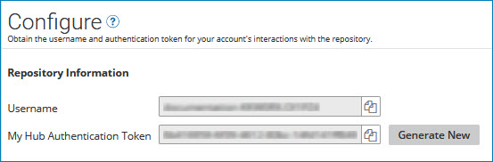

# Viewing the username and authentication token for a repository 

<head>
  <meta name="guidename" content="DataHub"/>
  <meta name="context" content="GUID-84011460-6ee7-4e96-81a2-0469f2b9cc21"/>
</head>

Any process that integrates a source system with a repository will submit service requests to the repository through its API. All API requests must authenticate via Basic Auth. The username and authentication token needed to construct API requests can be obtained from the repository **Configure** tab in Boomi DataHub.

## Procedure

1.  In the Repositories page, click the repository name.

2.  Select the **Configure** tab and note the **Username** and **My Authentication Token**.

    

## Next steps

You can click  **Copy to Clipboard** to copy the username or authentication token to the system clipboard and then paste the value where needed in your integration tool development environment — for example, a connection component for connecting to the repository from a process.