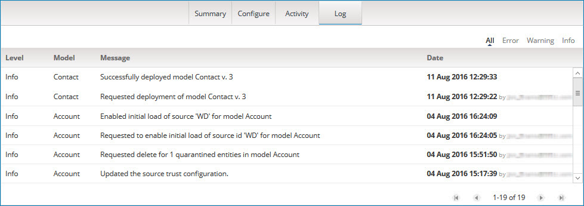

# Audit log 

<head>
  <meta name="guidename" content="DataHub"/>
  <meta name="context" content="GUID-4cb7f2e6-f9b3-4e4c-b0ce-ca94aa3c3e77"/>
</head>

To aid in managing master data, Boomi DataHub logs many user actions and system responses to those actions in an audit log.

When displayed, logged events are filtered to include only events for your account. Each logged event has an associated severity level — Error, Warning or Info. You can filter the events shown in either **Log** tab by severity level.

There are two ways in Boomi DataHub to access events logged during the past 30 days:

-   In the repository page with the repository selected, the **Log** tab shows the logged events for the repository and its deployed models under your account.

-   In the repository page with a domain selected, the **Log** tab shows the logged events for that domain.

Audit log entries are retained indefinitely. All logged events, including those logged more than 30 days prior to the current date, can be retrieved by querying the [Platform API’s audit log object](/docs/Atomsphere/Master%20Data%20Hub/REST%20APIs/r-mdm-Platform_API_368dc28d-455d-4aa2-970e-d2332c7ada83.md).

## Before you begin

You must have the following privileges to view the audit log: 

- **MDM - View Repositories**
- **MDM - View Logs**

## Audit Log Message Reference

The following events are logged:

-   **Repository property change**:

    -   Renamed repository '\(r1\)' to '\(r2\)'

-   **Model deployment request**:

    -   Requested deployment of model \(m\) v. \(version\_\#\)

-   **Model deployment response**:

    -   Successfully deployed model \(m\) v. \(version\_\#\)

     -   Failed to deploy model \(m\) v. \(version\_\#\): \(error description\)

     - Reapplying deployment for model \(m\) v.\(version\_\#\), due to a deployment failure of the previous version v.\(failed version\_\#\)

    -   Reapplying tags to all records in model \(m\) v. \(version\_\#\)

    -   Completed reapplying tags to all records in model \(m\) v. \(version\_\#\)

    -   Failed to reapply tags to all records in model \(m\) v. \(version\_\#\) \(error description\)

    -   Canceled applying tags to all records in model \(m\) v. \(version\_\#\)

-   **Model reset \(Clear Model Data\) request**:

     -   Requested reset of data and source states in model \(m\)

     -   Requested reset of data in model \(m\)

-   **Model reset \(Clear Model Data\) response**:

    -   Reset of model '\(m\)' with source and channel state reset has successfully completed. 

    -   Reset of model '\(m\)' without source and channel state reset has successfully completed.

    -   Reset of model '\(m\)' with source and channel state reset has errored due to ''\(error description\)''.

    -   Reset of model '\(m\)' without source and channel state reset has errored due to ''\(error description\)''.

-  **Model undeployment request**:

    -   Requested undeployment of model \(m\)

-   **Model undeployment response**:

    -   Successfully undeployed model '\(model component ID\)'

     -   Failed to undeploy model '\(m\)': \(error description\)

 -   **Domain source rankings change**:
 
     -   Source rankings updated

 -   **Domain default source designation change**:

        -   Default source selected

        -   Default source designation removed

-  **Source state change request**:

    -   Requested attachment of source id '\(s\)' to model \(m\)

     -   Requested to enable initial load of source id '\(s\)' for model \(m\)

    -   Requested to finish initial load of source id '\(s\)' for model \(m\)

    -   Requested removal of source id '\(s\)' from model \(m\)

    -   Requested change of \(s\) link to record '\(id\)' to PENDING state

-  **Source state change response**:

     -   Added source '\(s\)' for model \(m\)

    -   Failed to add source '\(s\)' for model \(m\): \(error description\)

     -   Deleted source '\(s\)' for model \(m\)

    -   Failed to delete source '\(s\)' for model \(m\): \(error description\)

     -   Enabled initial load of source '\(s\)' for model \(m\)

    -   Failed to enable initial load of source id '\(s\)' for model \(m\): \(error description\)

     -   Finished initial load of source id '\(s\)' for model \(m\)

    -   Failed to finish initial load of source id '\(s\)' for model \(m\): \(error description\)

-   **Channel state change request**:

     -   Requested addition of \(DIFF\|FULL\) channel \(c\) for source \(s\) in model \(m\)

    -   Requested deletion of \(DIFF\|FULL\) channel \(c\) from source \(s\) in model \(m\)

-   **Channel state change response**:

    -   Created or reset \(DIFF\|FULL\) channel \(c\) for source \(s\) in model \(m\)

    -   Failed to create or update \(DIFF\|FULL\) channel \(c\) for source \(s\) in model \(m\): \(error description\)

     -   Deleted \(DIFF\|FULL\) channel \(c\) from source \(s\) in model \(m\)

     -   Failed to delete \(DIFF\|FULL\) channel \(c\) from source \(s\) in model \(m\): \(error description\)

    -   Propagating initial deliveries to \(DIFF\|FULL\) channel \(c\) for source \(s\) in model \(m\)

     -   Completed propagating initial deliveries to \(DIFF\|FULL\) channel \(c\) for source \(s\) in model \(m\)

 -   **Staging area add request**:

        -   Requested addition of staging area '\(a\)' with id '\(id\)' for source '\(s\)'

-   **Staging area state change**:

    -   Requested name change for staging area '\(a\)' with id '\(id\)' for source '\(s\)'

     -   Staging area '\(a\)' with id '\(id\)' changed to 'READY' state

    -   Staging area '\(a\)' with id '\(id\)' changed to 'DISABLED' state. Reason: \(reason\)

    -   Staging area '\(a\)' with id '\(id\)' changed to 'DELETED' state

-   **Staging area delete request**:

    -   Requested deletion of staging area '\(a\)' with id '\(id\)' for source '\(s\)'

-   **Golden record manual update response**:

    -   Edited record '\(id\)'

-   **Golden record end-date request**:

     -   Requested end-date for \(N\) active records.

     -   Requested end-date for active records matching a filter\(s\).

-   **Golden record end-date stop request**:

    -   Requested to stop end-date of active records.

-   **Golden record purge request**:

    -   Requested purge for \(N\) end-dated records.

    -   Requested purge for end-dated records matching a filter\(s\).

    -   Requested purge for all end-dated records.

-   **Golden record purge stop request**:

    -   Requested to stop purge of end-dated records.

-   **Golden record export response**:

    -   Exported golden records for model \(m\)

 -   **Golden record unlink request**:

        -   Requested unlink of source \(s\) from record ‘\(id\)’.

-   **End-dated golden record restore response**:

    -   Restored end-dated record '\(id\)'.

-  **Delete pending channel update request**:

    -   Deleted updates from \(source\) channel

-   **Resend channel update request**:

    -   Resent record '\(id\)' to \(source\) channels

-   **Quarantine entry approval request**:

    -   Requested approval for 1 quarantined entities in model \(m\)

-   **Quarantine entry delete request**:

    -   Requested delete for all quarantined entities for source \(s\) in model \(m\)

    -   Requested delete for all quarantined entities in model \(m\)

     -   Requested delete for \(N\) quarantined entities in model \(m\)

 -   **Quarantine entry resolution request**:

        -   Requested ignore enrichment results for 1 quarantined entities in model \(m\)

        -   Requested match resolution for 1 quarantined entities in model \(m\)

        -   Requested reject for 1 quarantined entities in model \(m\)

        -   Requested restore for 1 quarantined entities in model \(m\)

        -   Requested resubmit for all quarantined entities for source \(s\) in model \(m\)

        -   Requested resubmit for all quarantined entities in model \(m\)

        -   Requested resubmit for \(N\) quarantined entities in model \(m\)

        -   Requested retry enrichment step for 1 quarantined entities in model \(m\)

-   **Quarantine entry data update request**:

    -   Requested data update for quarantined entity in model \(m\)

-   **Staged data commit request**:

    -   Requested commit of staged entities in staging area '\(a\)' with id '\(id\)' for source '\(s\)'
    
-   **Staged data delete request:**

    -   Requested deletion of staged entities in staging area '\(a\)' with id '\(id\)' for source '\(s\)'

-   **Staged data resubmit request:**

    -   Requested resubmission of staged entities in staging area '\(a\)' with id '\(id\)' for source '\(s\)'

<!-- *this list was removed because it is an older reference this is not specific like the list above* 

-   Repository name changes

-   Repository deletion

-   Model addition to or removal from an account group

-   Model deployment and, where applicable, reapplication of tags to golden records — requests and responses

-   Model reset — requests and responses

-   Model undeployment — requests and responses

-   Domain source rankings changes

-   Domain default source designation changes

-   Source state changes — requests and responses

-   Channel state changes — requests and responses

-   Staging area add and delete requests

-   Staging area name change requests

-   Staging area state changes

-   Golden record manual update actions

-   Golden record end-date and purge requests and requests to discontinue end-date and purge operations in progress.

-   Golden record export responses

-   Golden record unlink requests

-   End-dated golden record restore requests and responses

-   Channel updates for golden records — resend requests

-   Quarantine entry requests — approvals, entity data updates, deletes, match resolutions, rejections, resubmissions

-   Staged entity commit, resubmit, and delete requests -->
