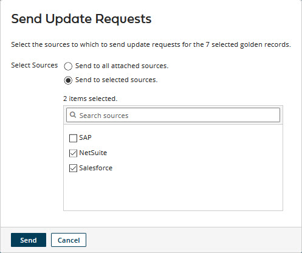
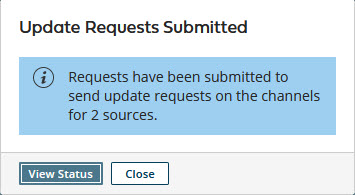

# Requesting bulk channel update requests 

<head>
  <meta name="guidename" content="DataHub"/>
  <meta name="context" content="GUID-32304f9d-c9d3-4046-84b3-c4591421ebe0"/>
</head>

Although automatically propagates source record update requests on the channels of attached sources, there can be valid reasons to request propagation of update requests in bulk.

## About this task

The following are examples of circumstances in which the capability to request propagation of bulk update requests may on occasion be useful:

-   An integration process that takes delivery of update requests fails.

-   A source system’s data is corrupted.

-   You have changed the configuration of an attached source’s channel and you want to test the changes.

:::note

Requests for propagation of bulk update requests are processed asychronously, source by source, and the processing status for each source is reported separately on the Bulk Processing Requests page \(**Reporting** \> **Bulk Processing Requests**\).

:::

## Procedure

1.  Select **Stewardship** \> **Golden Records**.

2.  In the repository/domain list, select the domain.

3.  To propagate update requests for some but not all golden records, do one of the following:

    -   In the data grid, select the check boxes of the golden records for which to propagate update requests.

    -   Filter the data grid to show only the golden records for which to propagate update requests.

4.  Click the **Send** button located immediately above the data grid and make a selection from the button’s drop-down menu as follows:

    -   If you skipped step 3, you evidently intend to request propagation of update requests for all of the domain’s active golden records — select **All**.

    -   If, in step 3, you selected check boxes of the golden records for which to propagate update requests, select **Selected**.

    -   If, in step 3, you filtered the data grid to show only the golden records for which to propagate update requests, select **All Matching Applied Filters**.

    The Send Update Requests dialog appears. The option to propagate to all attached sources is selected by default.

5.  To propagate update requests to some but not all attached sources, select **Send to selected sources** and then select those sources below.

    

6.  Click **Send**.

    The Send Update Requests dialog closes, and a bulk processing request is created for each affected source.

    The Update Requests Submitted dialog opens. The dialog indicates requests were submitted to propagate update requests on the channels for sources. The number of affected sources is indicated.

    

7.  Do one of the following:

    -   To go to the Bulk Processing Requests page to view the statuses of the new bulk requests and previously submitted bulk requests, and, optionally, to apply actions to bulk requests, click **View Status**.

    -   To return to the data grid, click **Close**.

## Next steps

:::note
        
If in step 7 you clicked **Close** and returned to the data grid, you can go to the Bulk Processing Requests page at any time by selecting **Reporting** \> **Bulk Processing Requests**.

:::