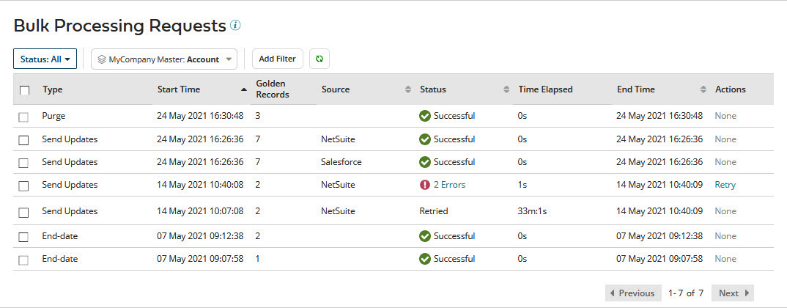
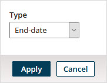
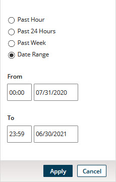
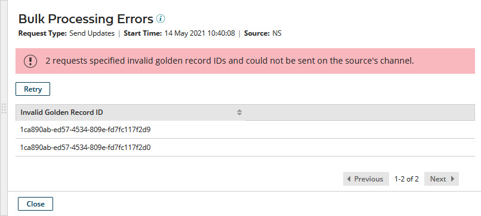

# Viewing and applying actions to bulk processing requests 

<head>
  <meta name="guidename" content="DataHub"/>
  <meta name="context" content="GUID-5f889b9a-4e1e-4b7a-93aa-011802c03ebd"/>
</head>

Bulk processing operations on golden records include end-dating, purging, and propagating source record update requests. In the Bulk Processing Requests page, you can view the status of bulk processing requests and apply actions to the requests. The available actions for a given request is dependent upon its type and status.

## Procedure 

1.  Select **Reporting** \> **Bulk Processing Requests**.

    The Bulk Processing Requests page opens.

    

    :::note
    
    You can also open the Bulk Processing Requests page by submitting a request for propagating update requests from the **Stewardship** \> **Golden Records** page and then clicking **View Status**.

    :::

2.  In the repository/domain list, select the domain.

    By default, all bulk processing requests are listed.

3.  **Optional**: To filter the bulk processing requests list by status, change the **Status** selection from All to either Processing, Errored, Successful, Submitted, Retried, or Canceled.

    To refresh the list, click **Refresh**.

    Steps 4–7 describe how to apply additional filters to the bulk processing requests list.

4.  **Optional**: To filter by request type, do one of the following:

    -   If filtering by type is not currently applied, click **Add Filter** and select the Type filter type.

    -   Otherwise, click the **Type** button for the currently applied filter.

    A dialog appears and takes focus.

    

    1.  In the **Type** list, select the type by which to filter — either End-date, Purge, or Send Updates.

    2.  Click **Apply**.

5.  **Optional**: To filter by source, do one of the following:

    -   If filtering by source is not currently applied, click **Add Filter** and select the Source filter type.

    -   Otherwise, click the **Source:** button for the currently applied filter.

    A dialog appears and takes focus.

    

    1.  In the **Source** list, select the source by which to filter.

    2.  Click **Apply**.

6. **Optional**: To filter by the date and time at which processing started, do one of the following:

    -   If filtering by the date and time at which processing started is not currently applied, click **Add Filter** and select the Start Time filter type.

    -   Otherwise, click the **Start Time:** button for the currently applied filter.

    A dialog appears and takes focus.

    

    Select one of the following from the dialog and click **Apply**:

    -   **Past Hour**

    -   **Past 24 Hour**

    -   **Past Week**

    -   **Date Range**, then type **From** and **To** dates, or click the date fields and select dates from calendars. You can optionally type or select **From** and **To** times rather than accepting the 00:00 and 23:59 defaults.

7.  **Optional**: To filter by the date and time at which processing ended, do one of the following:

    -   If filtering by the date and time at which processing ended is not currently applied, click **Add Filter** and select the End Time filter type.

    -   Otherwise, click the **End Time:** button for the currently applied filter.

    A dialog appears and takes focus.

    Select one of the following from the dialog and click **Apply**:

    -   **Past Hour**

    -   **Past 24 Hour**

    -   **Past Week**

    -   **Date Range**, then type **From** and **To** dates, or click the date fields and select dates from calendars. You can optionally type or select **From** and **To** times rather than accepting the 00:00 and 23:59 defaults.

8.  **Optional**: To retry requests of type Send Updates that either completed with errors or terminated:

    1.  Change the **Status** selection to Errored.

    2.  Do one of the following.

        -   To retry a particular request, in the Actions column for the request, click **Retry**

        -   To retry individually selected requests, select their check boxes, click **Retry** immediately above the list, and in the button’s drop-down menu, select **Selected Errored**.

        -   To retry requests to which you applied additional filtering, as described in steps 4–7, click **Retry** immediately above the list, and in the button’s drop-down menu, select **All Errored Matching Applied Filters**.

        -   To retry all requests that either completed with errors or terminated, click **Retry** immediately above the list, and in the button’s drop-down menu, select **All Errored**.

    3.  In the confirmation dialog, click **OK**.

    4.  In the status box, click **Close**.

        The page automatically refreshes to reflect the change in the status of each selected request to Retried and the creation of a new request for each selected request.

        -   If processing of an original request completed with errors, the corresponding new request specifies only the IDs of the golden records for which update requests were not propagated.

        -   If processing of an original request terminated, the corresponding new request specifies the IDs of all golden records specified in the original request.

        :::note
        
        You can also retry a request by clicking **Retry** in the Bulk Processing Errors detail view.

        :::

9.  **Optional**: To cancel requests having a status of Processing, select their check boxes, click **Cancel**, and in the button’s drop-down menu, select **Selected Processing**.

    The page automatically refreshes to reflect the change in the status of each selected request to Canceled.

10. **Optional**: To view detail for a request of type Send Updates for which processing completed with errors or terminated, click the error count in the Status column.

    The Bulk Processing Errors detail view opens.

    -   For a request for which processing completed with errors, each invalid golden record ID is listed.

    -   For a request for which processing terminated, 500 invalid golden record IDs are listed.

    

    To close the detail view, press **Esc**, click **Close**, or click elsewhere in the Bulk Processing Requests page.