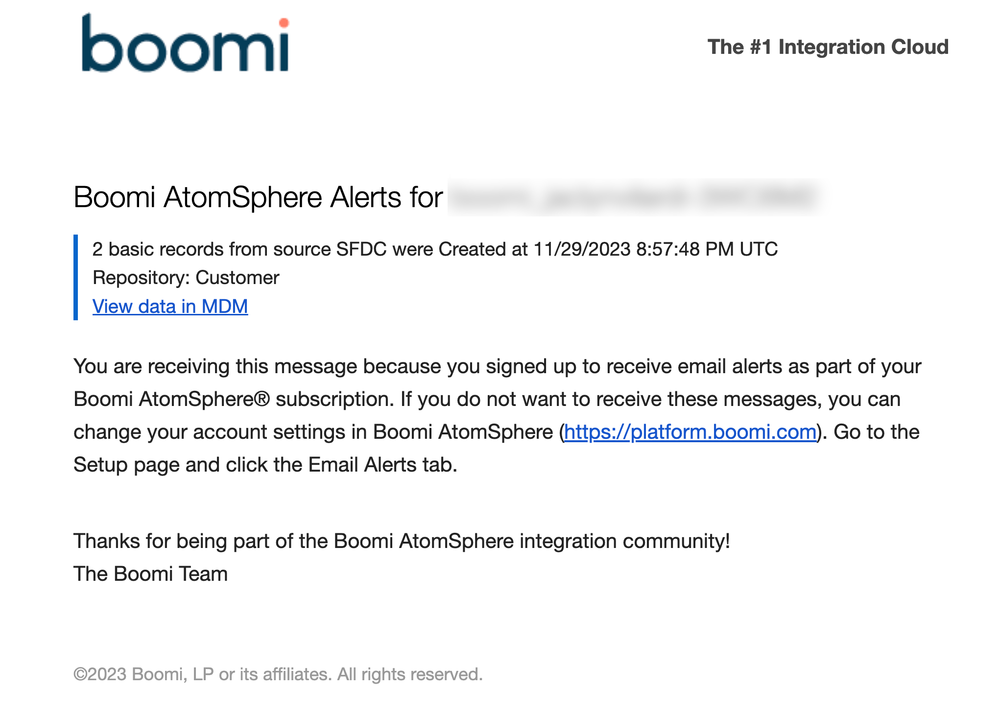

# Adding an email alert 

<head>
  <meta name="guidename" content="DataHub"/>
  <meta name="context" content="GUID-76a1dd73-caa8-4f7e-a43f-bb0c3d7ca1fe"/>
</head>

In your Boomi Enterprise Platform account, you can configure the platform to send you an email notification when certain events occur in Boomi DataHub. Emails are sent to the email address associated with your Boomi user account. You can specify which actions generate notifications. Email alerts you subscribe to only apply to your user for a specific Boomi account.

Email alerts are helpful when team members need to monitor changes and errors in Boomi DataHub. In addition to email alerts, you can also review the audit log for a more comprehensive view of past actions. 

You can click **View Data in MDM** in the email to view the data in the appropriate Boomi DataHub screen to gain additional insight. When a user sets a time zone on the User Information tab, email messages use that time zone for dates and times.

You can specify notifications to trigger based on actions in a specific repository, model, and/or source. You can also limit notifications for specific events. You can set notifications to trigger when the following actions occur:
- Record created
- Record end-dated
- Record quarantined
- Errors while processing batches of incoming source entities. 

## Email notification timing

If an event triggers a notification, you’ll receive the notification within 15 minutes from the time of the event. Alerts that occur within the 15-minute period are grouped together by Source and event type. If your account generates an unusually large volume of events during a single 15-minute interval, the platform may send additional emails to fully report all events that occurred.

## Procedure

:::note

You cannot select a different account when editing an existing subscription.

 :::

1.  Log in to the Boomi Enterprise Platform as the user who will receive the email alert. You cannot set alerts for another user.

2.  Navigate to **Settings** > **User Information**. 

3.  Select **Email Alerts**.

4.  Select the **Hub** sub-tab.

5.  Click **Add Email Alert**.

6.  Click the **Browse** icon and enter part of your account name into the search box. Your account name is listed in the Account Information screen in Settings. 

7.  Click **Search**.

8.  Select your account.

9.  Click **OK**. 

10. **Optional**: Select a repository. Only events in the specified repository trigger notifications.
    1. **Optional**: Select a model. Only events for the specified model in the repository trigger notifications. 

11. **Optional**: Select a source. Only events related to the specified source trigger notifications.

12. **Optional**: Select one of the following to specify which events trigger a notification:
    - **All** - all event types (create record, end-date, quarantine, and batch errors).
    - **Create Record** - golden record is created. Specifies the domain, repository, source, and time the record was created.
    - **End-date Record** - golden record is end-dated.
    - **Quarantine Record** - golden record is quarantined.
    - **Batch Error** - errors occurred while processing incoming source entity batches.

    Only specified events trigger notifications. If you select Quarantine Record, select one of the following: 
    - **Data Incorporation Error** - quarantine errors during incorporation into the selected domain. 
    - **Data Integration Error** - quarantine due to failure to structurally conform with the field layout specified in the    domain’s model.
    - **Data Quality Error** - quarantine due to a data step quality failure.
    - **Data Validation Error** - quarantine due to failure of data to conform to specified field type, omission of required fields, or multiple collection items with the same key field values.
    - **Matching Error** - quarantine error related to matching, including potential duplicates, ambiguous matches, and unresolvable references.
    - **Requires Approval** - quarantine due to a manual approval requirement.

13. Click **OK**.

    The new subscription appears in the list in the **Hub** sub-tab.