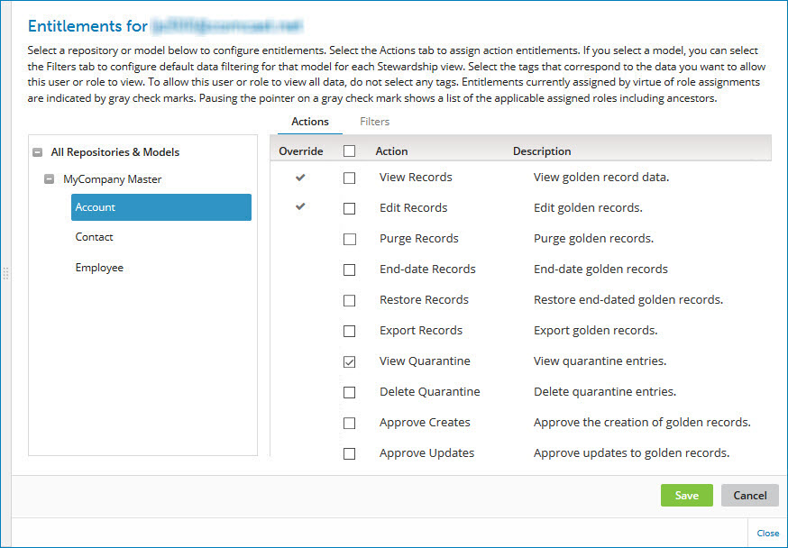

# Assigning entitlements to a custom role 

<head>
  <meta name="guidename" content="DataHub"/>
  <meta name="context" content="GUID-70155027-2226-4cab-8477-caacf0c1f365"/>
</head>

An entitlement is a Boomi DataHub-specific right reserved to a role. In order to be assigned entitlements, a user must first be assigned a role with the MDM - Stewardship privilege.

## Procedure

1.  Select **Settings** \> **Account Information and Setup**.

    A confirmation dialog appears.

2.  Click **OK**.

3.  From the Settings page, select **User Management** tab.

4.  Select the **Hub Role Entitlements** sub-tab.

    

5.  In the Entitlements column for the custom role to which you want to assign entitlements, click the gear icon ****.

    The role Entitlements dialog appears.

    

6.  Select action entitlements for users with this role:

    Entitlements assigned to a parent or ancestor role are indicated by a gray check mark in the Override column.

    Action entitlements cascade downward: Entitlement assignments made at the top level, All Repositories & Models, are applicable to all repositories and domains, and these assignments cascade down to both the repository and domain levels. Entitlement assignments made at the repository level cascade down to the domain level. You should therefore first evaluate the need for entitlement assignments at the top level.

    1.  **Optional:** To select entitlements applicable to all repositories and their hosted domains, select **All Repositories & Models** in the left-hand list, and in the right-hand list, select the check boxes for the desired entitlements.

        -   Selecting **Edit Records**, **Purge Records**, **End-date Records**, **Restore Records**, or **Export Records** also selects **View Records**.

        -   Selecting **Delete Quarantine**, **Approve Creates**, **Approve Updates**, **Approve End-dating**, **Reject Quarantine**, **Resubmit Quarantine**, **Edit Quarantine**, or **Match Quarantine** also selects **View Quarantine**.

        -   Selecting **Delete Staged Data**, **Resubmit Staged Data**, or **Commit Staged Data** also selects **View Staged Data**.

    2.  **Optional:** To select entitlements applicable to all domains hosted in a particular repository, select the repository in the left-hand list, and in the right-hand list, select the check boxes for the desired entitlements.
   
    3.  **Optional:** Repeat step b for each additional repository for which you want to select repository-wide entitlements.

    4.  **Optional:** To select entitlements applicable to a particular domain, select the domain in the left-hand list under the hosting repository, and in the right-hand list, select the check boxes for the desired entitlements.

    5.  **Optional:** Repeat step d for each additional domain for which you want to select domain-specific entitlements.

        :::note
        
        To assign tag-based entitlements for viewing a domain’s golden records \(step 7\), you must first assign the View Records action entitlement for that domain, its hosting repository or all repositories. Similarly, to assign tag-based entitlements for viewing a domain’s quarantine entries \(step 8\), you must first assign the View Quarantine action entitlement for that domain, its hosting repository or all repositories.

        :::

7.  **Optional:** Select domain-specific tag-based entitlements for users with this role for viewing golden records:

    1.  In the left-hand list, select a domain for which you want to assign entitlements.

    2.  Select the **Filters** tab.

        Entitlements assigned to a parent or ancestor role are indicated by a gray check mark adjacent to the entitlement’s check box.

    3.  Select the Data View check boxes for the tags by which the data grid in the **Golden Records** page \(**Stewardship** \> **Golden Records**\) is to be filtered by default.

        

    4.  **Optional:** Repeat steps a–c for each additional domain for which you want to assign tag-based entitlements for viewing golden records.

        :::note
        
        Domain-specific tag-based entitlements specify “allow-listed” tags. To prevent default filtering of golden records by tag for a domain, do not select Data View check boxes for that domain.

        :::

8.  **Optional:** Select domain-specific tag-based entitlements users with this role for viewing quarantine entries:

    1.  In the left-hand list, select a domain for which you want to assign entitlements.

    2.  Select the **Filters** tab.

        Entitlements assigned to a parent or ancestor role are indicated by a gray check mark adjacent to the entitlement’s check box.

    3.  Select the Quarantine View check boxes for the tags by which the quarantine entries list in the **Quarantine** page \(**Stewardship** \> **Quarantine**\) is to be filtered by default.

    4.  **Optional:** Repeat steps a–c for each additional domain for which you want to assign tag-based entitlements for viewing quarantine entries.

        :::note

        Domain-specific tag-based entitlements specify “allow-listed” tags. To prevent default filtering of quarantine entries by tag for a domain, do not select Quarantine View check boxes for that domain.

        :::

9.  Click **Save**.

10. To switch back to the Boomi DataHub service, select Boomi DataHub in the Boomi services menu.