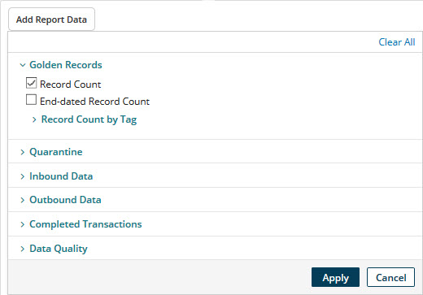

# Building and viewing historical reports 

<head>
  <meta name="guidename" content="DataHub"/>
  <meta name="context" content="GUID-d1f0a63e-0800-4efb-b3e9-70bce2162911"/>
</head>

Building and viewing historical reports are routine master data governance tasks.

## Procedure

1.  Select **Reporting** \> **Historical**.

    The historical reporting page loads.

2.  Select the report scope:

    1.  If you are an administrator of a primary account, optionally select an account group.

    2.  In the repositories and models list, select all repositories or an individual repository.

    3.  If you select an individual repository, optionally select an individual model \(domain\).

    4.  If you select an individual model, optionally select one of its sources in the next list.

3.  Click **Add Report Data**.

    A dialog is revealed. The dialog contains check boxes for selecting data types.

    

4.  Select the check box for each data type you want to include in the report.

    Breakdowns are not available for multiple-data type reporting, source-level reporting, or model-level reporting of golden record counts.

    Mean, minimum count, maximum count, and median metrics are not available for multiple-data type reporting or for single-data type reporting with data point breakdown.

5.  Click **Apply**.

    The dialog closes, and the report displays. The selected data types are listed below the **Add Report Data** button. This list is a color-coded legend to the data points in the report. You can deselect a data type by clicking **** in its list entry.

    If only one data type is selected, the mean, minimum count, maximum count, and median are shown. The total count is shown as well if the selected data type is Quarantine **Entries Created** \(total or by Cause\), Quarantine **Entries Resolved** \(total or by method of resolution\), **Inbound Data**, or **Completed Transactions** \(total or by Result\).

6.  **Optional**: If you selected only one data type and data point breakdown is available given your scope selection, you can view the breakdown in the report. To do this:

    1.  Select **Breakdown by …**.

        

    2.  **Optional**: To omit an account, repository, model (domain), or source from the breakdown, clear its check box.

7.  Select the reporting interval and period — set **Most Recent**:

    -   **7d** — daily during the seven-day period ending yesterday.

    -   **1m** — daily during the one-month period ending yesterday — for example, June 11-July 10.

    -   **6m** — weekly \(Monday-Sunday\) during the six-month period ending last Sunday.

    -   **1y** — monthly during the one-year period ending yesterday.

    -   **Custom** — set the **Start Date** and **End Date** for the reporting period. The reporting interval automatically adjusts to accommodate the length of the specified period.

8.  Select the report format — click one of the following icons:

    -   ** View Line Chart**.

    -   ** View Bar Chart**.

    -   ** View Stacked Bar Chart**

    -   **View Tabular Data**