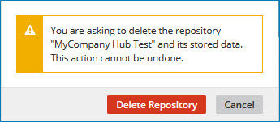

# Deleting a repository 

<head>
  <meta name="guidename" content="DataHub"/>
  <meta name="context" content="GUID-3b3bb2e6-f7a1-4f97-b702-d57ad89eac0b"/>
</head>

Administrators can delete a repository that does not contain deployed models.

## Before you begin

Before deleting a repository, you must undeploy all models attached to it. Read [Undeploying a model](/docs/Atomsphere/Master%20Data%20Hub/Governance/t-mdm-Undeploying_a_model_eb99bcbd-2998-4ade-ae82-0980e43de183.md) to learn more.

:::caution
When you delete a repository, all attached records are deleted and cannot be restored.
:::

## Procedure

1.  In the Repositories page, on the summary card for the repository you want to delete, click the **** icon and in the drop-down menu, select **Delete**.

    A confirmation dialog appears.

    

2.  Click **Delete Repository**.