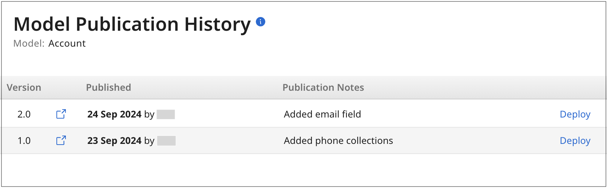
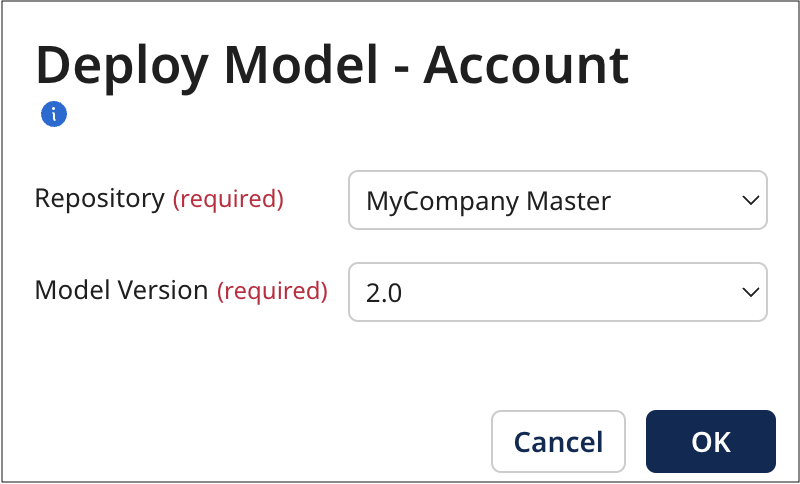
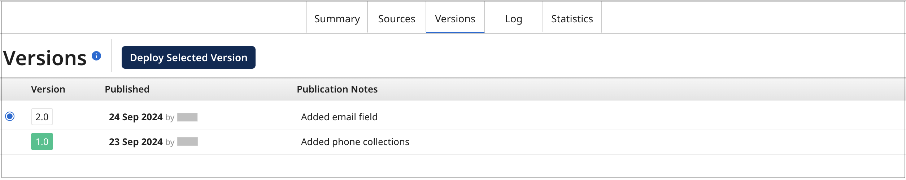

# Deploying a newer or older version of a model 

<head>
  <meta name="guidename" content="DataHub"/>
  <meta name="context" content="GUID-1ebf8753-8993-48f7-a73c-2ee5e26ff0fc"/>
</head>

Master data models evolve with changing requirements. You can deploy an older or newer version of a model as you need. However, deploying a newer or older version of a model where fields have been added or deleted may result in data loss. This means that some previously stored data may no longer be available, or you may lose access to data that was previously accessible.

## Before you begin​

You must have the following privileges to deploy a model in the repository:

- MDM - View Repositories

- MDM - Model Deployment 

## Model Deployment Options

You have two options: you can [deploy a model](../Deployment/t-mdm-Deploying_a_model_to_a_repository_4e36910d-ac80-4a04-b600-7dd9ed621444.md) from the Models or Repository pages, which allows you to roll back to older versions or move forward to newer ones. You can only deploy published models. 

### Deploying a version from the Models page

1. Navigate to the **Models** page.

2. Do one of the following

    - Click on domain model’s **version** number.
    
    - Select **View Publication History** in the source’s gear icon  menu.

3. In the model summary list, click **Deploy** for the version you need to deploy.

4. In the **Repository** list, select the repository you want to deploy.

5. In the **Model Version** list, select the version of the model to deploy.

6. Click **OK**.

### Deploying a version from the model’s Version tab

1. In the **Repositories** > repository page, select the deployed model.

2. Click **Versions**.

3. In the version summary list, click the radio button for the version you need to deploy.

4. Click **Deploy Selected Version**.

   When the deployment is completed, the version number is highlighted in green.
   
   The color highlighting on the version number indicates the deployment status: 
   
   - A **green** color indicates a currently deployed version.
   
   - The **red** color indicates a deployment failure. Navigate to the **Log** tab in the Repository > deployed model page to view the reason for the failure. Refer to [Audit Log](/docs/Atomsphere/Master%20Data%20Hub/Governance/c-mdm-Audit_log_4cb7f2e6-f9b3-4e4c-b0ce-ca94aa3c3e77) to learn more. If there is no domain data or you do not need the data, you may be able to recover from the failure by selecting the domain Summary tab and clicking [Clear Model Data](../Governance/t-mdm-Clearing_data_for_a_domain_ab21c86f-7f4b-4416-825b-f926afbd05e0.md). If you cannot recover from the failure, contact Support.
   
5. Click the  icon to view the model page for that version.
