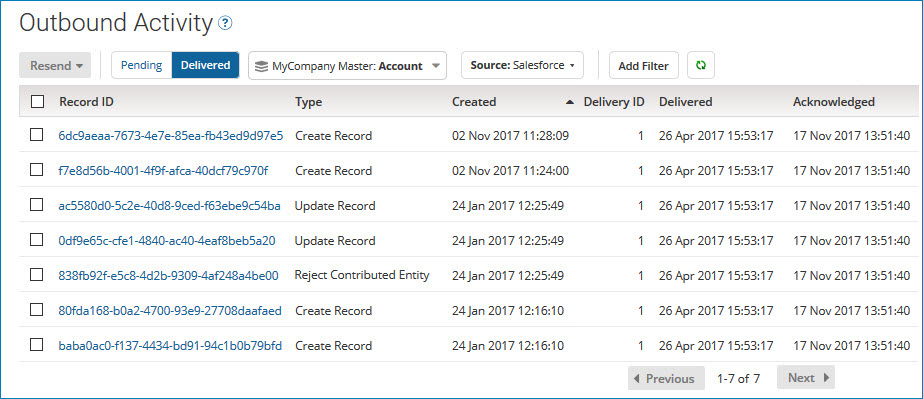

# Resending channel update requests 

<head>
  <meta name="guidename" content="DataHub"/>
  <meta name="context" content="GUID-bd6d18d0-9f68-46f4-aed5-ba75588d0de3"/>
</head>

After an integration process takes delivery of source record update requests from a source’s channel, the requested updates to some or all of the targeted source records may fail to occur. After you correct the issue that prevented the updates, you can manually propagate update requests for individual golden records so that the requests can again be retrieved by the process. While in this situation you could instead update the source system directly, manually propagating requests from Boomi DataHub is preferable from the standpoint of maintaining data integrity.

## About this task

Requested updates can fail to occur due to problems with the process, the source system, or both. The process might be improperly designed or it may have failed to execute as designed.

As is the case with automatically propagated requests, a manually propagated request reflects the current version of the associated golden record except in the case of a Reject Duplicate operation. In that case a manually propagated request contains the rejected entity.

:::note

If you need to ensure each delivered batch is successfully routed to the source system before requesting delivery of the next batch, consider using the Boomi Master Data Hub connector’s manual acknowledgment option. If manual acknowledgment is enabled, the connector sets the dynamic process property mdm-current-delivery-id to the delivery ID of the most recently delivered batch. If you need to ensure no more than one update request is delivered per request, consider using the Hub connector’s option to fetch single update requests.

:::

## Procedure

1.  In the Outbound Activity page \(**Reporting** \> **Outbound Activity**\), click **Delivered**.

    Each list entry represents a delivered and acknowledged update request.

    

2. In the adjacent list, select the repository and domain for which you want to manually propagate update requests.

3. In the sources list, select the domain source for which you want to manually propagate update requests.

4.  **Optional:** To filter the list, apply filters as described in steps 5–7 and 10 in the Related task for viewing outbound activity reports.

    When you apply multiple filters, the filters are “AND’ed”. For example, filtering on the operation type Update Record and created date of Past 24 Hours selects update requests of type Update Record that were created in the past 24 hours.

5.  **Optional:** If you want to manually propagate only some of the listed update requests, select the check box for each such update request.

6.  Do one of the following:

    -   If in step 5 you selected individual update requests, to initiate resend requests applicable to those update requests, click **Resend** and in the menu, select **Selected**.

    -   To initiate resend requests applicable to update requests that match the applied filter\(s\), click **Resend** and in the menu, select **All that Match Applied Filter**.

    -   To initiate resend requests applicable to all delivered update requests, click **Resend** and in the menu, select **All Deliveries**.

7.  In the confirmation dialog, click **OK**.

    -  For each golden record having an established link to the source, an update request specifying an Update or Delete operation is propagated. If an update request containing an entity representing the same golden record is already pending on the channel, the new request effectively replaces or is merged into the existing request, depending on whether the channel is configured to propagate entities that contain all fields or only changed fields. If the new request specifies a Delete operation and the existing request specifies an Update operation, the existing request is changed to specify a Delete operation.

    -   For each golden record having a pending link to the source, a request specifying a Create Record operation is propagated.

        :::note
        
        The Golden Records page, accessed through the Stewardship menu, provides another way to manually propagate a single Create Record, Update Record, or Delete Record update request: In the detail view for the created, updated, or end-dated golden record, select the **Sources** tab, and in the gear icon **** menu for the target source of the update request, select **Resend Channel Update**. Then in the confirmation dialog, click **OK**.

        

        :::