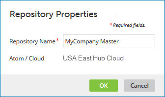

# Renaming a repository 

<head>
  <meta name="guidename" content="DataHub"/>
  <meta name="context" content="GUID-b4c79761-5485-4eaf-b40e-6fe98d44d08a"/>
</head>

You may decide before or after deploying models to a repository that you want to improve its name.

## Procedure

1.  In the Repositories page, on the summary card for the repository you want to rename, click the **** icon and in the drop-down menu, select **Properties**.

    The Repository Properties dialog opens.

    

2.  In the **Repository Name** field, type the new name.

3.  Click **OK**.