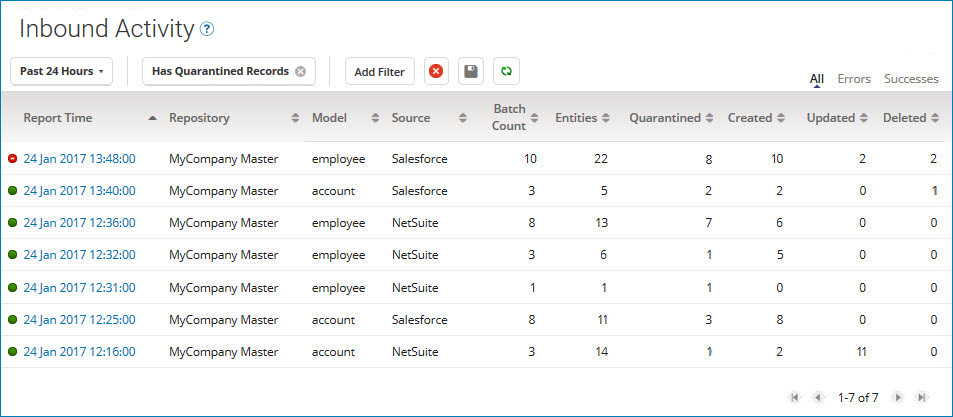
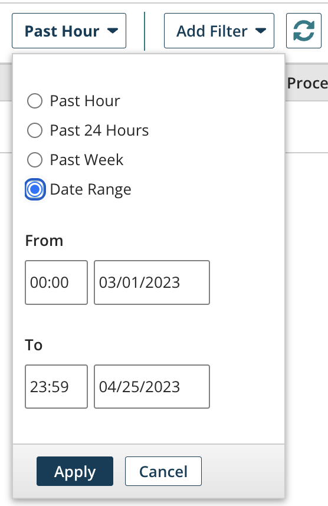
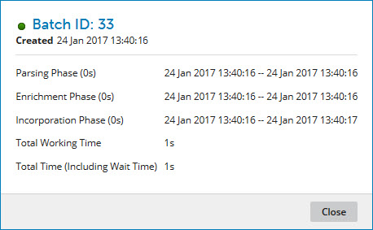
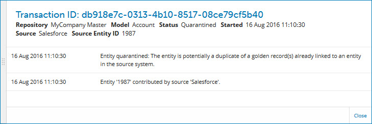

# Viewing inbound activity reports 

<head>
  <meta name="guidename" content="DataHub"/>
  <meta name="context" content="GUID-e821eb13-02df-4d4b-9df3-4f88c391cdda"/>
</head>

Viewing reports on processed batches of incoming source entities is a routine master data governance task.

## Before you begin

Masked values are visible if you have one of the following user permissions:, including originally submitted XML data:
 
- **MDM - Privileged Data Steward** role
- **MDM - Administrator** role
- **MDM - Reveal Masked Data** privilege
- **MDM - Data Steward** role (or **MDM - Stewardship** privilege) and the **Reveal Masked Data** Hub entitlement (available with the Advanced Security feature)

## Procedure

1.  Select **Reporting** \> **Inbound Activity**.

    The Inbound Activity page opens.

    

    By default inbound activity reports for the past hour are listed unless a different time span has been explicitly saved as the default. Each listed report is specific to a repository, domain and source for inbound activity — both ordinary batches and staged batches — for which processing concluded during a one-minute span. You can apply a different time span filter or other filters to the reports list.

    After receiving a small entity batch, Boomi DataHub may wait several seconds to receive additional batches. In this scenario, Boomi DataHub combines small batches and applies a single batch ID when processing.

    You can refresh the list by clicking ** Refresh**.

    :::note
    
    For information about the content of batch reports, see the Inbound Activity topic, linked below.

    :::

2.  **Optional:** To apply a different time span filter to the reports list, click the time span filter button, select one of the following from the dialog and then click **Apply:**

    

    -   **Past Hour**

    -   **Past 24 Hours**

    -   **Past Week**

    -   **Date Range**, then type **From** and **To** dates, or click the date fields and select dates from calendars. You can optionally type or select **From** and **To** times rather than accepting the 00:00 and 23:59 defaults.

        Steps 3–8 describe how to apply additional filtering to the reports list. Each step relates to a particular filter type.

        While one of these types of filters is applied, a button for that filter appears to the left of the **Add Filter** button. The button’s label shows the specified criterion — for example, **Source:** \(source name\).

    -   To clear one of these types of filters, click  on the filter’s button.

    -   To clear all of these types of filters, click ** Clear All Filters**.

    -   To save the currently applied filters as defaults for application to the reports list when Batch Reporting reloads, click ** Save current filters as default view**.

3.  **Optional**: To filter the reports list by repository, do one of the following

    -   If the list is not currently filtered by repository, click **Add Filter** and select the Repositories filter type.

    -   Otherwise, click the **Repositories:** button for the currently applied filter.

    A dialog appears and takes focus.

    

    1.  Select the check boxes for the repositories by which to filter.

    2.  Click **Apply**.

    If you want to see results for all repositories, do not apply this filter.

4.  **Optional**: To filter the reports list by domain, do one of the following:

    -   If the list is not currently filtered by domain, click **Add Filter** and select the Model filter type.

    -   Otherwise, click the **Model:** button for the currently applied filter.

    A dialog appears and takes focus.

    

    1.  In the **Model** list, select the domain by which to filter.

    2.  Click **Apply**.

5.  **Optional**: To filter the reports list by source, do one of the following:

    -   If the list is not currently filtered by source, click **Add Filter** and select the Source filter type.

    -   Otherwise, click the **Source:** button for the currently applied filter.

        A dialog appears and takes focus.

        

    1.  In the **Source** list, select the source by which to filter.

    2.  Click **Apply**.

6.  **Optional**: To filter the reports list by batches from which entities were quarantined, click **Add Filter** and select the Has Quarantined Records filter type.

7. **Optional**: To filter the reports list by batches from which golden records originated, click **Add Filter** and select the Has Created Records filter type.

8.  **Optional**: To filter the reports list by batches which resulted in the deletion of golden records, click **Add Filter** and select the Has Deleted Records filter type.

9.  **Optional**: To filter the reports list by batch processing result, click **Errors** or **Successes**.

    :::note
    
    To clear this filter, click **All**.

    :::

10. **Optional**: To see details about a report, click the report’s Report Time link in the reports list.

    The Batch Report detail view opens. In this view each line represents a batch.

    

11. **Optional**: Do any or all of the following:

    -   To view processing details for a batch, in its **Actions ** menu, select **Batch Processing Details**.

        The Batch Processing Details dialog appears.

        

    -   To resubmit a batch, in its **Actions ** menu, select **Resubmit Batch**, and then in the confirmation dialog, click **OK**.

    -   To view a report on the execution of the process that submitted a batch, if applicable, in the batch’s **Actions ** menu, select **View Process Execution**.

        Integration opens in a new browser tab or window and loads the Process Reporting page. The process execution results table is filtered to show only the relevant execution.

12. **Optional:** To view details about a batch, click the batch’s Created At link in the batches list

    The batch detail view opens. In this view each line represents an entity.

    

13. **Optional:** Do any or all of the following

    -   To view batch-level processing details, in the ** Actions** menu, select **Batch Processing Details**.

        The Batch Processing Details dialog appears.

    -   To resubmit the batch, in the ** Actions** menu, select **Resubmit Batch**, and then in the confirmation dialog, click **OK**.

    -   To view a report on the execution of the process that submitted the batch, if applicable, in the ** Actions** menu, select **View Process Execution**.

        opens in a new browser tab or window and loads the Process Reporting page. The process execution results table is filtered to show only the relevant execution.

    -   To view processing details for an entity, in its **Actions ** menu, select **Entity Processing Details**.

        The Entity Processing Details dialog appears.

        

    -   To view an entity’s data, in the entity’s **Actions ** menu, select **View Entity**.

        The Batch Entity dialog appears. In the Fields tab the values reflect the results of successfully applied data quality steps, if any.

        

        Select the **Submitted XML** tab to view the originally submitted entity data in the native XML format of the incoming batch.

        

    -   To view details for the golden record that was created, updated or end-dated as a result of the processing of an entity, if applicable, in the entity’s **Actions ** menu, select **View Golden Record**.

    -   To view details about the transaction associated with an entity, in the entity’s **Actions ** menu, select **View Transaction Details** \(not available for staged entities\).

        

        When you are done viewing transaction details, close the transaction detail view — either press **Esc**, click **Close** or click elsewhere in Batch Reporting.

14. **Optional:** When you are done reviewing the batch and entity details, do one of the following:

    -   Close the batch detail view — either press **Esc**, click **Close** or click elsewhere in the Inbound Activity page.

    -   Navigate to detail for the previous batch in the batches list — click ** Previous** \(or press the **Up arrow** key\).

    -   Navigate to detail for the next batch in the batches list — click **Next ** \(or press the **Down arrow** key\).

15. **Optional:** When you are done reviewing the report details, do one of the following

    -   Close the report detail view — either press **Esc**, click **Close** or click elsewhere in the Inbound Activity page.

    -   Navigate to detail for the previous report in the reports list — click ** Previous** \(or press the **Up arrow** key\).

    -   Navigate to detail for the next report in the reports list — click **Next ** \(or press the **Down arrow** key\).