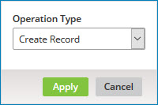
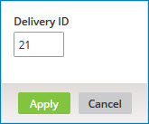

# Viewing outbound activity reports

<head>
  <meta name="guidename" content="DataHub"/>
  <meta name="context" content="GUID-3ecbe86f-b4a9-4d49-9f77-2b1e574d9309"/>
</head>

Outbound activity refers to fetching by Boomi DataHub to Source integrations of pending source record update requests from a source’s channel and acknowledgment of the delivery of batches of previously fetched update requests. Note that delivery is a pre-requisite but not a guarantee of successful application of requested updates to the source system.

## Before you begin

Masked values are visible if you have one of the following user permissions:

- **MDM - Privileged Data Steward** role
- **MDM - Administrator** role
- **MDM - Reveal Masked Data** privilege
- **MDM - Data Steward** role (or **MDM - Stewardship** privilege) and the **Reveal Masked Data** Hub entitlement (available with the Advanced Security feature)

## Procedure

1. Select **Reporting** \> **Outbound Activity**.

    By default each list entry represents a pending update request for the selected source attached to the selected domain hosted by the selected repository. The repository, domain, and source selections persist across instances of the loading of the page, even across sessions.

    

    You can manually refresh the list by clicking ** Refresh**.

2. **Optional:** To view delivered and acknowledged update requests, rather than pending requests, click **Delivered**. Otherwise, continue with step 3.

3. **Optional:** To view update requests for a different repository and domain, select the repository and domain from the list.

4. **Optional:** To view update requests for a different source’s channel, select the source from the list.

    Steps 5–10 describe how to apply filtering to the update requests list. Each step relates to a particular filter type.

    While a filter is applied, a button for that filter appears to the left of the **Add Filter** button. The button’s label shows the specified criterion — for example, **Created:** Past 24 Hours.

    - To clear a filter, click  on the filter’s button.

    - To clear all filters, click ** Clear All Filters**.

    When you apply multiple filters, the filters are “AND’ed”. For example, filtering on operation type of Update Record and a created date within the past 24 hours selects update requests of type Update Record created within the past 24 hours.

5. **Optional:** To filter by operation type, do one of the following:
  
    - If filtering by operation type is not currently applied, click **Add Filter** and select the Operation Type filter type.

    - Otherwise, click the **Type** button for the currently applied filter.

        A dialog appears and takes focus.

        

    1. In the **Operation Type** list:

        - To filter by requests specifying create operations, select Create Record.

        - To filter by requests specifying update operations, select Update Record.

        - To filter by requests specifying delete operations, select Delete Record.

        - To filter by requests specifying restore record operations, select Restore Record.

        - To filter by requests specifying reject contributed entity operations, select Reject Contributed Entity.

    2. Click **Apply**.

7. To filter by golden record ID, do one of the following:

    - If filtering by created date is not currently applied, click **Add Filter** and select the Created Date filter type.

    - Otherwise, click the **Created:** button for the currently applied filter.

    A dialog appears and takes focus.

    

    Select one of the following from the dialog and then click **Apply**

    - **Past Hour**

    - **Past 24 Hours**

    - **Past Week**

    - **Date Range**, then type **From** and **To** dates, or click the date fields and select dates from calendars. You can optionally type or select **From** and **To** times rather than accepting the 00:00 and 23:59 defaults.

8. **Optional:** To filter by golden record ID, do one of the following:

    - If filtering by golden record ID is not currently applied, click **Add Filter** and select the Golden Record ID filter type.

    - Otherwise, click the **Golden Record ID:** button for the currently applied filter.

        A dialog appears and takes focus.

        

    1. In the **Golden Record ID** field, type the golden record ID.

    2. Click **Apply**.

9. **Optional:** If you are viewing pending update requests, to view only held requests, click Add Filter and select the Held filter type.

10. **Optional:** If you are viewing pending update requests, to view only update requests that are not held, click **Add Filter** and select the Not Held filter type.

11. **Optional:** If you are viewing delivered update requests, to filter by delivery ID, do one of the following:

    - If filtering by delivery ID is not currently applied, click **Add Filter** and select the Delivery ID filter type.

    - Otherwise, click the **Delivery ID:** button for the currently applied filter.

    A dialog appears and takes focus.

    

    1. In the **Delivery ID** field, type the delivery ID.

    2. Click **Apply**.

12. **Optional:** To view details for a created, updated, or end-dated golden record, click its title or ID.

    The detail view opens, as described in step 13 in the Related task about viewing domain data.

    

13. **Optional:** When you are done reviewing the golden record details, press **Esc**, click **Close** or click elsewhere in the Outbound Activity page.