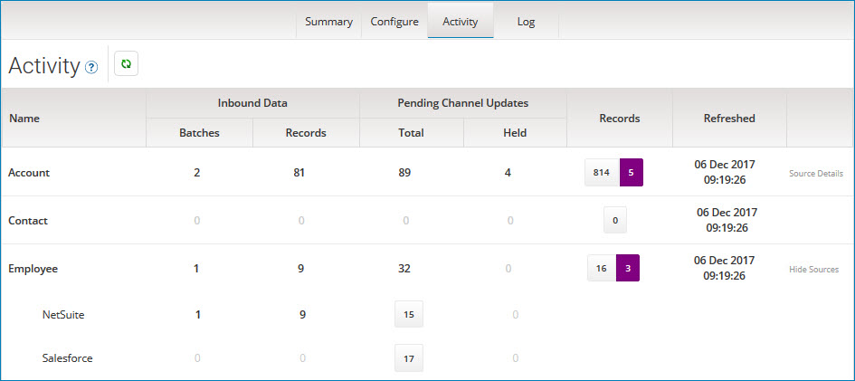

# Viewing pending activity for a repository 

<head>
  <meta name="guidename" content="DataHub"/>
  <meta name="context" content="GUID-8d83f96b-8396-4332-bb44-684ec053896c"/>
</head>

Viewing pending activity for a repository is a routine master data governance task.

## Procedure

1.  Do one of the following:

    -   In the repository page, select the **Activity** tab.

    -   Navigate to the **Activity** tab by clicking an activity icon —  \(high-level\),  \(medium-level\),  \(low-level\), or  \(none\) — in any of the following locations:

        -   summary card in the Repositories page

        -   domains summary list on the **Summary** tab in the repository page

        -   source attachments summary list on the **Sources** tab for a domain in the repository page

        

    Refer to the related Reference for the **Activity** tab to learn the meanings of the pending counts.

2.  **Optional:** To view pending counts by source for a domain, click **Source Details** for that domain.

    When you are done click **Hide Sources** to collapse the row.