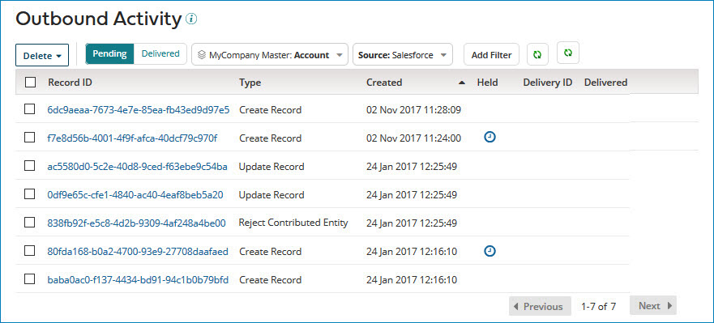

# Viewing pending channel update requests for a domain source 

<head>
  <meta name="guidename" content="DataHub"/>
  <meta name="context" content="GUID-225c545e-5802-43e7-a19a-60f4c5c81c73"/>
</head>

In the Outbound Activity page, you can review pending channel updates for the selected source.  Administrators can routinely review updates that are waiting to be delivered to the source so that they can identify issues. For example, a significant amount of pending deliveries could indicate a delivery failure.

## Procedure

1.  Navigate to **Reporting** > **Outbound Activity**. Each list entry represents a pending channel update request.

    

2.  **Optional:** Filter the requests. Applying multiple filters combines the filter criteria with an AND operator. For example, filtering on Operation Type of Update Record and applying the Held filter selects update requests that are held and of type Update Record.

3. Click the **Record ID** to view the golden record details. The detailed view contains all golden record fields. Even if a source is configured to exclude specific fields in a channel update or to accept only changed fields, all fields display here. You can use the [Fetch Channel Updates API endpoint](/docs/Atomsphere/Master%20Data%20Hub/REST%20APIs/r-mdm-Fetch_Channel_Updates_403852dd-1ebe-4cca-861f-8d423f6415a9.md) to view the fields included in the channel update.  
4. Click **Close** or press **ESC** on your keyboard.