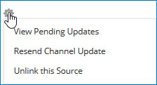

# Viewing pending channel update requests for a golden record 

<head>
  <meta name="guidename" content="DataHub"/>
  <meta name="context" content="GUID-ac780ce2-93a7-44ec-9dc6-755ff8f44e37"/>
</head>

Viewing pending channel update requests for a golden record in a routine master data governance task.

## Procedure

1.  Select **Stewardship** \> **Golden Records**.

2.  Filter the data grid by repository and domain.

3.  In the data grid, click the Updated Date of the golden record for which you want to view the pending channel update requests.

    The detail view opens.

4.  Select the **Sources** tab.

    The tab shows a list of the golden record’s links to sources.

5.  In the gear icon **** menu for the source for which you want to view the pending update requests, select **View Pending Updates**.

    

    The Outbound Activity page opens. Each list entry represents a pending channel update request. Filtering by the ID of the golden record is applied by default.

    

6.  **Optional:** To apply additional filtering to the list, follow steps 5–6 and 8–9 in the Related task about viewing outbound activity reports.

    When you apply additional filters, the filters are “AND’ed”. For example, applying an additional filter on operation type Update Record selects update requests for the golden record with the type Update Record.

7.  To view the golden record details for a particular update request, click the golden record title or ID.

    In the golden record detail view:

    -   To navigate to golden record details for the previous update request in the list, click ** Previous** \(or press the **Up arrow** key\).

    -   To navigate to golden record details for the next update request in the list, click ** Next** \(or press the **Down arrow** key\).

8.  **Optional:** When you are done reviewing golden record details, press **Esc**, click **Close** or click elsewhere in the Outbound Activity page.