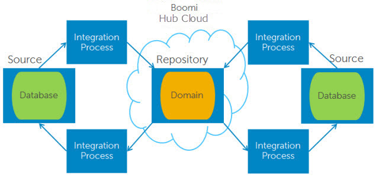

# Boomi DataHub components

<head>
  <meta name="guidename" content="DataHub"/>
  <meta name="context" content="GUID-84e6b21b-1a58-4ce5-b819-a23d4f959a02"/>
</head>

The Boomi DataHub system architecture is described in this topic.

The Boomi DataHub system components are as follows:

- Repositories are virtual containers for master data storage in a Boomi Hub Cloud. For example, you could set up a repository to host the following master data domains: Contact, Employee, Partner and Vendor. A repository accepts record updates from contributing sources, matches entities from different sources to one another and propagates source record update requests specifying create, update and delete operations.

- Integration processes that check for record updates from source systems and source record update requests from the repository and route them accordingly. These processes are also responsible for mapping source record fields to domain fields when updates are sent from sources and vice versa when requests are propagated to sources.

These processes can be built, deployed and managed using only a web browser with [Integration](/docs/Atomsphere/Integration/Getting%20started/c-atm-Integration_and_iPaaS_257fcf2c-7e93-48d0-be67-bd53fb444930.md). Integration provides the [Boomi Master Data Hub connector](/docs/Atomsphere/Integration/Connectors/r-atm-MDM_connector_ff690a6f-288d-44b3-96fb-e81afb046703.md) for this purpose. Alternatively, these processes may be custom-developed using the Boomi DataHub repository REST API.

A Integration process built for this purpose integrates a single domain hosted on a single repository with a single contributing source. If the process connects to a source hosted on-premise, the process must be deployed to an on-premise Atom. Otherwise, the process can be deployed either on-premise or to a Boomi Atom Cloud.

  

- A data warehouse, which is an optional component, houses master data for analytics, reporting, visualization, etc. purposes. It does not contribute data to the repository. Master data from the repository is imported into the data warehouse via a manual procedure or a Integration process or other custom-built integration process.

-  The [ Boomi DataHub](https://platform.boomi.com/MdmSphere.html) service, which is used to model, deploy, and steward master data using only a web browser.