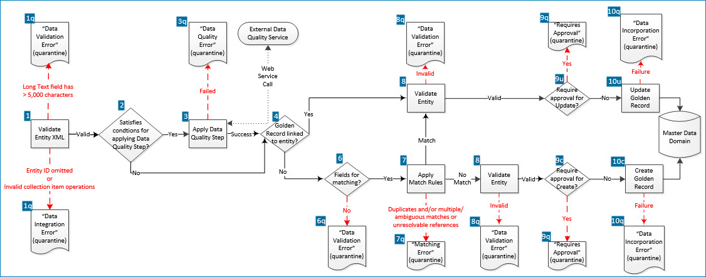

# Incoming source entity processing

<head>
  <meta name="guidename" content="DataHub"/>
  <meta name="context" content="GUID-b6b546d4-bf5c-4fe8-9591-5591541fe010"/>
</head>

When a repository receives a batch of incoming source entities for a domain, the repository processes the batch in three phases:

1.  Validation

2.  Enrichment

3.  Incorporation

## Validation 

During the Validation phase the repository validates the batch (1) for specification of a valid contributing source for the target domain and for conformance with the domain model definition. During this round of validation, field properties, such as data type and whether required, are ignored — all fields are considered to be strings.

If the batch is invalid, it is reported as errored and none of its entities advance to the next phase. This type of error is sometimes referred to as a parsing error.

Entities containing a Long Text field value exceeding 5,000 characters are quarantined **(1q, top)** — the recorded cause is “Data Validation Error”.

Entities that do not specify source entity IDs are quarantined **(1q, bottom)** — the recorded cause is “Data Integration Error”.

Entities are quarantined if they specify operations on some but not all items in a collection, or on items in a collection for which item matching is by occurrence **(1q, bottom)** — the recorded cause is “Data Integration Error”.

## Enrichment 

During the Enrichment phase for an entity, the repository may apply data quality steps specified in the domain model to the entity (2, 3). (The flow chart above illustrates the case of a model specifying just a single ordinary data quality step.)

The repository maintains a transient representation of the entity during this phase. When the output of one data quality step is received, it is applied to the transient representation. The newly updated transient representation is then sent as input to the next data quality step.

An ordinary data quality step may be applied to the entity only if it contains fields that are inputs or outputs to that data quality step. An ordinary data quality step may furthermore specify conditions under which it is applied, such as the entity satisfying a specified business rule or containing one or more input or output fields having new or changed values. A Integration process call data quality step may also specify conditions under which it is applied.

If an existing golden record is linked to the entity, if the entity omits fields that are inputs to an ordinary data quality step but those fields are populated in the golden record, the golden record values for omitted fields are used as inputs.

Collection items in an entity are submitted individually to the target data quality service specified in an ordinary data quality step; each submission requires a separate connection to the service. However, collection items for which a Delete action is specified are not submitted to the service.

Entities are sent in their entirety to Integration process call data quality steps.

When a business rule data quality step is applied, omitted and empty fields in the entity are evaluated as empty strings.

If the entity fails a data quality step it is quarantined **(3q)** — the recorded cause is “Data Quality Error”.

## Incorporation 

During the Incorporation phase for an entity, the repository either incorporates the entity in the domain or quarantines the entity.

-   If a golden record is linked to the entity **\(4\)**, the entity is potentially eligible to be incorporated as an update to that golden record.

-   If a golden record is not linked to the entity, the repository sequentially applies match rules specified in the domain model to attempt to match field values in the entity to an existing golden record. Once a golden record is found that satisfies a match rule, any remaining match rules are not applied. Leading zeros are disregarded for matching purposes in fields of type Integer and Float.

    :::note
    
    However, if the entity does not have the fields necessary to apply any match rules **\(6\)**, the entity is quarantined **\(6q\)** — the recorded cause is “Data Validation Error”. For example, consider a model having fields A, B and C and a single match rule specifying fields B and C. If an entity not linked with a golden record were to arrive with just an id field and field A, the entity would be quarantined.

    :::

If match rules are applied **\(7\)** to the entity:

-   If reference fields are specified for matching in a match rule and any of the values of those fields in the entity do not resolve to a golden record, the entity is quarantined **\(7q\)** — the recorded cause is “Matching Error”. Otherwise:

    -   If a matching golden record is not found, the entity is potentially eligible to be incorporated as a new golden record.

    -   If one \(and only one\) matching golden record is found that is not yet linked to an entity in the source system, the entity is potentially eligible to be incorporated as an update to that golden record. Otherwise:

        -   If one or more matching golden records are found that already have a link to an entity in the source system and the contributing source is configured to disallow multiple links from an individual golden record to entities in the source system, the entity is quarantined as a possible duplicate **\(7q\)** — the recorded cause is “Matching Error”.

        -   If multiple matching golden records are found that are not yet linked to an entity in the source system, the entity is quarantined **\(7q\)** — the recorded cause is “Matching Error”.

        -   If more than 10 matching golden records are found, regardless of their links to source entities, the entity is quarantined **\(7q\)** — the recorded cause is “Matching Error”.

            :::note
            
            In the case of a match rule consisting of an exact matching expression and a fuzzy matching expression, quarantining occurs if more than 1,000 golden records satisfy the exact matching expression, regardless of the golden records’ links to source entities. In this scenario the fuzzy matching expression is not evaluated.

            :::

:::note

If a collection field is specified in a match rule expression and that field’s value in the entity matches any collection item in the golden record, the expression is satisfied.

If multiple fields in a given collection item are specified in a match rule expression with AND as the grouping operator and those fields’ values in a collection item in the entity all match a collection item in the golden record, the expression is satisfied.

:::

If the entity has not yet been quarantined, the entity is then validated for full conformance with the domain model definition **\(8\)** as follows. \(First, however, any fields specified in the configuration of the contributing source for exclusion from master data are removed from the entity.\)

-   Data type validation is applied to all fields.

-   The lengths of populated text and Enumeration fields are validated for conformance with the Boomi DataHub system limit of 255 characters.

-   The presence of required fields is validated. (Empty collections are valid even if the collection definition in the model includes a required field.)

-  Populated collections whose items are identifiable by matching key field values, are further validated for the presence of the designated key fields and the absence of multiple items with the same key field values.

-   Populated text fields are further validated for conformance with requirements specified in the model as field validation options, such as patterns for matching and minimum and maximum character counts.

If the entity in not fully in conformance it is quarantined **\(8q\)** — the recorded cause is “Data Validation Error”.

If the entity is fully in conformance, possible requirements for manual approval are evaluated:

-   If the contributing source is configured to unconditionally require manual approval for entities updating any or selected fields or collections **\(9u\)**, the entity is quarantined **\(9q\)**. The recorded cause is “Requires Approval”.

-   If the contributing source is configured to conditionally require manual approval for entities updating any or selected fields or collections **\(9u\)**, the entity is quarantined **\(9q\)**, provided it satisfies the applicable condition with respect to the linked or matching golden record. The recorded cause is “Requires Approval”.

-   If the contributing source is configured to require approval for entity contributions for which there is a pending link from the matching golden record to the source and in which a field has a base value, and the entity meets that description **\(9u\)**, the entity is quarantined **\(9q\)**. The recorded cause is “Update With Base Value Approval Required”.

    :::note
    
    A field’s base value for a source is the value of the field in the matching golden record’s base version for the source. While there is a pending link from a golden record to a source, the base version of the golden record for that source is the golden record version when the pending link was created.

    :::

-   If the entity is potentially eligible for incorporation as a new golden record but the contributing source is configured to unconditionally require manual approval for new entity contributions **\(9c\)**, the entity is quarantined **\(9q\)**. The recorded cause is “Requires Approval”.

-   If the entity is potentially eligible for incorporation as a new golden record but the contributing source is configured to conditionally require manual approval for new entity contributions **\(9c\)**, the entity is quarantined **\(9q\)**, provided it satisfies the applicable condition. The recorded cause is “Requires Approval”.

If manual approval is not required, the entity is eligible to be incorporated as a new golden record **\(10c\)** or an update to the linked or matching golden record **\(10u\)**. During the actual incorporation, the following processing occurs:

-   If the golden record is not yet linked to the entity \(always the case for a new golden record\), a link is created.

-   For a create, the repository omits from the new golden record any collection items for which a Delete action is specified

-   For an update, the repository adds to the linked or matching golden record any fields from the entity that were not already present.

-   For an update, if optional domain source rankings are configured, the repository applies data survivorship rules derived from the rankings to the entity field by field. A field is updated in the linked or matching golden record only if the entity’s contributing source is more trusted for that field than the source from which the existing data was contributed.

-   If optional domain source rankings are configured, the repository updates source value agreement tracking data for affected fields.

-   Source entity IDs in reference fields in the entity are resolved to golden record IDs which are written to the corresponding fields in the golden record. In the case of a new golden record, if an entity in another domain was previously quarantined due to an attempt to match on what was then an unresolvable reference to the new entity, that quarantined entity is automatically resubmitted for incorporation in that domain.

    If an optional default source is configured in a referenced domain and the entity’s source is not attached to that domain, an attempt is made to match the entity ID in the referencing field to an entity ID linking a golden record in the referenced domain to the default source. If the attempt is successful, the reference is resolved, and the referenced golden record’s ID is written to the referencing field.

-   Field values in the new or updated golden record are evaluated for conformance with tag definitions specified in the current version of the domain model, and tags are applied to the golden record where applicable.

If an incorporation error occurs the entity is quarantined **\(10q\)**.

-   If the entity has an unresolvable collection item reference or the entity has an unresolvable reference in a field for which referential integrity is enforced for incoming entity contributions, the recorded cause is “Unknown Reference Value”.

-   If there is a link to the entity from an end-dated golden record, the recorded cause is “Record Already End-dated”.

- If a quarantined entity is edited and re-submitted, Hub re-evaluates that entity and can identify is the entity is a duplicate. In this scenario, the duplicate record's quarantine cause is "Potential Duplicate". 

-   Otherwise, the recorded cause is “Other Incorporation Error”.

:::note

The repository does not explicitly cleanse incoming entity data during incorporation. However, cleansing may implicitly occur for the purpose of writing a golden record to ’s underlying database.

For example, 00045 in a domain’s Integer field will be written to the database as 45. Similarly, “ Round Rock ” in a domain’s Text field \(without quotes\) will be written to the database as “Round Rock” \(without quotes\).

:::

:::caution

The repository does not process incoming source entities linked to end-dated golden records. Therefore, the following capabilities supported by some source systems pose a risk to data integrity:

-   Reusing IDs — there is the risk that new records having reused IDs would be ignored.

-   Undelete operations — there is the risk that undelete requests would be ignored.

:::

## Entities in staged batches 

Staged batches of incoming source entities are processed similarly to ordinary batches. The most obvious difference, of course, is that staged entities are not actually incorporated in the target domain — golden records are not added, updated, end-dated or linked to source entities.

The only other differences relate to matching:

-  A staged entity is first matched against previously staged entities in the target staging area. If a match occurs, processing ends, and a staging result of Quarantine with the cause of “Potential Duplicate” is recorded. If there is no match, processing continues as it would for an entity in an ordinary batch, with the matching of the staged entity against existing golden records.

-   Collection matching is not supported for staging. When a match rule specifying a collection field is applied to a staged entity, a staging result of Quarantine with the cause of “Incorporation Error” is recorded, regardless of the contents of the collection in golden records.