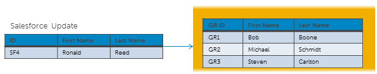
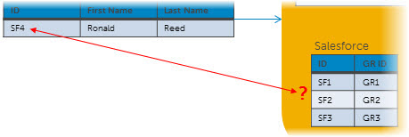
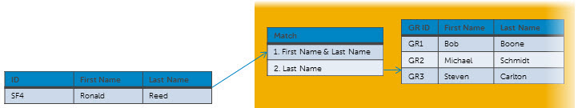
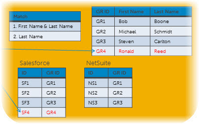
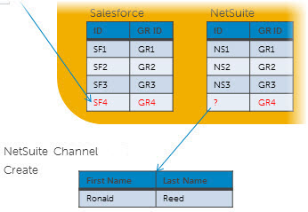
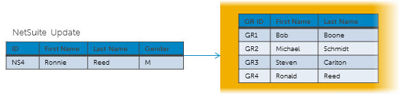
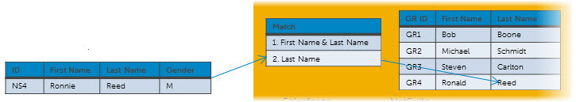
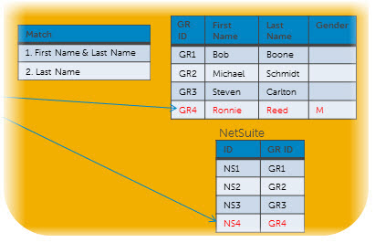

# Source record Creates 

<head>
  <meta name="guidename" content="DataHub"/>
  <meta name="context" content="GUID-a71756f1-2dd5-4931-ae11-eb556f954c94"/>
</head>

This topic outlines a scenario that illustrates Boomi DataHub processing in response to the creation of a source record.

Consider a domain named Contact whose sources are NetSuite and Salesforce. Assume:

-   Both sources contribute data to Contact and initial loading of their data has been completed.

-   For each source an incremental synchronization process is deployed that batches source record updates and routes them to the repository on which Contact is hosted.

-   For each source a channel is configured for propagating batches of source record update requests necessitated by golden record updates. The channels are configured to propagate only changed fields in update requests. Requests propagated on these channels are not unconditionally or conditionally restricted at either the record level or the field level.

-  Neither source is configured such that their entity contributions resulting from the creation of source records are subject to manual approval.

-  Neither source is configured to allow multiple links from individual golden records to entities in the source system.

- Source rankings are not configured.

-  A default source is not designated.

-   For each source a synchronization process is deployed that routes batches on the source’s channel to the source.

    

The following scenario illustrates processing in response to the creation of Salesforce record SF4:

1.  Salesforce record SF4 is created.

2.  Golden record GR4 is created:

    1.  The Salesforce to process detects that Salesforce record SF4 has just been updated.

        :::note
        
        Source to Boomi DataHub processes need not differentiate updates from creates because from these processes’ perspective there is no difference between those operations.

        :::

    2. The process maps SF4’s profile to the domain profile.

    3. The process sends the SF4 source entity to the repository.

        

    4.  The repository receives the entity and verifies it conforms to the field layout specified in the domain model.

    5.  The repository checks whether a golden record is linked to SF4 and finds no such link.

        

    6. The repository executes any data quality steps defined in the model to perform data validation and enrichment.

    7.  The repository applies match rules specified in the model to try to match SF4 to an existing golden record that does not have a Salesforce link. SF4 fails to match.
   
    

    8. The repository verifies the entity contains all required fields and their data types are correct, as specified in the domain model.

    9. The repository creates golden record GR4 with a link to SF4.

    

    10. The repository propagates an update request specifying a create operation on the NetSuite channel. 

    

3.  NetSuite record NS4 is created:

    1.  The Boomi DataHub to NetSuite process gets the update request specifying a create operation.
    2.  The process maps GR4’s profile to the applicable NetSuite record profile.

    3.  The process routes the update request to NetSuite.

    4.  NetSuite creates record NS4.

    5.  In NetSuite record NS4 is updated by a user or data service as follows: A new field, Gender, is added, and the value of field First Name is updated from Ronald to Ronnie.

4.  Golden record GR4 is updated:

    1.  The NetSuite to Boomi DataHub process detects that NetSuite record NS4 has just been updated.

    2.  The process maps NS4’s profile to the domain profile.

    3.  The process sends the updated NS4 source entity to the repository.

        

    4.  The repository receives the entity and verifies it conforms to the field layout specified in the domain model.

    5.  The repository checks whether a golden record is linked to NS4 and finds no such link.

    6.  The repository executes any data quality steps defined in the model to perform data validation and enrichment.

    7.  The repository applies match rules to try to match NS4 to an existing golden record that does not have a NetSuite link and finds GR4 matching on Last Name, the second match rule.

        

    8.  The repository computes the difference between NS4 and GR4 and detects the presence of the new field attached by NetSuite and the update to the value of field First Name.

    9.  The repository verifies the entity contains all required fields and their data types are correct, as specified in the domain model.

    10. The repository applies the update to GR4 and links GR4 to NS4.

        

5.  The repository propagates update requests on the Salesforce and NetSuite channels.

    :::note

    Each link established from a golden record to a non-contributing source uses the golden record ID.

    :::

## Unique constraints in source systems

When sources receive Hub data, they need to ensure the outgoing data adheres to its rules, such as unique identifiers. If the data update creates a duplicate or violates the source's rules, the update should be rejected.