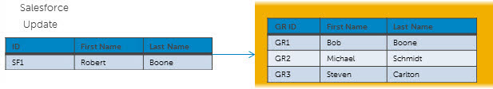
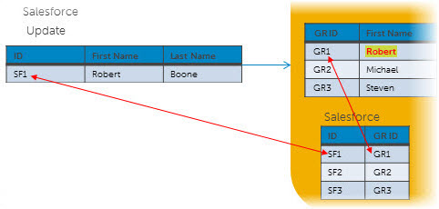
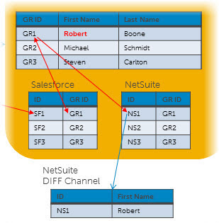

# Source record Updates 

<head>
  <meta name="guidename" content="DataHub"/>
  <meta name="context" content="GUID-52e84b83-20e5-43a0-a60b-53c37135f7aa"/>
</head>

This topic outlines a scenario that illustrates Boomi DataHub processing in response to the updating of a source record.

During the incorporation phase of the processing of incoming source entities, which occurs after enrichment, the repository merges fields in incoming entities with fields in matching golden records.

-   If source rankings are configured for the target domain, field merging is subject to the application of data survivorship rules derived from the rankings. A linked topic discusses the intricacies of golden record updates with ranked sources.
  
-  Fields not present in incoming entities do not affect golden record field values. This behavior applies to collection item fields as well as ordinary fields.
  
    Collection items not present, on the other hand, are removed from collections in golden records.

- If the Early Delta Detection setting is configured for the source, Hub detects when a submitted entity does not change a golden record. Hub compares the previous entity with the inbound entity. If the inbound entity matches the previous entity submitted, the next time the same entity is submitted again without a change, Hub skips processing the entity. Boomi DataHub will only include the source's entity submissions when it detects a change to the record or if a new model version is deployed or a source configuration is changed. Model deployment or a change to the entity or to a source configuration starts the evaluation process again from the beginning, and Hub will skip the third time the same entity is submitted.

    :::info

    Early delta detection does not detect a change to a record when you are [using third-party data quality services](/docs/Atomsphere/Master%20Data%20Hub/Modeling/t-mdm-Enabling_a_quality_service_to_use_in_data_quality_f74aa25d-86a6-4390-b5f0-e90b75ebbd4a.md) for data enrichment, such as [Loqate](https://www.loqate.com/en-gb/address-verification/). A change cannot be detected because data enrichment from the third party happens after the entity is compared to the previous entity.

    :::

    :::info

    Early delta detection may not detect a change to a record if you submit an entity and then submit the same entity again with changed and unchanged data within 1 second.

    :::

-  Entities containing empty fields (denoted by empty XML element tags) are processed in accordance with the domain model definition as follows:

    -   If any of the empty fields are Required, the entity is quarantined.

    -  Otherwise, the corresponding fields in the matching golden record are nullified.
  
    Empty collections in entities nullify the corresponding collections in matching golden records. Collections in entities consisting entirely of empty items do not affect the corresponding collections in matching golden records.

   Empty fields and collections are omitted from resulting update requests propagating on channels to sources. This prevents continuous propagation of update requests and updates back and forth between the repository and the contributing source.

The repository records unresolved references found in matching entities as pending. A background process running in the repository monitors the establishment of links from golden records to source records and marks references as resolved where applicable.

The method by which the repository matches collection items in incoming entities with collection items in matching golden records is set in the domain model as a property of an individual collection’s corresponding repeatable field or field group. The options are matching by occurrence or by key field values. For the latter option, all fields in a repeatable field group are automatically designated as key fields if none are explicitly designated. A linked topic contains collection item matching examples.

:::note

The remainder of this topic discusses ordinary field updates. Create, update and delete operations on individual collection items are supported for collections for which matching by key field values is enabled. A linked topic discusses the intricacies of collection item operations.

:::

Consider a domain named Contact whose sources are NetSuite and Salesforce. Assume:

- Both sources contribute data to Contact and initial loading of their data has been completed.

- For each source an incremental synchronization process is deployed that batches source record updates and routes them to the repository on which Contact is hosted.

- For each source a channel is configured for propagating batches of source record update requests necessitated by golden record updates. The channels are configured to propagate only changed fields in update requests. Requests propagated on these channels are not unconditionally or conditionally restricted at either the record level or the field level.

- Neither source is configured such that their entity contributions that would update matching golden records are subject to manual approval.

- Neither source is configured to allow multiple links from individual golden records to entities in the source system.

- Source rankings are not configured.

- A default source is not designated.

- For each source a synchronization process is deployed that routes batches on the source’s channel to the source.

    

The following scenario illustrates processing in response to the updating of Salesforce record SF1:

1.  Salesforce record SF1 is updated.

2.  Linked golden record GR1 is updated:

    1.  The Salesforce to Boomi DataHub process detects that Salesforce record SF1 has just been updated.

    2.  The process maps SF1’s profile to the domain profile.

    3.  The process sends the SF1 source entity to the repository.

        

    4.  The repository receives the entity and verifies it conforms to the field layout specified in the domain model.

    5.  The repository checks whether a golden record is linked to SF1, and finds golden record GR1 is linked to SF1.

    6.  The repository executes any data quality steps defined in the model to perform data validation and enrichment.

    7.  The repository computes the difference between the updated SF1 and GR1 and determines the value of GR1 field First Name needs to be updated from Bob to Robert.

    8.  The repository verifies the entity contains all required fields and their data types are correct, as specified in the domain model.

    9.  The repository applies the update to GR1.

        

    10. The repository extracts the ID of the linked NetSuite record \(NS1\) from GR1.

    11. The repository propagates an update request specifying NS1 on the NetSuite channel.

        

3.  Linked NetSuite record NS1 is updated:

    1. The Boomi DataHub to NetSuite process detects that the golden record linked to NS1 has been updated.

    2.  The process maps GR1’s profile to the applicable NetSuite record profile.

    3.  The process routes the update request to NetSuite.

    4.  NetSuite applies the update to NS1.

4. The NetSuite to Boomi DataHub process detects that NetSuite record NS1 has just been updated.

5.  The process maps NS1’s profile to the domain profile.

6.  The process sends the NS1 source entity to the repository.

7.  The repository receives the entity and verifies it conforms to the field layout specified in the domain model.

8.  The repository checks whether a golden record is linked to NS1, and finds GR1 is linked to NS1.

9.  The repository computes the difference between the updated NS1 and GR1 and determines there is no difference, and therefore, no further processing is necessary.

:::note
    
When contribution of a source entity results in establishment of a link from the golden record to the source entity with the specified ID, an update request is propagated to the contributing source on its channel regardless of whether the golden record is updated.

A source entity contribution can result in establishment of a link without a golden record update in these circumstances:

-   The contribution resolves a reference to the golden record from another golden record, enabling establishment of what had previously been a pending link.

-   The specified source entity ID is different from the ID of the source entity to which the golden record is currently linked. In this case, the golden record is unlinked from that source entity and then linked to the source entity with the specified ID, provided the source is configured to disallow multiple links from individual golden records to entities in the source system.

-   The golden record had been manually unlinked from the source entity with the specified ID. In this case, the golden record is relinked to the source entity with the specified ID.

:::

:::note

When update requests specifying successful collection item delete operations are propagated on channels for sources other than the contributing source, the entire collection is included in the requests. The deleted item is omitted, however, from the post-back update request propagated on the contributing source’s channel.

:::

:::note

When update requests specifying a value for a field referencing data mastered in another domain are propagated, the manner in which the field is populated in the update requests is determined as follows:

-   If the destination source is attached as a non-contributing source, the field is populated with the ID of the referenced golden record..

-   If the destination source is attached as a contributing source:

-   If the destination source is attached to the referenced domain as a non-contributing source, the field is populated with the ID of the referenced golden record.

 -   If, on the other hand, the destination source is also attached to the referenced domain as a contributing source and the referenced golden record is linked to the source, the field is populated with the source entity ID from the referenced golden record. If, under otherwise the same conditions, the referenced golden record is not linked to the source, the field is populated with the ID of the referenced golden record.

-   If the destination source is not attached to the referenced domain and the referenced domain does not have a default source, the field is populated with the ID of the referenced golden record.

-   If the destination source is not attached to the reference data domain, the referenced domain has a default source, and the referenced golden record is linked to the default source, the field is populated with the source entity ID from the referenced golden record. If, under otherwise the same conditions, the referenced golden record is not linked to the source, the field is populated with the ID of the referenced golden record.

:::

## Unique constraints in source systems

When sources receive Hub data, they need to ensure the outgoing data adheres to its rules, such as unique identifiers. If the data update creates a duplicate or violates the source's rules, the update should be rejected