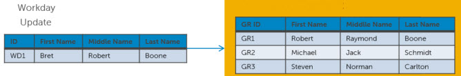
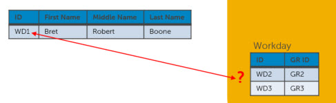
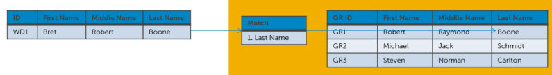
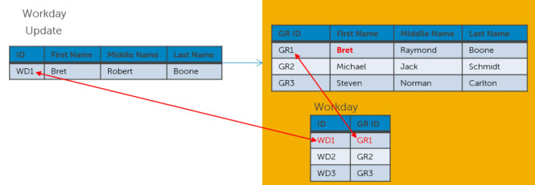
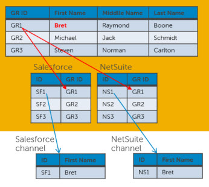
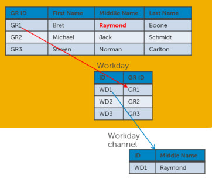

# Updates with ranked sources 

<head>
  <meta name="guidename" content="DataHub"/>
  <meta name="context" content="GUID-5b05de43-8972-45eb-ba15-4539f3028ba1"/>
</head>

Where rankings for a domain’s sources are configured, the incorporation phase for source record updates includes additional processing to apply data survivorship rules based on those rankings field by field. Data survivorship rules are applied to collections in their entirety, not to individual collection items. The repository merges an entity field value into a golden record only if the entity’s contributing source is more trusted for that field than each of the sources from which the existing data was contributed. In addition, the repository updates the golden record’s source value agreement tracking data to reflect field updates.

Upon rejection by the repository of less trusted data, the following occurs to enable correction of the data in the contributing source system:

- If the source’s channel is configured for differential updates, the repository propagates the more trusted golden record data in a source record update request on that channel.

- If the source’s channel is configured for full updates — assuming the golden record is updated — the repository propagates source record update requests to sources, including the contributing source, on their channels, as is the case where source rankings are not configured.

:::note

Details related to updates with ranked sources specific to reference fields are in the topics discussing references, linked below.

:::

Consider a domain named Contact whose sources are NetSuite, Salesforce, and Workday. Assume:

- All sources contribute data to Contact and initial loading of their data has been completed.

- For each source an incremental synchronization process is deployed that batches source record updates and routes them to the repository on which Contact is hosted.

- For each source a channel is configured for propagating batches of source record update requests necessitated by golden record updates. The channels are configured to propagate only changed fields in update requests. Update requests propagated on these channels are not subject to restriction based on golden record tags.

- None of the sources are configured such that their entity contributions that would update matching golden records are subject to manual approval.

- For each source a synchronization process is deployed that routes batches on the source’s channel to the source.

-   Source rankings are configured as follows:

    -  For the First Name field, the most trusted source is Workday, and the least trusted source is NetSuite.

    -   For the Middle Name and Last Name fields, the most trusted source is Salesforce, and the least trusted source is Workday.

-  The domain model’s only match rule specifies that the Last Name field is used for matching.

The following are highlights of processing in response to the updating of Workday record WD1:

-   Golden record update

    

    -   While processing incoming source entity WD1, the repository checks whether a golden record is linked to WD1 and finds none.

        

    -   The repository applies the match rule to try to match WD1 to an existing golden record that does not have a Workday link and finds GR1 matching on Last Name.

        

    -   The repository applies data survivorship rules to WD1 fields and determines the following:

        -   The value of the First Name field in GR1 needs to be updated from Robert to Bret because Workday is that field’s most trusted source.

        -   The value of the Middle Name field in GR1 does not need to be updated because Workday is that field’s least trusted source.

    -   The repository updates GR1 accordingly and links GR1 to WD1.

        

-   Source record update request propagation

    -   The update requests that go to NetSuite and Salesforce include only the GR1 value for the First Name field because only that was field was updated as a result of the processing of WD1.

        

    -   The post-back update request on the Workday channel, on the other hand, includes only the GR1 value for the Middle Name field because that value was contributed by a more trusted source.

        

-   Source record updates and aftermath

    -   In response to the update requests, NS1, SF1, and WD1 are each updated in their respective source systems. In the absence of intervening updates, the updated records are synchronized for the moment with GR1 — that is, they have the same field values.

    -   As each updated entity circles back to the repository, the repository computes the difference between the entity and GR1.

    -   In each case the repository determines there is no difference, and therefore, no further processing is necessary.

:::note

When a golden record is manually edited in the Golden Records page, the repository incorporates the updated fields regardless of source rankings. The repository incorporates updates to manually edited golden record fields only where contributed by a field’s highest ranked source.

:::

:::note

If a golden record update changes the value of a field in a ranked field group, the contributing source is considered, for the application of source rankings to subsequent incoming entities, to have been the contributing source for the field group.

:::

:::note

Source value agreement tracking data for a golden record field is discarded when the record is updated if source ranking was disabled for that field since the record was last updated.

:::