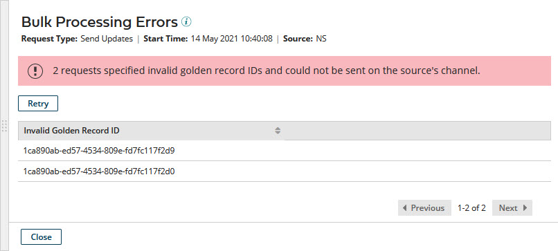

# Bulk Processing Errors detail view 

<head>
  <meta name="guidename" content="DataHub"/>
  <meta name="context" content="GUID-979c9c8f-50b4-4e92-b800-45e505ee659d"/>
</head>

In the Bulk Processing Requests page, clicking an error count in the Status column for a request opens a detail view for the errors that occurred during the processing of the request.

In the view header:

**Name**  
**Description**

**Request Type**    
The type of bulk processing request is one of the following:

- End-date — The request is for the end-dating of golden records.

- Purge — The request is for the purging of end-dated golden records.

- Send Updates — The request is for the propagation of source record update requests for golden records

**Start Time**  
Date and time at which processing of the request started.

**Source**  
The source specified in the request.

## **Retry** 

This button is present only for a bulk processing request of type Send Updates. Clicking this button initiates a request to propagate an update request for each golden record in the errors list.

A confirmation dialog appears and takes focus. In the confirmation dialog:

-   Clicking **OK** executes the request.

-   Clicking **Cancel** cancels the request.

Upon execution of the request, a status box appears and takes focus. Clicking **Close** dismisses the status box and closes the detail view. The page then automatically refreshes to reflect the change in the status of the request to Retried and the creation of a new request.

-   If processing of the original request completed with errors, the corresponding new request specifies only the IDs of the golden records in the errors list.

-   If processing of the original request terminated, the corresponding new request specifies the IDs of all golden records specified in the original request.

## Errors list 

Each listed invalid golden record ID corresponds to an error.

If processing of the request terminated due to the occurrence of 500 errors, the list has 500 entries.

## List navigation 

In addition to the scroll bars, the following controls are used to navigate the errors list:

**Name**  
**Description**

****  
Loads the first errors.

****  
Loads errors immediately prior to those currently loaded.

**x-y of z**  
Indicates the number and relative chronological position of the currently loaded errors — for example, “51-75 of 2086”.
****  
Loads errors immediately subsequent to those currently loaded.

****  
 Loads the last errors.

**Close**  
Closes the view. Keyboard shortcut: **Esc**.

:::note

You can also close the view by clicking elsewhere in the page.

:::