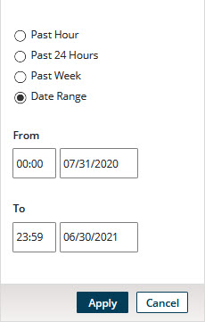

# Bulk Processing Requests page 

<head>
  <meta name="guidename" content="DataHub"/>
  <meta name="context" content="GUID-f2a81151-c775-4105-b784-0e984bcd3ff4"/>
</head>

Selecting **Reporting > Bulk Processing Requests** opens the Bulk Processing Requests page, which is used to view the status of requests for bulk processing of golden records, including end-dating (request type End-date), purging (request type Purge), and propagating source record update requests (request type Send Updates).

An individual bulk processing request of type Send Updates is specific to all or a subset of golden records linked to a given source attached to a given domain hosted in a given repository. Cancel and retry actions can be performed on individual bulk processing requests of this type, depending upon the status of the requests.

An individual bulk processing request of type End-date or Purge is specific to all or a subset of golden records in a given domain hosted in a given repository. Cancel actions can be performed on individual bulk processing requests of these types, depending on the status of the requests.

:::note

This page is accessible directly from the Golden Records page upon submission of a request of type Send Updates.

:::

:::note

The page is accessible only by administrators and users having a role with the MDM - Source Management privilege.

:::

## **Status**  
Filters the bulk processing requests list by status, subject to additional filtering applied using controls about the list.

-   All — Selects all requests.

-   Processing — Selects only requests for which processing of golden records specified in the requests is in progress.

-   Errored — Selects only requests for which processing of golden records specified in the requests either completed with errors or terminated as a result of the occurrence of 500 errors.

-   Successful — Selects only requests for which processing of golden records specified in the requests was completed without errors.

-   Submitted — Selects only requests that have been received but for which processing of golden records specified in the requests has not yet begun.

-   Retried — Selects only requests of type Send Updates to which the **Retry** action was applied.

-   Canceled — Selects only requests to which the **Cancel** action was applied.

If **All** is selected, which is the default, filtering is not applied to the list — that is, all bulk processing requests are listed.

## **Retry**

Opens a drop-down menu with options for retrying bulk processing requests of type Send Updates that either completed with errors or terminated. This button and drop-down menu are visible only if either the **Status** filter is set to Errored or the **Status** filter is set to All and at least one check box for an errored request is selected.

-   **Selected Errored** — Initiates a request to retry requests whose check boxes are selected in the list.

-   **All Errored Matching Applied Filters** — Initiates a request to retry all requests listed as a result of the application of filters, including requests not currently visible in the list due to paging or the size of the browser window.

-   **All Errored** — Initiates a request to retry all listed requests, including those not currently visible in the list due to paging or the size of the browser window.

Upon selection of a menu item, a confirmation dialog appears and takes focus. In the confirmation dialog:

-   Clicking **OK** executes the request.

-   Clicking **Cancel** cancels the request.

Upon execution of the request, a status box appears and takes focus. Clicking **Close** dismisses the status box. The page then automatically refreshes to reflect the change in the status of each selected request to Retried and the creation of a new request for each selected request.

-   If processing of an original request completed with errors, the corresponding new request specifies only the IDs of the golden records for which update requests were not propagated.

-   If processing of an original request terminated, the corresponding new request specifies the IDs of all golden records specified in the original request.

:::note

A request cannot be directly retried more than once.

:::

## **Cancel** 

Opens a drop-down menu with one item, **Selected Processing**. Selecting this item cancels the bulk processing requests with the status Processing whose check boxes are selected in the requests list. This button and drop-down menu are visible only if all requests whose check boxes are selected have the status Processing.

Upon selection of **Selected Processing**, the page automatically refreshes to reflect the change in the status of each selected request to Canceled.

## **Repository:domain** 

Selects the repository and domain for which to list bulk processing requests. The selections persist across instances of the loading of the page, even across sessions.

## Filters 

The requests list can optionally be filtered using one or more of the following types of criteria:

-   Type

-   Source

-   Start time

-   End time

While a filter is applied, a button for that filter appears to the left of the **Add Filter** button. The button’s label shows the specified criterion — for example, **Source:** NetSuite. Clicking  on the button clears the filter. Clicking elsewhere on the button opens that dialog for the purpose of modifying the criterion.

**Name**  
**Description**

**Add Filter**  
Lists filter types for selection:

  -   Type — opens the dialog used to apply filtering by bulk processing request type.
    
        

        - **Type** — Sets the request type by which to filter:

           - End-date — Selects only requests for the end-dating of golden records.

           -   Purge — Selects only requests for the purging of end-dated golden records.

           - Send Updates — Selects only requests for the propagation of source record update requests.

        -  **Apply** — Sets the filter criterion, closes the dialog and applies the filter.

        -   **Cancel** — Closes the dialog without applying a filter.
-   Source — opens the dialog used to apply filtering by source.

    

    -   **Source** — Sets the source.

    -   **Apply** — Sets the filter criterion, closes the dialog and applies the filter.

    -   **Cancel** — Closes the dialog without applying a filter.

-   Start Time — opens the dialog used to apply filtering by the time at which processing of requests started.

    

    -   **Past Hour** — Selects the past hour.

    -   **Past 24 Hours** — Selects the past 24 hours.

    -   **Past Week** — Selects the past week.

    -   **Date Range** — Enables the selection of a custom time span. The default is the past hour.

        -   **From** — Sets the starting time and date:

            -   time — Type a value in the range 00:00–23:59, or select a :00 or :30 value.

            -   date — Type the value or select it from the calendar.

        -   **To** — Sets the ending time and date:

            -   time — Type a value in the range 00:00–23:59, or select a :00 or :30 value.

            -   date — Type the value or select it from the calendar.

        -   **Apply** — Sets the selected time span, closes the dialog and applies the filter.

        -   **Cancel** — Closes the dialog without setting the time span.
-   End Time — opens the dialog used to apply filtering by the time at which processing of requests completed, terminated, or was canceled, given the chosen **Status** filter.

    -   **Past Hour** — Selects the past hour.

    -   **Past 24 Hours** — Selects the past 24 hours.

    -   **Past Week** — Selects the past week.

    -   **Date Range** — Enables the selection of a custom time span. The default is the past hour.

        -   **From** — Sets the starting time and date:

            -   time — Type a value in the range 00:00–23:59, or select a :00 or :30 value.

            -   date — Type the value or select it from the calendar.

        -   **To** — Sets the ending time and date:

            -   time — Type a value in the range 00:00–23:59, or select a :00 or :30 value.

            -   date — Type the value or select it from the calendar.

        -   **Apply** — Sets the selected time span, closes the dialog and applies the filter.

        -   **Cancel** — Closes the dialog without setting the time span.

**** **Clear All Filters**  
Clears all filters.

## ** Refresh** 
Refreshes the bulk processing requests list.

## Bulk processing requests list 

Bulk processing requests are listed, subject to filtering.

:::note

Purged bulk processing requests are not listed. Requests are purged 30 days after creation.

:::

**Type**   
The type of bulk processing request is one of the following:

- End-date — The request is for the end-dating of golden records.

- Purge — The request is for the purging of end-dated golden records.

- Send Updates — The request is for the propagation of source record update requests for golden records.

**Start Time**  
Date and time at which the request was submitted.

**Golden Records**  
The count of golden records specified in the request. This count does not appear until processing of the request begins.

:::note

For a request of type Send Updates, the count shown here may exceed the number of update requests that are actually propagated, due not only to the occurrence of errors during processing, but also to the application of propagation rules configured for the source in the **Outbound** tab of the source configuration dialog.

:::

**Source**  
The source, for a request of type of Send Updates, to which golden records specified in the request are linked. The source is not populated until processing of the request begins. This column is empty for a request of type End-date or Purge.

**Status**  
The status of the bulk processing request is one of the following:

 - Processing — processing is in progress.

- For a request for which processing completed with errors, the error count is shown as a link to the Bulk Processing Errors detail view. In that view, each invalid golden record ID is listed.

    For a request for which processing terminated as a result of the occurrence of 500 errors, the error count is shown as a link to the Bulk Processing Errors detail view. In that view, the 500 invalid golden record IDs are listed.

- Successful — processing completed without errors.

-  Submitted — processing has not yet begun.

-  Retried — the **Retry** action was applied to the request, resulting in the creation of a new, separately listed request.

-  Canceled — the **Cancel** action was applied to the request.

**Time Elapsed**  
If processing of the request is in progress or processing has not yet begun, the elapsed time since submission of the request is shown. If processing of the request was completed, terminated, or canceled, the elapsed time between submission of the request and the cancellation or conclusion of processing is shown.

**End Time**  
Date and time at which processing of the request completed, terminated, or was canceled. If processing of the request is in progress, “Still processing” is shown. If processing has not yet begun, “Not yet processing” is shown.

**Actions**  
The available actions on a request are dependent on its type and status.

  -   **Cancel** — available for requests with the status Processing. When this action is selected, the page automatically refreshes to reflect the change in the status of the request to Canceled.

 -  **Retry** — available for requests of type Send Updates for which processing completed with errors or terminated as a result of the occurrence of 500 errors. When this action is selected, a confirmation dialog appears and takes focus. In the confirmation dialog:

    -   Clicking **OK** executes the action.

    -   Clicking **Cancel** cancels the action.

     Upon execution of the action, a status box appears and takes focus. Clicking **Close** dismisses the status box. The page then automatically refreshes to reflect the change in the status of the request to Retried and the creation of a new request.

    -   If processing of the original request completed with errors, the new request specifies only the IDs of the golden records for which update requests were not propagated.

    -   If the processing of the original request terminated, the new request specifies the IDs of all golden records specified in the original request.

        :::note
        
        A request cannot be directly retried more than once.

        :::

## List navigation 

In addition to the scroll bars, the following controls are used to navigate the bulk processing requests list:

**Name**
 **Description**

****  
Loads the first requests.

****  
Loads requests immediately prior to those currently loaded.

**x-y of z**  
Indicates the number and relative chronological position of the currently loaded bulk processing requests — for example, “51-75 of 2086”. The total count shown reflects currently applied filtering.

****  
Loads requests immediately subsequent to those currently loaded.

****  
Loads the last requests.