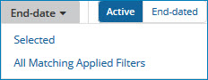
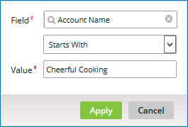
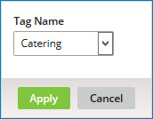
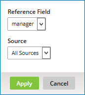
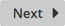

# Golden Records page

<head>
  <meta name="guidename" content="DataHub"/>
  <meta name="context" content="GUID-DFBB0D4D-7CE9-41DB-A7CF-0F0270BA64DF"/>
</head>

Selecting **Stewardship**\> **Golden Records** opens the Golden Records page, which is used to view, search, and filter a domain’s golden records.

:::note

This page is visible only to administrators and users having a role with the View Records entitlement.

:::

## Send

:::note

This button is visible only to administrators and users having a role with the MDM - Source Management privilege and only while **Active** is selected.

:::

Opens a drop-down menu with options for requesting the propagation of source record update requests in bulk for selected active golden records on the channels for selected attached sources. Source record update requests can be propagated only to sources configured to accept channel updates.

The selected drop-down menu option selects the golden records and opens the Send Update Requests dialog for selection of the sources and submission of the request. These are the drop-down menu options:

- **All** — Selects all active golden records, including those not currently visible due to paging or the size of the browser window.

- **Selected** — Selects active golden records whose check boxes are selected in the data grid.

- **All Matching Applied Filters** — Selects active golden records currently loaded in the data grid as a result of the application of filters, including golden records that match the applied filters but are not currently visible due to paging or the size of the browser window.

In the Send Update Requests dialog:

**Name**  
**Description**
b
**Select Sources**

**Name**  
**Description**

**Send to all attached sources**  
Selects all sources configured to accept channel updates.

**Send to all selected sources**  
Reveals a list of sources with adjacent check boxes as the means for selection. Above the list is the **Search sources** field, which can be used to filter the list. Only sources configured to accept channel updates are available for selection.

**Send**  
Submits the propagation request.

The Send Update Requests dialog closes, and a bulk processing request is created for each affected source.

The Update Requests Submitted dialog opens. The dialog indicates requests were submitted to propagate update requests on the channels for sources. The number of affected sources is indicated.

**Name**  
**Description**

**View Status**  
Closes the dialog and opens the Bulk Processing Requests page, in which the statuses of the new bulk requests and previously submitted bulk requests are viewable.

**Close**  
Closes the dialog.

**Cancel**  
Closes the dialog without submitting a propagation request.

:::note

If an error occurs during the processing of a submitted propagation request, the next time the page loads, an error notification appears above the data grid.

The notification shows the count of bulk requests for which processing resulted in errors due to the specification of invalid golden record IDs.

In the notification:

**Name**  
**Description**

**Retry**  
Opens the Retry Update Requests dialog, which is used to initiate a request to propagate an update request for each of the golden records for which an error occurred. The dialog shows the count of bulk requests with which the update requests to be retried are associated.

In the Retry Update Requests dialog:

- Clicking **Retry** initiates the request. A new bulk request is created for each of the original bulk requests for which update requests are being retried.

    A message box appears to confirm the update requests were retried. The message box contains **View Status** and **Close** buttons, which have the same function as the corresponding buttons in the Update Requests Submitted dialog.

- Clicking **Cancel** cancels the request.

**View errors**  
Opens the Bulk Processing Requests page in a new tab or window. The bulk processing requests list is filtered to include only the bulk requests for which errors occurred.

**Close**  
Closes the error notification. This specific notification will not reappear the next time the page loads, but if in the meantime an error occurs during the processing of a different propagation request, a notification of that error will appear.

:::

## End-date

Opens a drop-down menu with the following options for requesting end-dating \(deactivating\) of golden records:

- **Selected** — Requests end-dating of golden records whose check boxes are selected in the data grid.

- **All Matching Applied Filters** — Requests end-dating of golden records currently loaded in the data grid as a result of the application of filters, including golden records that match the applied filters but are not currently visible due to paging or the size of the browser window.

In the confirmation dialog:

**Name**  
**Description**

**End-date**  
Executes the request.

If the drop-down menu selection was **Selected**, when a selected golden record is end-dated, a source record update request specifying a Delete operation is propagated to each source to which the golden record is linked.

If the drop-down menu selection was **All Matching Applied Filters**, a bulk processing request is created. A status box appears. When processing of the request is complete, a **Close** button appears in the status box. The status of the request is also viewable in the Bulk Processing Requests page \(**Reporting** \> **Bulk Processing Requests**\). In that page it is possible to cancel the request before or during its processing.

**Cancel**  
Cancels the request.

:::note

It is not possible to end-date a golden record that is referenced by another golden record.

:::

:::note

The **End-date** button and drop-down menu are visible while active golden records are loaded in the data grid and only to administrators and users having a role with the End-date Records entitlement.

:::

## Purge

Opens a drop-down menu with the following options for requesting purging of end-dated \(inactive\) golden records:

:::caution

Purging a golden record permanently removes it from the domain and cannot be undone. When a golden record is purged, source record update requests specifying Delete operations are *not* propagated to attached sources.

:::

:::note

The quarantine entries counts in the Repositories page and the repository Summary tab can take more than a minute to update to reflect the purge.

:::

- **All** — Requests purging of all end-dated golden records, including those not currently visible due to paging or the size of the browser window.

- **Selected** — Requests purging of golden records whose check boxes are selected in the data grid.

- **All Matching Applied Filters** — Requests purging of golden records currently loaded in the data grid as a result of the application of filters, including golden records that match the applied filters but are not currently visible due to paging or the size of the browser window.

In the confirmation dialog:

**Name**  
**Description**

**Purge**  
Executes the request.

If the drop-down menu selection was **All** or **All Matching Applied Filters**, a bulk processing request is created. A status box appears. When processing of the request is complete, a **Close** button appears in the status box. The status of the request is also viewable in the Bulk Processing Requests page \(**Reporting** \> **Bulk Processing Requests**\). In that page it is possible to cancel the request before or during its processing.

**Cancel**
 Cancels the request.

When a golden record is purged from a domain that has a default source, resolved references to that golden record are changed to Pending.

:::note

The **Purge** button and drop-down menu are visible while end-dated golden records are loaded in the data grid and only to administrators and users having a role with the Purge Records entitlement.

:::

## Status filter

- Selecting **Active** \(the default\) loads only active golden records into the data grid.

- Selecting **End-dated** loads only end-dated \(inactive\) golden records into the data grid.

## Repository: domain list

Clicking  opens this drop-down list, which is used to select a repository and domain. Selecting a repository and domain loads the data grid with content relating to that domain. The button label identifies the selected repository and domain. The repository and domain most recently selected in this page, or more recently in the Repositories page, is selected by default.

Repositories and domains listed for selection are those for which the user has the View Record entitlement. The selections are alphabetically ordered and grouped by repository. The current selection appears in bold.

Typing in the filter field above the list filters the list to include only repositories and domains whose names partially or completely match the typed characters.

## Filters

The data grid can optionally be filtered using one or more of the following types of criteria:

- Created Date \(**Active** golden records only\)

- Updated Date \(**Active** golden records only\)

- End Date \(**End-dated** golden records only\)

- Field Data — Multiple filters of this type can be applied.

- Record Tag \(**Active** golden records only\)

  :::note
    
  Where tag-based entitlements for viewing golden records are assigned to one of the user’s roles for the selected domain, default filtering by tag is applied to the grid. Manually applying filtering by tag does not override default filtering. While any tag can be used for filtering, the visibility of a given golden record is contingent upon the record having a tag for which one of the user’s roles has an entitlement.

  :::

- Creating Source \(**Active** golden records only\)

- Source Entity ID

- Source Links \(**Active** golden records only\)

  :::note
     
  If the selected domain has one or more attached sources configured with the **Allow Multiple Links** option, when filtering by source links is applied, there may be a noticeable delay before the data grid is refreshed.

  :::

- Unresolved References \(**Active** golden records only, not applicable to domains that have collection data\)

- Golden Record ID

The grid is filtered by default — only golden records updated in the past 24 hours are initially loaded — unless other filters have been explicitly saved as defaults or default filtering by tag is applied due to tag-based entitlements assigned to the user’s roles.

While a filter is manually applied, a button for that filter appears to the left of the **Add Filter** button. The button’s label shows the specified criterion — for example, **Creating Source:** NetSuite. Clicking  on the button clears the filter. If a dialog is used to apply the filter, clicking elsewhere on the button opens that dialog for the purpose of modifying the criterion.

:::note

While a Golden Record ID filter is applied, it is not possible to manually apply any of the other types of filters — and vice-versa.

:::

**Name**  
**Description**

**Add Filter**  
Lists filter types for selection:

- Created Date — Opens the dialog used to apply filtering of active golden records by the date and time of creation.

    

  - **Past Hour** — Selects the past hour.

  - **Past 24 Hours** — Selects the past 24 hours.

  - **Past Week** — Selects the past week.

  - **Date Range** — Enables the selection of a custom time span. The default is the past month.

    - **From** — Sets the starting time and date:

      - time — Type a value in the range 00:00–23:59, or select a :00 or :30 value.

      - date — Type the value or select it from the calendar.

    - **To** — Sets the ending time and date:

      - time — Type a value in the range 00:00–23:59, or select a :00 or :30 value.

      - date — Type the value or select it from the calendar.

  - **Apply** — Sets the selected time span, closes the dialog and applies the filter.

  - **Cancel** — Closes the dialog without applying a filter.

- Updated Date — Opens the dialog used to apply filtering of active golden records by the date and time of last update. The dialog is the same as the one used to apply Created Date filtering — see the description above. A filter of this type is applied by default — only golden records updated in the past 24 hours are initially loaded in the grid — unless other filters have been explicitly saved as defaults.

- End Date — Opens the dialog used to apply filtering of end-dated \(inactive\) golden records by the date and time of end-dating. The dialog is the same as the one used to apply Created Date filtering — see the description above.

- Field Data — Opens the dialog used to apply filtering by a field value.

    

  - **Field** — Selects the field.

  - The next list selects the operator. The operators available for selection and the default selection are dependent upon the type of the selected **Field**.

      The Equals operator is available for all field types and is the default for an Integer, Float, Boolean, or Enumeration field. For a Reference field, collection field, or collection item field, Equals is the only available selection.

       These operators are available for all field types *except* Reference fields, collection fields, and collection item fields:

    - Not Equal To

    - Is Set

    - Is Not Set

    These operators are available only for Text and Long Text fields:

    - Starts With — This is the default for Text and Long Text fields.

    - Ends With

    - Contains

    These operators are available only for Integer and Float fields:

    - Less Than

    - Less Than or Equal To

    - Greater Than

    - Greater Than or Equal To

    This operator is available only for Date, Date/Time, and Time fields and is the default for those types:

    - In the Range
  
  - **Value** — Sets the value.

    - If the selected **Field** is of type Boolean, this control is a list containing the values True and False.

    - If the selected **Field** is of type Enumeration, this control is a list of the enumerated values. Check boxes in this list enable multiple selections. If multiple values are selected, the “OR” operator is used when the filter is applied. For example, if customer data is filtered by an enumerated Type field, selecting the values “Commercial” and “Residential” includes golden records of either type.

    - If the selected **Field** is of type Reference, clicking this control reveals a field for searching resolved values and selecting one. If the referenced field is included in the golden record title format in the referenced domain’s model, title format field values are searchable as well as actual field values \(golden record IDs\).

        If the Is Set or Is Not Set operator is selected, this control is disabled.

  - **From** — Sets the starting date, date and time, or time value for the In the Range criterion. A calendar control assists date selection.

    The date/time format is yyyy-MM-dd'T'HH:mm:ss'Z', where 'T' separates the date and time — for example, 2013-03-01T15:32:00Z.

  - **To** — Sets the ending date, date and time, or time value for the In the Range criterion. A calendar control assists date selection.

  - **Apply** — Sets the filter criterion, closes the dialog and applies the filter.

  - **Cancel** — Closes the dialog without applying a filter.

- Record Tag — Opens the dialog used to manually apply filtering of active golden records by tag.

     

  - **Tag Name** — Selects the tag by which to filter.

  - **Apply** — Sets the filter criterion, closes the dialog and applies the filter.

  - **Cancel** — Closes the dialog without applying a filter.

- Creating Source — Opens the dialog used to apply filtering of active golden records by creating source.

     

  - **Source** — Selects the source by which to filter.

  - **Apply** — Sets the filter criterion, closes the dialog and applies the filter.

  - **Cancel** — Closes the dialog without applying a filter.

- Source Entity ID — Opens the dialog used to apply filtering by source entity ID.

    

  - **Source** — Selects the source.

  - **Entity ID** — Sets the entity ID.

  - **Apply** — Sets the filter criterion, closes the dialog and applies the filter.

  - **Cancel** — Closes the dialog without applying a filter.

    :::note
    
    The Starts With operator is used when applying this filter type. For example, setting **Entity ID** to “12” would return each golden record whose entity ID for the selected **Source** begins with “12”, such as "123" and "1234321".

    :::

- Source Links — Opens the dialog used to apply filtering of active golden records by the presence or absence of links to sources.

 

  - In the first list:
  
     - Linked — Filter by the presence of links.  
    - Not Linked — Filter by the absence of links.
  
  
  - **To Source** — Selects the source.
  - **Apply** — Sets the filter criterion, closes the dialog and applies the filter.
  - **Cancel** — Closes the dialog without applying a filter.

- Unresolved References — Opens the dialog used to apply filtering of active golden records by the presence of unresolved reference field data.

  

  -  **Reference Field** — Selects the reference field to evaluate for the presence of unresolved data.

  - **Source** — Selects an individual source by which to filter or All Sources \(default\), which limits results to records for which all source contributions are unresolved.

  - **Apply** — Sets the filter criterion, closes the dialog and applies the filter.

  - **Cancel** — Closes the dialog without applying a filter.

- Golden Record ID — Opens the dialog used to apply filtering by golden record ID.

    

    - **Golden Record ID** — Sets the golden record ID.

    - **Apply** — Sets the filter criterion, closes the dialog and applies the filter.

    - **Cancel** — Closes the dialog without applying a filter.

** Clear All Filters**  
Clears all filters.

** Save current filters as default view**  
Saves the currently applied filters and **Filter Operator** as defaults for application to the data grid when the Golden Records page reloads. Your defaults are saved separately per account for each of the repository’s hosted domains. For a given domain, your defaults are saved separately for **Active** and **End-dated** golden records.

## Filter Operator 

Sets the manner in which multiple filters are applied to the data grid.

- AND — The filters are “AND’ed” \(default\). For example, filtering on a Name field value of Tom and a Gender field value of Male selects golden records with both of the specified values.

- OR — The filters are “OR’ed”. For example, filtering on a Name field value of Tom or a Gender field value of Male selects golden records with either of the specified values.

:::note

This control is hidden while filtering by golden record ID is applied because filtering by golden record ID in conjunction with a filter of another type is not possible.

:::

## ** Refresh**

Refreshes the data grid.

## ** Download CSV** 

Exports the active golden records currently represented in the data grid — that is, the filter results — to comma-separated values \(CSV\) format.

:::note

This icon is visible only to administrators and users having a role with the Export Records entitlement.

:::

:::note

Exporting Hub data is an optional account feature. The Export Records entitlement is valid only in accounts for which the feature is available. If you would like to have this feature enabled in your account, contact your Boomi account representative.

:::

- If there are no more than 10,000 filter results, the data is downloaded using the browser’s download function.

- If there are more than 10,000 filter results, clicking the icon opens a confirmation dialog . In the confirmation dialog:

  - Clicking **OK** downloads the data using the browser’s download function. The export is limited in this case to the first 10,000 filter results.

  - Clicking **Cancel** cancels the request.

Depending on the browser and its download settings, it may be necessary to specify the destination path and filename to complete the request.

The download is a Zip file containing the CSV file.

- The default Zip filename is model\_name\_data.zip.

- The default CSV filename is model\_name.csv.

In these filenames, model\_name is the domain model name with an underscore character substituted for each instance of the following special characters: < \> : " / \\ \| ? \*.

In the CSV file:

- Each exported golden record is represented by a line of comma-separated field values.

- Golden records are represented in the same order as they appear in the data grid.

- The first column represents the id field. Its value is the golden record ID.

- Reference field values are represented as they appear in the data grid — that is, if a golden record title format is specified in a referenced domain’s model, title format field values in referenced golden records are shown as reference field values instead of golden record IDs.

- If a field value contains a comma, the value is enclosed in double-quotes \(`"`\) — for example, `"Smith, John"`.

    If a field value contains a double-quote \(`"`\), the double-quote is represented by a double-double-quote \(`""`\), and the value is enclosed in double-quotes — for example, `"William ""Bill"" Tell"`.

:::note

Collection data, due to its nature, cannot be represented in CSV format and is therefore omitted from exported CSV.

:::

## Data grid

Each row represents a golden record.

- Selecting the check box at left for an active golden record selects the golden record for end-dating using the **End-date** button above the data grid. End-dating is “soft” deletion; an end-dated golden record is one designated as inactive.

- Selecting the check box at left for an end-dated golden record selects the golden record for purging using the **Purge** button above the data grid.

- The left-most column for active golden records, Updated Date, is the timestamp of the last update of the golden record. This timestamp is a link to the golden record’s detail view.

- The left-most column for end-dated \(inactive\) golden records, End Date, is the timestamp of the end-dating of the golden record. This timestamp is a link to the golden record’s detail view.

- The right-most column for active golden records, Created Date, is the timestamp of the creation of the golden record.

The remaining columns correspond to the fields in the domain model.

- If a golden record title format is specified in the domain model, the Record Title column is second from the left. In this column the golden record title is normally shown. However, the golden record ID is shown instead if none of the title format fields have values.

- If a golden record title format is specified in the referenced domain’s model, title format field values in the referenced golden record are shown as reference field values instead of golden record IDs.

- Collections are omitted; collection data for an individual golden record is viewable in its detail view.

Initially a maximum of 100 golden records load into the grid.

- The grid is scrollable, both vertically and horizontally.

- In addition to the scroll bars, the following controls are used to navigate the grid:

    **Name**  
    **Description**

    ****  
    Loads the first golden records.

    ****  
    Loads golden records immediately prior to those currently loaded.

    **x-y of z**  
    Indicates the number and relative chronological position of the currently loaded golden records — for example, “301-400 of 2086”. The total golden record count shown reflects currently applied filtering.

    ****
    Loads golden records immediately subsequent to those currently loaded.

    ****
    Loads the last golden records.

- To sort the data by the values in a particular field, click its field name in the header row. The initial sort is in ascending order. Clicking the field name again toggles the sort order. Only fields used in the underlying model’s match rules are sortable.

- To adjust column widths, drag and drop the column dividers in the header row. Minimum column widths are enforced relative to the width of the browser window.

- Values in reference field columns are links to details for the referenced golden record.

- Long Text field values are represented by the ** View value** icon. Clicking that icon for a represented value opens a dialog in which the value is shown:

    