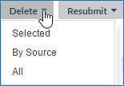

# Quarantine page 

<head>
  <meta name="guidename" content="DataHub"/>
  <meta name="context" content="GUID-3AB783C4-4474-44D8-81E4-D66015186037"/>
</head>

Selecting **Stewardship** \>**Quarantine** opens the Quarantine page, which is used to view and manage a domain’s quarantine entries.

:::note

This page is visible only to administrators and users having a role with the View Quarantine entitlement.

:::

## Repository: domain list 

Clicking  opens this drop-down list, which is used to select a repository and domain. Selecting a repository and domain loads the quarantine entries list with content relating to that domain. The button label identifies the selected repository and domain. The repository and domain most recently selected in this page, or more recently in the Repositories page, is selected by default.

Repositories and domains listed for selection are those for which the user has the View Quarantine entitlement. The selections are alphabetically ordered and grouped by repository. The current selection appears in bold.

Typing in the filter field above the list filters the list to include only repositories and domains whose names partially or completely match the typed characters.

## Quarantine entry counts 

This panel shows the total and itemized non-zero counts of quarantine entries. Itemized counts are links. Where tag-based entitlements for viewing quarantine entries are assigned to one of the user’s roles for the selected domain, the counts reflect the default filtering by tag applied to the quarantine entries list.

-   While active quarantine entries are listed to the right, clicking an itemized count link applies the corresponding Quarantine Cause filter to the list.

   

**Total Entries**  
Full count of active quarantine entries.

**Data Incorporation Error**  
Count of entities quarantined due to their causing errors during incorporation into the domain:

    

**Other Incorporation Error**  
Count of entities quarantined during incorporation due to causes other than unresolvable references.

**Unknown Reference Value**  
Count of entities quarantined during incorporation due to unresolvable references, either collection items or fields for which referential integrity for entity contributions is enforced.

**Record Already End-dated**  
Count of entities quarantined during incorporation due to the existence of a link to the entity from an end-dated golden record.

**Data Integration Error**  
Count of entities quarantined due to their failure to structurally conform with the field layout specified in the domain model.

**Data Quality Error**  
Count of entities quarantined due to data quality step failure.

**Data Validation Error**   
Count of entities quarantined due to any of the causes in this category:

**Required Field Omitted**  
Count of entities quarantined due to their omission of fields specified as required or as key fields for collections in the domain model.

 **Field Format Error**  
Count of entities quarantined because they contain data not in conformance with either their field type, validation options for that field type specified in the domain model, or with the system 255-character limit for text and Enumeration field values.

**Duplicate Collection Key**  
Count of entities quarantined because they contain multiple collection items with the same key values.

**Matching Error**  
Count of entities quarantined due to any of the causes in this category:

**Multiple Matches**  
Count of entities quarantined due to their matching multiple golden records not yet linked to a record in the source.

**Ambiguous Match**  
Count of entities quarantined due to their matching 10 or more golden records, regardless of links to source records \(1,000 or more in the case of an exact matching expression grouped with a fuzzy matching expression\).

**Potential Duplicate**  
Count of entities quarantined due to their matching golden records that have already been linked to a record in the source.

**Reference Matching Error**  
Count of entities quarantined due to their having a value in a reference field specified for matching in a match rule that does not resolve to a golden record.

**Requires Approval**  
Count of entities quarantined due to any of the causes in this category:

**Create Approval Required**  
Count of entities quarantined due to their satisfying conditions configured for their source requiring the manual approval of new entity contributions.

**Update Approval Required**  
Count of entities quarantined due to their satisfying conditions configured for their source requiring the manual approval of contributed entities that would update matching golden records.

**Update With Base Value Approval**  
Count of entities quarantined due to their source being configured to require manual approval of contributed entities for which a pending link exists from the matching golden record to the source and in which a field has a base value.

:::note

A field’s base value for a source is the value of the field in the matching golden record’s base version for the source. While there is a pending link from a golden record to a source, the base version of the golden record for that source is the golden record version when the pending link was created.

:::

 **End-date Approval Required**  
Count of entities quarantined due to their source being configured to require manual approval of contributed entities that would end-date matching golden records.

-   While resolved quarantine entries are listed to the right, clicking an itemized count link applies the corresponding Resolution filter to the list.

    **Name**  
    **Description**

    **Total Entries**  
    Full count of resolved quarantine entries.

    **Approved for Incorporation**  
    Count of entries for which a user approved the quarantined entity.

    **Entity Deleted**  
    Count of entries for which a user requested deletion.

    **Entity Rejected**  
    Count of entries for which a user rejected the quarantined entity.

    **Fields Selectively Merged**  
    Count of entries for which a user merged fields from the quarantined entity into a selected matching golden record and also rejected the quarantined entity.

    **Golden Record Deleted**  
    Count of entries for which a user manually deleted the golden record associated with the quarantined entity.

    **Golden Record Restored**  
    Count of entries for which a user restored an end-date golden record from which there exists a link to the quarantined enity.

    **Matching Issue Resolved**  
    Count of entries for which a user resolved the matching issue associated with the quarantined entity.

    **Newer Version Contributed**  
    Count of entries for which a newer version of the quarantined entity was contributed in a batch, thereby making this quarantine entry obsolete.

    **Newer Version Incorporated**  
    Count of entries automatically resolved as a result of the successful incorporation in the target domain of a replacement for the quarantined entity.

    **Resubmitted Ignoring Enrichment**  
    Count of entries for which a user resubmitted the quarantined entity, applying only data quality steps subsequent to the failed step.

    **Resubmitted Retrying Enrichment**  
    Count of entries for which a user resubmitted the quarantined entity, reapplying the failed data quality step and all subsequent steps.

    **Resubmitted With Edits**  
    Count of entries for which a user edited and resubmitted the quarantined entity using the Edit and Resubmit Entity wizard.

    **Resubmitted Without Editing**  
    Count of entries for which a user resubmitted the quarantined entity without editing.

The panel is collapsible.

- «

  Collapses the panel.

- »

  Expands the panel.

## Delete 

Opens a drop-down menu with the following options for requesting deletion of quarantine entries:

-   **Selected** — Requests deletion of quarantine entries whose check boxes are selected in the quarantine entries list.

-   **By Source** — Requests deletion of active quarantine entries associated with a particular source, including entries not listed due to filtering. The source will be selected in the confirmation dialog.

-   **All** — Requests deletion of all active quarantine entries, including entries not listed due to filtering.

In the confirmation dialog:

**Source**  
Selects the source whose associated quarantine entries are to be deleted.

**OK**  
Executes the request.

**Cancel**  
Cancels the request.

:::note

The **Delete** button and drop-down menu are visible only to administrators and users having a role with the Delete Quarantine entitlement. The button is disabled for **Resolved** quarantine entries.

:::

## Resubmit  

Opens a drop-down menu with the following options for requesting resubmission of quarantined entities for incorporation in the domain:

-   **Selected** — Requests resubmission of entities represented by quarantine entries whose check boxes are selected in the quarantine entries list.

-   **By Source** — Requests resubmission of entities originating from a particular source, where the entities are represented by active quarantine entries, including entries not listed due to filtering. The source will be selected in the confirmation dialog.

-   **All** — Requests resubmission of all entities represented by active quarantine entries, including entries not listed due to filtering.

In the confirmation dialog:

**Name**  
**Description**

**Source**  
Selects the source whose associated entities are to be resubmitted.

**OK**
 Executes the request.

**Cancel**  
Cancels the request.

:::note

When an entity quarantined with the cause “Update Approval Required” is resubmitted, if a golden record with the ID specified for linking does not exist, the repository performs normal matching, which in a normal case will result in creation of a golden record.

:::

:::note

The **Resubmit** button and drop-down menu are visible only to administrators and users having a role with the Resubmit Quarantine entitlement. The button is disabled for **Resolved** quarantine entries.

:::

## Status filter 

-   Selecting **Active** \(the default\) lists only active quarantine entries.

-   Selecting **Resolved** lists only resolved quarantine entries.

## Filters 

The quarantine entries list can optionally be filtered using one or more of the following types of criteria:

-   Source

-   Source Entity ID

-   Quarantine Cause — category of reason for quarantining — for example, Matching Error — or a specific cause for quarantining — for example, Potential Duplicate. Multiple categories and causes are selectable.

-   Quarantined Date — time span.

-   Resolved Date \(**Resolved** quarantine entries only\) — time span.

    :::note
    
    Resolved quarantine entries are purged 60 days after resolution with this exception: Superseded quarantine entries are purged 14 days after resolution.

    :::

-   Record Tag

    :::note
    
    Where tag-based entitlements for viewing quarantine entries are assigned to one of the user’s roles for the selected domain, default filtering by tag is applied to the quarantine entries list. Manually applying filtering by tag does not override default filtering. While any tag can be used for filtering, the visibility of a given quarantine entry is contingent upon the matching golden record having a tag for which one of the user’s roles has an entitlement.

    :::

-   Transaction ID

-   Field Data — entity field data. Multiple filters of this type can be applied.

-   Resolution \(**Resolved** quarantine entries only\) — for example, Matching Issue Resolved. Multiple resolutions are selectable.

While a filter is manually applied, a button for that filter appears to the left of the **Add Filter** button. The button’s label shows the specified criterion — for example, **Source:** NetSuite. Clicking  on the button clears the filter. Clicking elsewhere on the button opens the dialog used to apply the filter for the purpose of modifying the criterion.

:::note

While a Transaction ID filter is applied, it is not possible to manually apply any of the other types of filters — and vice-versa.

:::

**Name**  
**Description**

**Add Filter**  
Lists filter types for selection:

-   Source — Opens the dialog used to apply filtering by source.

    

    -   **Source** — Selects the source by which to filter. The selection MDM specifies entities submitted via **Edit this record** in golden record detail view in .

    -   **Apply** — Sets the filter criterion, closes the dialog and applies the filter.

    -   **Cancel** — Closes the dialog without applying a filter.

-   Source Entity ID — Opens the dialog used to apply filtering by source entity ID.

    

     -   **Source Entity ID** — Sets the entity ID.

     -   **Apply** — Sets the filter criterion, closes the dialog and applies the filter.

     -   **Cancel** — Closes the dialog without applying a filter.

-   Quarantine Cause — Opens the dialog used to apply filtering by category of reason and/or cause for quarantining.

    -   The categories are mutually exclusive, and therefore check boxes enable the selection of one, multiple or all.

    -   Within each category the causes are mutually exclusive, and therefore check boxes enable the selection of one, multiple or all.

        Toggling a category’s check box toggles the check boxes for all of that category’s causes.

        

    -   **Data Incorporation Error** — Filter by entities quarantined due to an error during incorporation into the domain. This selection is collectively equivalent to the following selections:

        -   **Other Incorporation Error** — Filter by entities quarantined during incorporation due to causes other than unresolvable references.

        -   **Unknown Reference Value** — Filter by entities quarantined during incorporation due to unresolvable references, either collection items or fields for which referential integrity for entity contributions is enforced.

        -   **Record Already End-dated** — Filter by entities quarantined during incorporation due to the existence of a link to the entity from an end-dated golden record.

    -   **Data Integration Error** — Filter by entities quarantined due to failure to structurally conform with the field layout specified in the domain model.

    -   **Data Quality Error** — Filter by entities quarantined due to data quality step failure.

     -   **Data Validation Error** — Filter by entities quarantined due to any of the causes in this category:

            -   **Required Field Omitted** — Filter by entities quarantined due to their omitting fields specified as required in the domain’s model.
            -   **Field Format Error** — Filter by entities quarantined due to their containing data not in conformance with their field type or validation options for that field type specified in the domain’s model and/or with the system 255-character limit for text and Enumeration field values.
            -   **Duplicate Collection Key** — Filter by entities quarantined due to their containing multiple collection items with the same key field values.
    -   **Matching Error** — Filter by entities quarantined due to any of the causes in this category:

        -   **Multiple Matches** — Filter by entities quarantined due to their matching multiple golden records not yet linked to a record in the contributing source.

        -   **Ambiguous Match** — Filter by entities quarantined due to their matching 10 or more golden records, regardless of links to source records \(1,000 or more in the case of an exact matching expression grouped with a fuzzy matching expression\).

         -   **Potential Duplicate** — Filter by entities quarantined due to their matching golden records that have already been linked to a record in the contributing source.

        -   **Reference Matching Error** — Filter by entities quarantined due to their having a value in a reference field specified for matching in a match rule that does not resolve to a golden record.

    -   **Requires Approval** — Filter by entities quarantined due to any of the causes in this category:

        -   **Create Approval Required** — Filter by entities quarantined due to their satisfying conditions configured for their source requiring the manual approval of new entity contributions.

        -   **Update Approval Required** — Filter by entities quarantined due to their satisfying conditions configured for their source requiring the manual approval of contributed entities that would update matching golden records.

        -   **Update With Base Value Approval Required** — Filter by entities quarantined due to their source being configured to require manual approval of contributed entities for which a pending link exists from the matching golden record to the source and in which a field has a base value.

        -   **End-date Approval Required** — Filter by entities quarantined due to their source being configured to require manual approval of contributed entities that would end-date matching golden records.

    -   **Apply** — Sets the filter criteria, closes the dialog and applies the filter.

    -   **Cancel** — Closes the dialog without applying a filter.

-   Quarantined Date — Opens the dialog used to apply filtering by the date and time of quarantining.

    

    -   **Past Hour** — Selects the past hour. This is the default.

     -   **Past 24 Hours** — Selects the past 24 hours.

    -   **Past Week** — Selects the past week.

     -   **Date Range** — Enables the selection of a custom time span.

            -   **From** — Sets the starting time and date:

                -   time — Type a value in the range 00:00–23:59, or select a :00 or :30 value.

                -   date — Type the value or select it from the calendar.

            -   **To** — Sets the ending time and date:

                -   time — Type a value in the range 00:00–23:59, or select a :00 or :30 value.

                -   date — Type the value or select it from the calendar.

    -   **Apply** — Sets the selected time span, closes the dialog and applies the filter.

    -   **Cancel** — Closes the dialog without applying a filter.

-   Resolved Date — Opens the dialog used to apply filtering to resolved quarantine entries by the date and time of resolution. The dialog is the same as the one used to apply Quarantined Date filtering — see the description above.

-   Record Tag — Opens the dialog used to manually apply filtering by tag.

     

    -   **Tag Name** — Selects the tag by which to filter.

    -   **Apply** — Sets the filter criterion, closes the dialog and applies the filter.

    -   **Cancel** — Closes the dialog without applying a filter.

-   Transaction ID — Opens the dialog used to apply filtering by transaction ID.

    

    -   **Transaction ID** — Selects the transaction ID by which to filter.

    -   **Apply** — Sets the filter criterion, closes the dialog and applies the filter.

    -   **Cancel** — Closes the dialog without applying a filter.

-   Field Data — Opens the dialog used to apply filtering by an entity field value.

    

    -   **Field** — Selects the field.

     -   **Value** — Sets the value.

    -   **Apply** — Sets the filter criterion, closes the dialog and applies the filter.

    -   **Cancel** — Closes the dialog without applying a filter.

        :::note
        
        The Starts With operator is used when applying this filter type. For example, specifying a **Value** for a given **Field** of “Chime Timers” would return quarantine entries for which the value of the entity field in question begins with “Chime Timers”, such as “Chime Timers, Inc.” and “Chime Timers”.

        :::

-   Resolution — Opens the dialog used to apply filtering to resolved quarantine entries by resolution. The selections are mutually exclusive, and therefore check boxes enable the selection of one, multiple, or all.

    

    -   **Approved for Incorporation** — Filter by entries for which a user approved the quarantined entity.

    -   **Approved for Update With Base Values** — Filter by entries for which a user approved the quarantined entity for incorporation with base values.

    -   **Approved for Update Without Base Values** — Filter by entries for which a user approved the quarantined entity for incorporation without base values.

     -   **Entity Deleted** — Filter by entries for which a user requested deletion.

    -   **Entity Rejected** — Filter by entries for which a user rejected the quarantined entity.

    -   **Fields Selectively Merged** — Filter by entries for which a user merged fields from the quarantined entity into a selected matching golden record and also rejected the quarantined entity.

    -   **Golden Record Deleted** — Filter by entries for which a user manually deleted the golden record associated with the quarantined entity.

    -   **Golden Record Restored** — Filter by entries for which a user restored an end-dated golden record from which there exists a link to the quarantined enity.
     -   **Matching Issue Resolved** — Filter by entries for which a user resolved the matching issue associated with the quarantined entity.

    -   **Newer Version Contributed** — Filter by entries for which a newer version of the quarantined entity was contributed in a batch, thereby making this quarantine entry obsolete.

    -   **Newer Version Incorporated** — Filter by entries automatically resolved as a result of the successful incorporation in the target domain of a replacement for the quarantined entity.

     -   **Resubmitted Ignoring Enrichment** — Filter by entries for which a user resubmitted the quarantined entity, applying only data quality steps subsequent to the failed step.

     -   **Resubmitted Retrying Enrichment** — Filter by entries for which a user resubmitted the quarantined entity, reapplying the failed data quality step and all subsequent steps.

     -   **Resubmitted With Edits** — Filter by entries for which a user edited and resubmitted the quarantined entity using the Edit and Resubmit Entity wizard.

     -   **Resubmitted Without Editing** — Filter by entries for which a user resubmitted the quarantined entity without editing.

    -   **Apply** — Sets the filter criteria, closes the dialog and applies the filter.

     -   **Cancel** — Closes the dialog without applying a filter.

** Clear All Filters**  
Clears all filters.

** Save current filters as default view**  
Saves the currently applied filters and **Filter Operator** as defaults for application to the quarantine entries list when the **Quarantine**page reloads. Your defaults are saved separately per account for each of the repository’s hosted domains. For a given domain, your defaults are saved separately for **Active** and **Resolved** quarantine entries.

## Filter Operator 

Sets the manner in which multiple filters are applied to the quarantine entries list.

-   AND — The filters are “AND’ed” \(default\). For example, filtering on a Name field value of Tom and a Gender field value of Male selects quarantine entries for entities with both of the specified values.

-   OR — The filters are “OR’ed”. For example, filtering on a Name field value of Tom or a Gender field value of Male selects quarantine entries for entities with either of the specified values.

## **** Refresh 

Refreshes the quarantine entries list.

## Quarantine entries list 

Quarantine entries are listed, subject to filtering.

The following are shown for each listed quarantine entry except as noted:

**Name**  
**Description**

**Check box**  
\(**Active** entries only\) Select the entry for deletion or for resubmission of its entity for incorporation in the domain. Clicking the Quarantined Date link to the right automatically selects this. To simultaneously select or deselect all listed quarantine entries, select or clear the check box in the column heading.

**Quarantined Date**  
Timestamp of the quarantining of the entity. This also serves as a link to quarantine entry details. Clicking the link automatically selects the check box to the left.

**Resolved Date**  
\(**Resolved** entries only\) Timestamp of the resolution of the entry.

**Record Title**    
Formatted title of the golden record that could potentially be created, updated, or end-dated as a result of resolving the entry. This column is omitted if a null golden record title format is specified in the domain model.

**Source**    
Source of the entity, where this can be determined.

**Entity ID**    
Source entity ID, where this can be determined.

**Resolution**  
\(**Resolved** entries only\) Method of resolution — for example, Matching Issue Resolved.

**Cause**  
Cause for quarantining — for example, Potential Duplicate.

Clicking the information icon displays detail — for example, the entity is potentially a duplicate of a golden record\(s\) already linked to an entity in the source system.

**Active** entries are sorted by Quarantined Date. The default is newest to oldest. Clicking the column heading toggles the sort order.

**Resolved** entries are sorted by default by Resolved Date, newest to oldest. To sort by Quarantined Date, click that column heading. To restore sorting by Resolved Date, click that column heading. Clicking the column heading of the date by which entries are currently sorted toggles the sort order.

Initially a maximum of 100 entries load into the list.

-   The list is scrollable, both vertically and horizontally.

-   In addition to the scroll bars, the following controls are used to navigate the list:

    **Name**  
    **Description**

    ****  
    Loads the first quarantine entries.

    ****  
    Loads quarantine entries immediately prior to those currently loaded.

    **x-y of z**  
    Indicates the number and relative chronological position of the currently loaded quarantine entries — for example, “301-400 of 2086”. The total quarantine entry count shown reflects currently applied filtering.

    ****  
    Loads quarantine entries immediately subsequent to those currently loaded.

    ****  
    Loads the last quarantine entries.

-   To adjust column widths, drag and drop the column dividers in the header. Minimum column widths are enforced relative to the width of the browser window.

:::note

The list does not update to reflect actions performed in the quarantine entry detail view until the detail view is closed.

:::