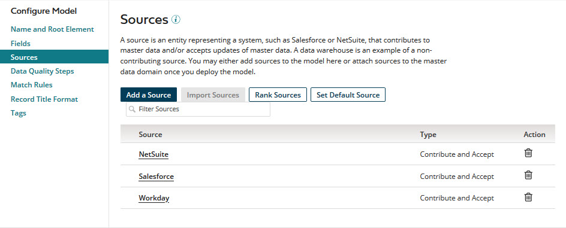
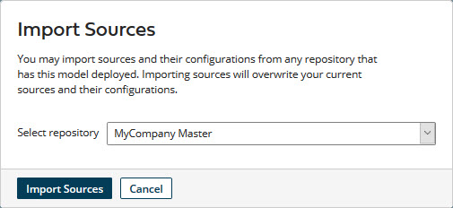
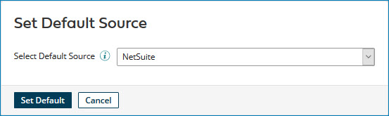
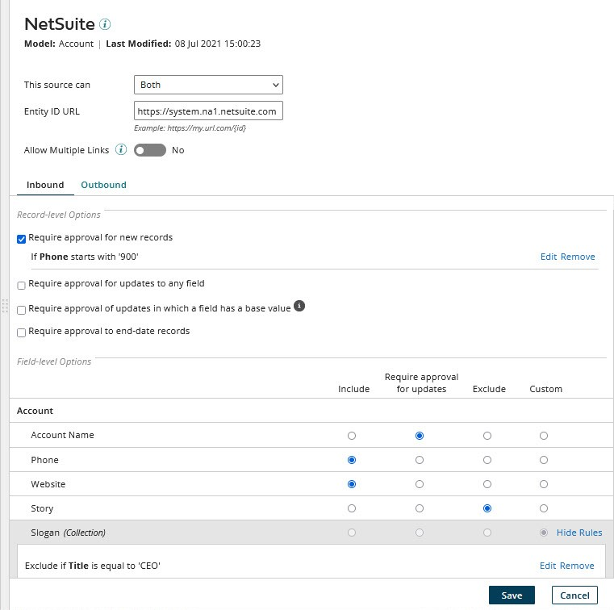
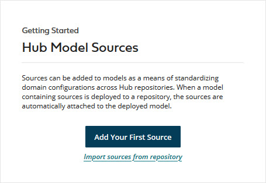

# Sources tab \(model\) 

<head>
  <meta name="guidename" content="DataHub"/>
  <meta name="context" content="GUID-3333e3f7-c402-4772-ab60-8c9b620788dc"/>
</head>

The **Sources tab** in the model page is used to add sources to the model, modify the model’s sources, remove sources from the model, and, optionally, rank the model’s sources and set the the model’s default source.

## Add a Source 
Opens the Add a Source dialog, which is used to add a source to the model.

## Import Sources 

Opens the Import Sources dialog, which is used import the source configuration from a domain that is hosted in a repository to which the model is deployed. Importing replaces the model’s existing source configuration.

:::note

If either the model is not deployed or the model is deployed but does not have attached sources, the dialog does not appear. An error message appears instead.

:::

:::note

When a domain to which a model with embedded sources was deployed has a source configuration that is specific to the repository in which the domain is hosted, a notification to that effect appears in the domain **Sources** tab in the repository page. The notification contains a link to the model’s **Sources** tab to facilitate importing of the domain source configuration.

:::

**Name**  
Description

**Select repository**  
The available repository selections are the repositories to which the model is deployed.

**Import Sources**  
Initiates a request to import sources into the model. In the confirmation dialog:

 -   Clicking **OK** executes the request.

        When the operation is complete, the imported sources are listed in the sources summary list.

 -   Clicking **Cancel** cancels the request.

## Rank Sources 

Opens the Source Rankings by Field dialog, which is used to configure source rankings for the model.

## Set Default Source 
Opens the Set Default Source dialog, which is used to set the default source for the model. Designating a source as a model’s default source effectively identifies domains hosted in repositories to which the model is deployed as reference data domains, which helps ensure references to that data are consistent across referencing master data domains. A model is not required to have a default source.

**Name**  
Description

**Select Default Source**  
The available default source selections are the model’s contributing sources and None. Selecting None and applying that selection results in the not having a default source.

**Set Default**  
Initiates a request to apply the default source selection to the model. In the confirmation dialog:

-   Clicking **OK** executes the request.

    When the new model version is deployed, if there was not a designated default source for the domain, there is no immediate effect on pending references. Going forward, while that source remains the default, when an entity is contributed to a master data domain that references this domain from a source not attached to this domain, an attempt is made to match the entity ID in the referencing field to an entity ID linking a golden record in this domain to the default source. If the attempt is successful, the reference is resolved for the source contributing the entity. If the attempt is unsuccessful, the reference is designated as Pending for that source.

    When the new model version is deployed, if there was a designated default source for the domain:

    -   Regardless of whether **Select Default Source** is set to a different source or None, all resolved references to golden records in the referenced domain linked to the previous default source are changed to Pending.
     -   Then, if a **Select Default Source** is set to a different source, an attempt is made to match the entity ID in each pending reference to the entity ID in a golden record in the referenced domain linked to the new default source. For each such successful attempt, the reference is resolved.
 -   Clicking **Cancel** cancels the request.

**Cancel**  
Closes the dialog without changing the default source.

## Filter Sources 

Typing in this field filters the sources summary list below to include only sources having matching names. Clicking  clears the field and stops filtering.

## Sources summary list 

Lists the model’s sources, subject to filtering, and provides access to source and channel configuration tools.

For each source the following tools and properties are shown:

**Name**  
**Description**

**Source**  
Name of the source. Hovering on the name displays the unique source ID used to refer to the source in integrations and calls to the REST APIs. This is a link to the source configuration dialog. If the source is the model’s default source, “ - Default” appears immediately following the name.

In the source configuration dialog:

**Model**  
The name of the model.

**Last Modified**  
Date and time of the most recent modification of the source configuration.  

    
**Name**  
**Description**

**Contribute data**  
This source can contribute data to domains hosted in repositories to which the model is deployed but cannot accept channel updates. This type of source is called a contribute-only source.

**Accept channel updates**    
This source can accept channel updates from domains hosted in repositories to which the model is deployed but cannot contribute data. This type of source is called a non-contributing source — data warehouses are common non-contributing sources.

**Both**  
This source can contribute data to domains hosted in repositories to which the model is deployed and accept channel updates.

**Entity ID URL**  
Sets the URL template the Boomi DataHub uses to construct target URLs for links, rendered in the Golden Records page, to entities in this source system. This setting is also in the [Add a Source dialog](/docs/Atomsphere/Master%20Data%20Hub/Menu/hub-Add_a_Source_dialog_Inbound_tab_8d797fa1-8285-4788-a45e-4b040d8ec493.md) and the [Attach a Source dialog](/docs/Atomsphere/Master%20Data%20Hub/Menu/hub-Add_a_Source_dialog_Inbound_tab_8d797fa1-8285-4788-a45e-4b040d8ec493.md).

**Allow Multiple Links**  
If switched to Yes, it allows multiple links from individual golden records to entities in the source system, and entities contributed from the source cannot be quarantined as potential duplicates. This switch is set to No by default. This setting is also in the [Add a Source dialog](/docs/Atomsphere/Master%20Data%20Hub/Menu/hub-Add_a_Source_dialog_Inbound_tab_8d797fa1-8285-4788-a45e-4b040d8ec493.md) and the [Attach a Source dialog](/docs/Atomsphere/Master%20Data%20Hub/Menu/hub-Add_a_Source_dialog_Inbound_tab_8d797fa1-8285-4788-a45e-4b040d8ec493.md).

:::note

Existing multiple links from individual golden records to a source’s entities persist if, after the source is configured to allow multiple links, the source is then reconfigured to disallow multiple links.

:::

**Inbound**  
(Present only if this source can contribute data.)
Use this tab to configure handling of entity contributions from the source. Its controls are identical to those in the Inbound tab in the Add a Source dialog and the Attach a Source dialog.

**Outbound**  
(Present only if this source can contribute data.)
Use this tab to configure handling of entity contributions from the source. Its controls are identical to those in the Outbound tab in the Add a Source dialog and the Attach a Source dialog.

**Save**
Changes the source configuration and closes the dialog.
**Cancel**
Closes the dialog without changing the source configuration.

**Type**  
Shows the type of source:

 -   Contribute and Accept — The source can contribute data to domains hosted in repositories to which the model is deployed and accept channel updates from those domains.

 -   Contribute Only —The source can only contribute data to domains hosted in repositories to which the model is deployed.

-   Accept Only — The source can only accept channel updates from domains hosted in repositories to which the model is deployed.

**Action**  
A single action is available:

-   ** Remove Source** — Removes the source from the summary list. The source is not actually removed from the model until the model is subsequently saved. If the model is then published and deployed to a repository, if the removed source was attached to the domain, it is automatically removed from the domain, along with its staging areas and staged entities. The effect of automatic removal is the same as manual removal.

## Getting Started: Hub Model Sources 

Until the first source is added to a model, this Getting Started box will be visible in the **Sources** tab:

**Name**  
**Description**

**Add Your First Source**  
Clicking this button has the same effect as clicking **Add a Source**.

**Import sources from repository**  
Clicking this link has the same effect as clicking **Import Sources**.