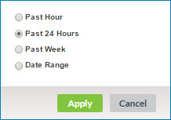

# Staged Entities page 

<head>
  <meta name="guidename" content="DataHub"/>
  <meta name="context" content="GUID-5DF0380E-9CAD-43F0-BA45-301C989629AA"/>
</head>

Selecting **Stewardship** \> **Staged Entities** opens the Staged Entities page, which is used to view entities in staging areas for a domain’s attached sources.

:::note

This page is visible only to administrators and users having a role with the View Staged Data entitlement.

:::

## Repository: domain list

Clicking  opens this drop-down list, which is used to select a repository and domain. Selecting a repository and domain loads the page with content relating to that domain. The button label identifies the selected repository and domain. The repository and domain most recently selected in this page, or more recently in the Repositories page, is selected by default.

Repositories and domains listed for selection are those for which the user has the View Staged Data entitlement. The selections are alphabetically ordered and grouped by repository. The current selection appears in bold.

Typing in the filter field above the list filters the list to include only repositories and domains whose names partially or completely match the typed characters.

## Staging area 

**Name**  
**Description**

**selected staging area**  
Shows the name of the staging area whose entities are listed and the name of the source for which the staging area was added.

Clicking ** Select Staging Area** opens the dialog used to select a different staging area.

 **Name**  
**Description**

 **Source**  
Sets the source for which the desired staging area was added.

**Staging Area**  
Sets the staging area.

**Apply**   
Applies the change to the staging area selection and closes the dialog.

**Cancel**  
Closes the dialog without changing the staging area selection.

## Entity counts 

This panel shows the total and itemized non-zero counts of entities in the selected staging area. Itemized counts are links. Clicking an itemized count link applies the corresponding Entity Result filter to the staged entities list to the right.

**Name**  
**Description** 

**Total Entities**  
Full count of entities in the selected staging area.

**Create Record**  
Count of staged entities which, if actually contributed when staged, would have resulted in the creation of a golden record.

**Update Record**  
Count of staged entities which, if actually contributed when staged, would have resulted in the updating of a golden record.

**End-date Record**  
Count of staged entities which, if actually contributed when staged, would have resulted in the end-dating of a golden record.

**Link Record**  
Count of staged entities which, if actually contributed when staged, would have resulted in the linking of a golden record to the source entity.

**Link and Update Record**  
 Count of staged entities which, if actually contributed when staged, would have resulted in the linking of a golden record to the source entity and the updating of that golden record.

**No Change**  
Count of staged entities which, if actually contributed when staged, would not have resulted in the creation, updating, end-dating, or linking of a golden record.

**Quarantine \(All\)**  
Count of staged entities which, if actually contributed when staged, would have been quarantined.

The following itemized sub-counts, where non-zero, are indented below. These sub-counts are also links. Clicking an itemized sub-count link applies the corresponding Entity Result filter to the staged entities list to the right.

**Name**
  **Description**

**Ambiguous Match**  
    Count of entities that would have been quarantined due to their matching 10 or more golden records, regardless of links to source records \(1,000 or more in the case of an exact matching expression grouped with a fuzzy matching expression\).

**Create Approval Required**  
    Count of entities that would have been quarantined due to their satisfying conditions configured for their source requiring the manual approval of new entity contributions.

**Data Integration Error**  
    Count of entities that would have been quarantined due to their failure to structurally conform with the field layout specified in the domain model.

**Data Quality Error**  
    Count of entities that would have been quarantined due to data quality step failure.

**Duplicate Collection Key**  
    Count of entities that would have been quarantined because they contain multiple collection items with the same key values.

 **End-date Approval Required**  
    Count of entities that would have been quarantined due to their source being configured to require manual approval of entity contributions that would end-date matching golden records.

**Field Format Error**    
    Count of entities that would have been quarantined because they contain data not in conformance with either their field type, validation options for that field type specified in the domain model, or with the system 255-character limit for text and Enumeration field values.

**Multiple Matches**  
Count of entities that would have been quarantined due to their matching multiple golden records not yet linked to a record in the source.

**Other Incorporation Error**    
Count of entities that would have been quarantined during incorporation due to causes other than unresolvable references.

**Potential Duplicate**  
Count of entities that would have been quarantined due to their matching golden records that have already been linked to a record in the source.

**Record Already End-dated**  
    Count of entities that would have been quarantined due to the existence of a link to the entity from an end-dated golden record.

**Reference Matching Error**  
    Count of entities that would have been quarantined due to their having a value in a reference field specified for matching in a match rule that does not resolve to a golden record.

**Required Field Omitted**  
    Count of entities that would have been quarantined due to their omission of fields specified as required or as key fields for collections in the domain model.

 **Unknown Reference Value**  
    Count of entities quarantined that would have been quarantined during incorporation due to unresolvable references, either collection items or fields for which referential integrity for entity contributions is enforced.

**Update Approval Required**  
    Count of entities that would have been quarantined due to their satisfying conditions configured for their source requiring the manual approval of contributed entities that would update matching golden records.

The panel is collapsible.

«

Collapses the panel.

»

Expands the panel.

## Delete 

Opens a drop-down menu with the following options for requesting deletion of staged entities:

-   **Selected** — Requests deletion of entities whose check boxes are selected in the list below.

-   **Filter Results** — Requests deletion only of entities in the filter results.

-   **All** — Requests deletion of all entities, including entities not listed due to filtering. This operation will enable a staging area that was automatically disabled due to the deployment of a new version of the domain model.

In the confirmation dialog:

-   Clicking **OK** executes the request.
   
    The staged entities list automatically refreshes shortly after the completion of the operation to reflect the result. In the meantime you can request a manual **Refresh**.

-   Clicking **Cancel** cancels the request.

:::note

The **Delete** button and drop-down menu are visible only to administrators and users having a role with the Delete Staged Data entitlement.

:::

## Resubmit 

Opens a drop-down menu with the following options for requesting resubmission of staged entities to the staging area:

-   **Selected** — Requests resubmission of entities whose check boxes are selected in the list below.

-   **Filter Results** — Requests resubmission only of entities in the filter results.

-   **All** — Requests resubmission of all entities, including entities not listed due to filtering.

In the confirmation dialog:

-   Clicking **OK** executes the request.

    If the number of selected entities exceeds the maximum batch size of 200, multiple batches are submitted for restaging; otherwise, a single batch is submitted.

    The staged entities list automatically refreshes shortly after the completion of the operation to reflect the result. In the meantime you can request a manual **Refresh**.

-   Clicking **Cancel** cancels the request.

:::note

The **Resubmit** button and drop-down menu are visible only to administrators and users having a role with the Resubmit Staged Data entitlement.

:::

## Commit 

Opens a drop-down menu with the following options for committing staged entities for transaction processing:

-   **Selected** — Requests a commit for entities whose check boxes are selected in the list below.

-   **Filter Results** — Requests a commit only for entities in the filter results.

-   **All** — Requests a commit for all entities, including entities not listed due to filtering.

In the confirmation dialog:

-   Clicking **OK** executes the request.

    If the number of selected entities exceeds the maximum batch size of 200, multiple batches are committed for transaction processing; otherwise, a single batch is committed.

-   Clicking **Cancel** cancels the request.

:::note

The **Commit** button and drop-down menu are visible only to administrators and users having a role with the Commit Staged Data entitlement.

:::

## Filters 

The staged entities list can optionally be filtered using one or more of the following types of criteria:

-   Created Date — time span.

-   Source Entity ID

-   Entity Result

While a filter is applied, a button for that filter appears to the left of the **Add Filter** button. The button’s label shows the specified criterion — for example, **Result:** Create Record. Clicking  on the button clears the filter. Clicking elsewhere on the button opens the dialog used to apply the filter for the purpose of modifying the criterion.

When multiple filters are applied, the filters are “AND’ed”. For example, filtering on a Source Enity ID of 101 and an Entity Result of Update Record selects staged entities that meet both criteria.

You can apply the AND or OR filter operator.

**Add Filter**  
Lists filter types for selection:

-   Created Date — Opens the dialog used to apply filtering by time span. The default selection is **Past Hour**.

    

    -   **Past Hour** — Selects the past hour.

     -   **Past 24 Hours** — Selects the past 24 hours.

    -   **Past Week** — Selects the past week.

     -   **Date Range** — Enables the selection of a custom time span. The default settings equate to the past month.

            -   **From** — Sets the starting time and date:

                -   time — Type a value in the range 00:00–23:59, or select a :00 or :30 value.

                -   date — Type the value or select it from the calendar.

            -   **To** — Sets the ending time and date:

                -   time — Type a value in the range 00:00–23:59, or select a :00 or :30 value.

                -   date — Type the value or select it from the calendar.

     -   **Apply** — Sets the selected time span, closes the dialog and applies the filter.

    -   **Cancel** — Closes the dialog without applying a filter.

-   Source Entity ID — Opens the dialog used to apply filtering by source entity ID.

    

    -   **Source Entity ID** — Sets the entity ID.

    -   **Apply** — Sets the filter criterion, closes the dialog and applies the filter.

    -   **Cancel** — Closes the dialog without applying a filter.

-   Entity Result — Opens the dialog used to apply filtering according to type of entity staging result.

    

    -   **Entity Result** — Sets the result type:

         -   Create Record — Filter by entities which, if actually contributed when staged, would have resulted in the creation of a golden record.

        -   Update Record — Filter by entities which, if actually contributed when staged, would have resulted in the updating of a golden record.

        -   End-date Record — Filter by entities which, if actually contributed when staged, would have resulted in the end-dating of a golden record.

        -   Link Record — Filter by entities which, if actually contributed when staged, would have resulted in the linking of a golden record to the source entity.

        -   Link and Update Record — Filter by entities which, if actually contributed when staged, would have resulted in the linking of a golden record to the source entity and the updating of that golden record.

        -   No Change to Record — Filter by entities which, if actually contributed when staged, would not have resulted in the creation, updating, end-dating, or linking of a golden record.

        -   Quarantine — Filter by entities which, if actually contributed when staged, would have been quarantined.

    -   **Quarantine Cause** — Refines filtering by the reason for quarantining applicable to entities that would have been quarantined.

        -   All — Do not refine filtering by the reason for quarantining — retrieve allentities that would have been quarantined.

        - Ambiguous Match — Filter by entities that would have been quarantined due to their matching 10 or more golden records, regardless of links to source records \(1,000 or more in the case of an exact matching expression grouped with a fuzzy matching expression\).

         -   Create Approval Required — Filter by entities that would have been quarantined due to their satisfying conditions configured for their source requiring the manual approval of new entity contributions.

        -   Data Integration Error — Filter by entities that would have been quarantined due to their failure to structurally conform with the field layout specified in the domain model.

        -   Data Quality Error — Filter by entities that would have been quarantined due to data quality step failure.

        -   Duplicate Collection Key — Filter by entities that would have been quarantined due to their having multiple collection items with the same key values.

        -   End-date Approval Required — Filter by entities that would have been quarantined due to their source being configured to require manual approval of entity contributions that would end-date matching golden records.

        -   Field Format Error — Filter by entities that would have been quarantined because they contain data not in conformance with either their field type, validation options for that field type specified in the domain model, or with the system 255-character limit for text and Enumeration field values.

        -   Multiple Matches — Filter by entities that would have been quarantined due to their matching multiple golden records not yet linked to a record in the source.

        -   Other Incorporation Error — Filter by entities that would have been quarantined during incorporation due to causes other than unresolvable references.

         -   Potential Duplicate — Filter by entities that would have been quarantined due to their matching golden records that have already been linked to a record in the source.

         -   Record Already End-dated — Filter by entities that would have been quarantined during incorporation due to the existence of a link to the entity from an end-dated golden record.

         -   Reference Matching Error — Filter by entities that would have been quarantined due to their having a value in a reference field specified for matching in a match rule that does not resolve to a golden record.

        -   Required Field Omitted — Filter by entities that would have been quarantined due to their omission of fields specified as required or as key fields for collections in the domain model.

        -   Unknown Reference Value — Filter by entities that would have been quarantined during incorporation due to unresolvable references, either collection items or fields for which referential integrity for entity contributions is enforced.

        -   Update Approval Required — Filter by entities that would have been quarantined due to their satisfying conditions configured for their source requiring the manual approval of contributed entities that would update matching golden records.

        -   Update With Base Value Approval Required — Filter by entities that would have been quarantined due to their source being configured to require manual approval of contributed entities for which a pending link exists from the matching golden record to the source and in which a field has a base value.

            :::note

            A field’s base value for a source is the value of the field in the matching golden record’s base version for the source. While there is a pending link from a golden record to a source, the base version of the golden record for that source is the golden record version when the pending link was created.

            :::

            This list is present only if **Entity Result** is set to Quarantine.

            -   **Apply** — Sets the filter criteria, closes the dialog and applies the filter.

            -   **Cancel** — Closes the dialog without applying a filter.

** Clear All Filters**  
Clears all filters.

 

## **** Refresh 

Refreshes the staged entities list.

## Staged entities list 
Staged entities in the selected staging area are listed, subject to filtering.

The following are shown for each listed entity except as noted:

**check box**  
Select the entity for deletion. Clicking the Created Date link to the right automatically turns this on. To simultaneously select or deselect all listed entities, select or clear the check box in the column heading.

**Created Date**  
Date of the staging of the entity. This is also ordinarily a link to entity details. Clicking the link automatically turns on the check box to the left. This is not a link, however, while a Commit or Delete action on the entity is in progress.

**Record Title**  
Formatted title of the golden record that could potentially be created, updated, or end-dated as a result of committing the entity. This column is omitted if a null golden record title format is specified in the domain model.

**Entity ID**  
Source record ID.

**Result**    
The result of staging the entity — in other words, the entity processing result that would have occurred had the entity actually been contributed when it was staged:

 -   Create Record — creation of a golden record.

-   Update Record — updating of a golden record.

-   End-date Record — end-dating of a golden record.

-   Link Record — linking of a golden record to the source entity.

-   Link and Update Record — linking of a golden record to the source entity and updating of that golden record.

-   No Change to Record — no impact on a golden record.

 -   Quarantine — quarantining of the entity. The cause is shown.

Staged entities are sorted primarily by Created Date, from newest to oldest.

Initially a maximum of 100 entities load into the list.

-   The list is scrollable, both vertically and horizontally.

-   In addition to the scroll bars, the following controls are used to navigate the list:

    **Name**  
    **Description**

    ****  
    Loads the first entities.

    ****  
    Loads entities immediately prior to those currently loaded.

    **x-y of z**  
    :   Indicates the number and relative chronological position of the currently loaded entities — for example, “301-400 of 2086”. The total entity count shown reflects currently applied filtering.

    ****  
    Loads entities immediately subsequent to those currently loaded.

    ****  
    Loads the last entities.

-   To adjust column widths, drag and drop the column dividers in the header. Minimum column widths are enforced relative to the width of the browser window.

## Getting Started: Hub Staging Areas 

Until the first staging area is added for a source attached to the selected domain, this Getting Started box will be visible in the **Staged Entities** page:

  
**Name**  
**Description**

**Add Your First Staging Area**  
Clicking this button navigates to the domain’s **Sources** tab in the repository page. You can add staging areas for sources there.