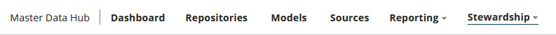
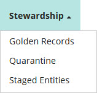

# Stewardship menu 

<head>
  <meta name="guidename" content="DataHub"/>
  <meta name="context" content="GUID-46c25a29-2b5e-4f1e-96de-2350c04fa03e"/>
</head>

The **Stewardship** menu is the entry point for the stewarding capabilities of Boomi DataHub.

:::note

The Stewardship menu is visible only to administrators and users having a role with the MDM - Stewardship privilege.

Masked values are visible if you have one of the following user permissions:

- **MDM - Privileged Data Steward** role
- **MDM - Administrator** role
- **MDM - Reveal Masked Data** privilege
- **MDM - Data Steward** role (or **MDM - Stewardship** privilege) and the **Reveal Masked Data** Hub entitlement (available with the Advanced Security feature)

:::

The menu has the following selections:

**Name**  
**Description**

**Golden Records**  
Opens the Golden Records page, which is used to view, search, and filter a domain’s golden records. This menu item is visible only to administrators and users having a role with the View Record entitlement.

**Quarantine**  
Opens the Quarantine page, which is used to view and manage a domain’s quarantine entries. This menu item is visible only to administrators and users having a role with the View Quarantine entitlement.

**Staged Entities**  
Opens the Staged Entities page, which is used to view entities in staging areas for a domain’s attached sources. This menu item is visible only to administrators and users having a role with the View Staged Data entitlement.