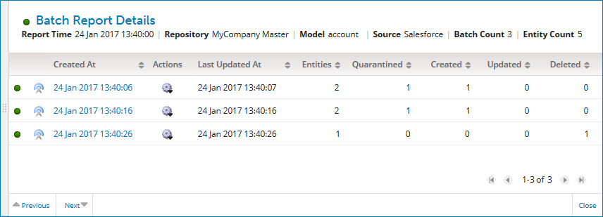
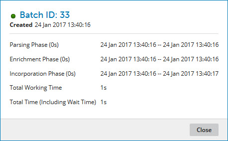

# Batch Report detail view 

<head>
  <meta name="guidename" content="DataHub"/>
  <meta name="context" content="GUID-DED98FE4-8B0D-4A39-BD0D-0FB1DB0C3AC6"/>
</head>

Clicking a Report Time link in an Inbound Activity report opens the Batch Report detail view, which contains details about the subject batches and links to batch and entity details. The view is sourced from the repository, so it may take a few moments to populate depending on the volume of data.

:::note

Batch and entity details are available for a batch for the first 60 days after batch processing completes.

:::

The view header shows the summary report information also shown in the reports list.

Clicking and dragging the **** icon in the view border adjusts the width of the view.

## Batches list 

For each reported batch, including staged batches, the following information is shown:

**Name**   
**Description**

**status**
 Status of the batch:

-    The batch was processed successfully. Hovering the pointer on this icon displays the help text “Completed”.

-    The batch was processed with errors. Hovering the pointer on this icon displays the help text “Errored”, “Quarantined” or “Completed with Errors”.

-    Processing of the batch is in progress. Hovering the pointer on this icon displays the help text “Created”, “Parsing”, “Parsed”, “Enriching”, “Enriched” or “Processing”.

**submission type**
 Type of submission:

-    The batch originated from the source. Hovering the pointer on this icon displays help text as follows:

    -   “API” — contributed batch.

    -   “Staging API” — staged batch.

-    The batch was manually originated. Hovering the pointer on this icon displays help text as follows:

    -   “Manual Edit” — the batch was created as a result of the editing and resubmission by a user of a quarantined entity.

    -   “Manual Resubmit” — the batch was created as a result of the resubmission \(without editing\) by a user of one or more quarantined entities.

    -   “Selective Merge” — the batch was created as a result of the selective merging by a user of fields in a quarantined entity into a matching golden record.

    -   “Staging Commit” — the batch was created as a result of the committing by a user of one or more staged entities for incorporation in the target domain.

    -   “Staging Resubmit” — the batch was created as a result of the resubmission by a user of one or more staged entities.

**Created At**
 The time at which the batch record was created. This is a link to the batch detail view, in which you can view detail about the batch’s entities and links.

Actions ****
 Opens a menu of actions applicable to the batch:

-   **Batch Processing Details** — Opens the Batch Processing Details dialog which lets you view processing details for the batch. Elapsed times are shown as hours \(h\), minutes \(m\) and seconds \(s\).

    

    **Name**
     **Description**

    **ID**
     The system batch ID.

    **Created**
     The time at which the batch record was created.

    **Parsing Phase \( \)**
     The \(elapsed\), starting and ending time of the parsing \(validation\) phase of processing.

    **Enrichment Phase \( \)**
     The \(elapsed\), starting and ending time of the phase of processing during which data quality steps are applied.

    **Incorporation Phase \( \)**
     The \(elapsed\), starting and ending time of the incorporation phase of processing.

    **Total Working Time**
     The total elapsed time of the three phases of processing.

    **Total Time \(Including Wait Time\)**
     The elapsed time of the three phases of processing plus any waiting time before processing started.

    **Close**
     Closes the dialog.

-   **Resubmit Batch** — Initiates a request to resubmit the batch. In the confirmation dialog:

    -   Clicking **OK** executes the operation.

    -   Clicking **Cancel** cancels the request.

        :::note

        This action is available only to administrators and users having a role with the MDM - Batch Management privilege.

        :::

-   **View Process Execution** — Opens in a new browser tab or window and navigates directly to the report in the Process Reporting page for the process execution that created the batch and routed it to the repository. If the batch was a manual resubmission of quarantined entities or otherwise not submitted as a result of a process execution, this selection is not present.

**Last Updated At**
 The time at which the batch record was last modified.

**Entities**
 Aggregate count of processed batch entities.

:::note

Any difference between this count and the sum of the counts of quarantined entities plus the sum of the counts of golden records created, updated, and deleted, is attributable to entities not quarantined but for which there was not an operation on a golden record.

:::

**Quarantined**
 Count of entities quarantined during processing.

**Created**
 Count of golden records originated during processing.

**Updated**
 Count of golden records updated as a result of processing.

**Deleted**
 Count of golden records end-dated as a result of processing.

By default the list is sorted by batch record creation time from oldest to newest. Clicking a column heading selects the column by which to sort the list. Clicking the selected column reverses the sort order.

The controls used to navigate the list are the same as those for the reports list.

## Navigation bar 

The following navigation controls are in the bar at the bottom of the view:

**Name**
 **Description**

** Previous**
 Navigates to detail for the previous report in the reports list. Keyboard shortcut: **Up arrow**.

**Next **
 Navigates to detail for the next report in the reports list. Keyboard shortcut: **Down arrow**.

**Close**
 Closes the view. Keyboard shortcut: **Esc**.

:::note

You can also close the view by clicking elsewhere in Inbound Activity.

:::