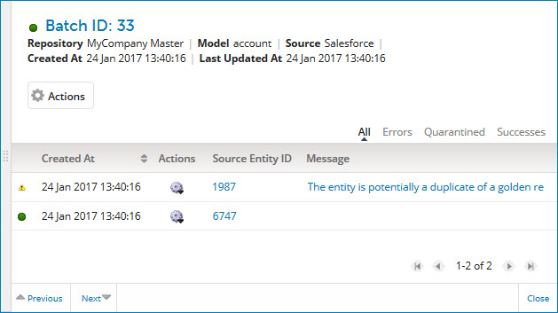
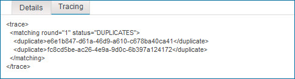
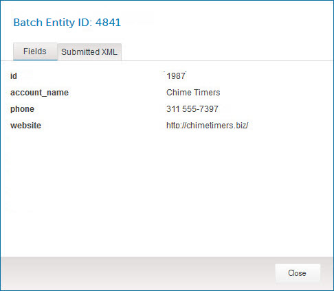
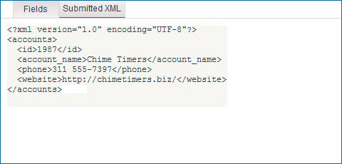

# Batch detail view

<head>
  <meta name="guidename" content="DataHub"/>
  <meta name="context" content="GUID-1C910AD0-1508-49DB-8D64-33EF967DBFD0"/>
</head>

Clicking the Created At link in a batch listed in the Batch Report detail view opens the detail view for that batch, which contains details about the entities and links. The view is sourced from the repository, so it may take a few moments to populate depending on the volume of data.

The view header shows the system batch ID in addition to the summary report information also shown in the Batch Report detail view.

Clicking and dragging the **** icon in the view border adjusts the width of the view.

##  Actions 

Clicking this button opens a menu of actions applicable to the batch:

-   **Batch Processing Details** — Opens the Batch Processing Details dialog which lets you view processing details for the batch. Elapsed times are shown as hours \(h\), minutes \(m\) and seconds \(s\).

    
  
    **Name**  
    **Description**

    **ID**
    The system batch ID.

    **Created**  
    The time at which the batch record was created.

    **Parsing Phase** \( \)  
    The \(elapsed\), starting and ending time of the parsing \(validation\) phase of processing.

     **Enrichment Phase** \( \)  
    The \(elapsed\), starting and ending time of the phase of processing during which data quality steps are applied.

     **Incorporation Phase**\( \)  
    The \(elapsed\), starting and ending time of the incorporation phase of processing.

     **Total Working Time**
    The total elapsed time of the three phases of processing.

     **Total Time \(Including Wait Time\)**  
    The elapsed time of the three phases of processing plus any waiting time before processing started.

    **Close**  
    Closes the dialog.

-   **Resubmit Batch** — Initiates a request to resubmit the batch. In the confirmation dialog:

    -   Clicking **OK** executes the operation.

    -   Clicking **Cancel** cancels the request.

    :::note
    
    This action is available only to administrators and users having a role with the MDM - Batch Management privilege.

    :::

-   **View Process Execution** — Opens in a new browser tab or window and navigates directly to the report in the Process Reporting page for the process execution that created the batch and routed it to the repository. If the batch was a manual resubmission of quarantined entities or otherwise not submitted as a result of a process execution, this selection is not present.

## Result type filter

The entities list can optionally be filtered by processing results:

**Name**    
**Description**
  
**All**  
Filtering by results is not applied. This is the default.

**Errors**  
Show only entities processed with errors.

**Quarantined**  
Show only quarantined entities.

**Successes**  
Show only entities for which the result of processing was the same as that specified in the batch.

## Entities list 

For each entity in the batch, the following tools and properties are available:

**Name**  
**Description**

**status**  
Status of the entity:

-    The entity was processed successfully. Hovering the pointer on this icon displays the help text “Completed”.

-    The entity was quarantined. Hovering the pointer on this icon displays the help text “Quarantined”.

-    The entity was processed with errors. Hovering the pointer on this icon displays the help text “Errored”.

-    Processing of the entity is in progress. Hovering the pointer on this icon displays the help text “Created”, “Parsed”, “Enriched” or “Processing”.

**Created At**  
The time at which the entity was created in the batch.

Actions ****
 Opens a menu of actions applicable to the entity:

-   **Entity Processing Details** — Opens the Entity Processing Details dialog which lets you view processing details for the entity.

    

**Name**    
**Description**

**Batch Entity ID**  
        The system entity ID.

**Created**  
        The time at which the entity was created in the batch.

**Close**  
        Closes the dialog.

The **Details** tab is selected by default:

**Name**  
        **Description**

**Source Entity ID**  
        The name of the entity’s source and the source entity ID, separated by a colon \(:\).

**Entity Resolution Details**  
         The manner in which the entity was resolved, such as golden record creation, linking of a golden record to the source entity, quarantining, or no changes to domain data. If the entity was quarantined, the cause is shown.

**Message**  
        If the entity was quarantined, the reason is shown.

The **Tracing** tab shows details in XML format of the application of match rules, data quality steps and tags to the entity.

:::note

Tracing information is not available for a Delete \(end-date\) operation or if the entity was quarantined during the validation \(parsing\) phase.

:::

For more information, see the linked topic about entity processing trace.

-   **View Entity** — Opens the Batch Entity dialog which lets you view the entity data:
 
    

    **Name**  
        **Description**

    **ID**  
        The system entity ID.

    **Fields**  
        The entity data — fields and their respective values. The values reflect the results of successfully applied data quality steps, if any. Collections are collapsed by default.

    Long Text field values are represented by the ** View value** icon. Clicking **** for a represented value opens a dialog in which the value is shown.

    This tab is selected by default.

    **Submitted XML**     The originally submitted entity data in the native XML format of the incoming batch.

    

    If the entity’s source is MDM \(resulting from an **Edit this record** operation in golden record detail view\), this tab is not available.

    **Close**  
        Closes the dialog.

    -   **View Golden Record** — Opens the detail view for either the golden record that was created, updated or end-dated as a result of the processing of this entity, or the golden record that would have been updated had the entity not been quarantined.

    -   **View Transaction Details** — Opens the transaction detail view, in which you can view detail for the transaction associated with the entity. A transaction is viewable for six months after its end \(60 days for a transaction that did not result in an operation on a golden record\). Staged entities do not have associated transactions; this action is therefore not available for staged entities.

**Source Entity ID**   The source entity ID. Clicking the ID, if it is shown as a link, will open the record in the source system in another browser tab or window, provided the source entity URL format is correctly specified in the **Entity ID URL** field for the source attachment in the **Sources** tab, or if not there, for the source definition in the Sources page.

**Message**  If the entity was quarantined, the reason is shown as a link.

Clicking the link displays the reason in a dialog.

By default the list is sorted by entity creation time from oldest to newest. Clicking a column heading selects the column by which to sort the list. Clicking the selected column reverses the sort order.

The controls used to navigate the list are the same as those for the reports and batches lists.

## Navigation bar

The following navigation controls are in the bar at the bottom of the view:

**Name**  
**Description**

** Previous**  
Navigates to detail for the previous batch in the batches list. Keyboard shortcut: **Up arrow**.

**Next **  
Navigates to detail for the next batch in the batches list. Keyboard shortcut: **Down arrow**.

**Close**  
Closes the view. Keyboard shortcut: **Esc**. 

:::note

You can also close the view by clicking in the Batch Report detail view or elsewhere in Inbound Activity.

:::